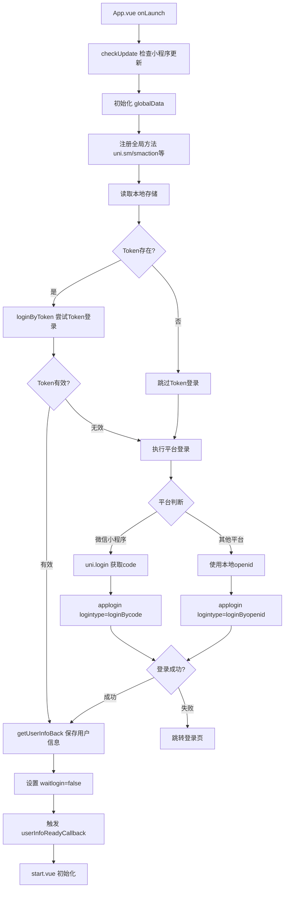
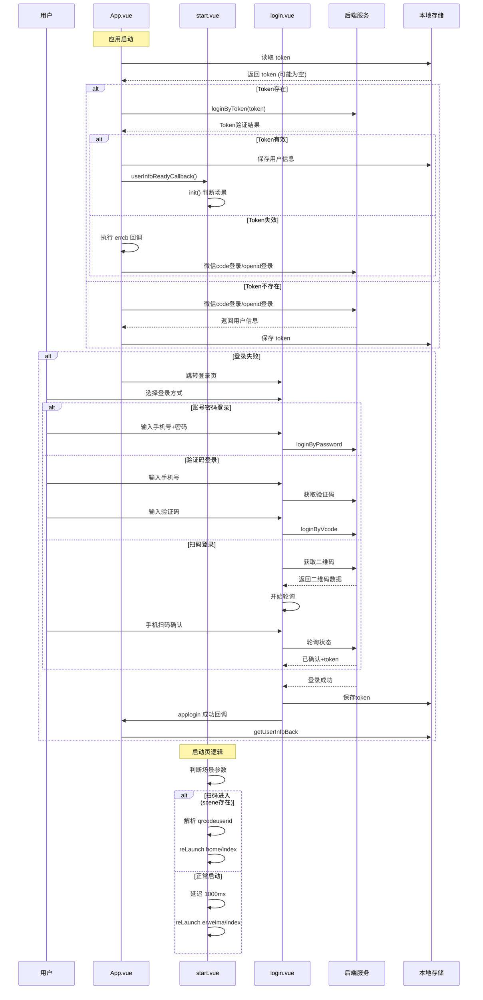
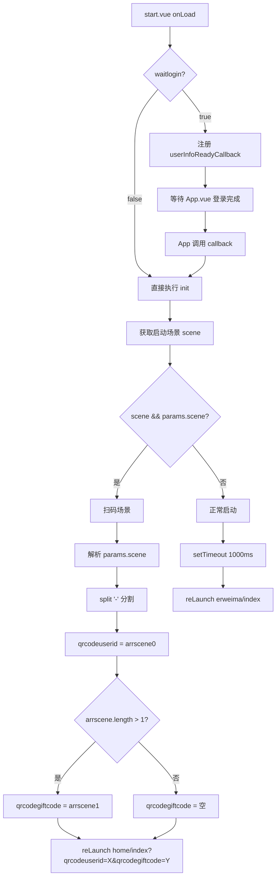
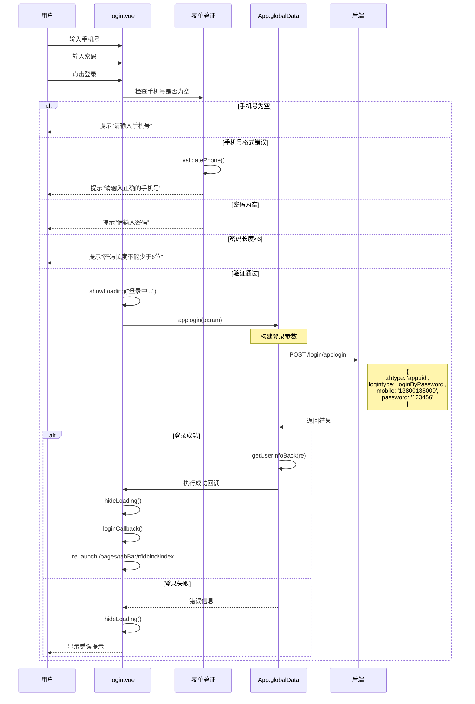
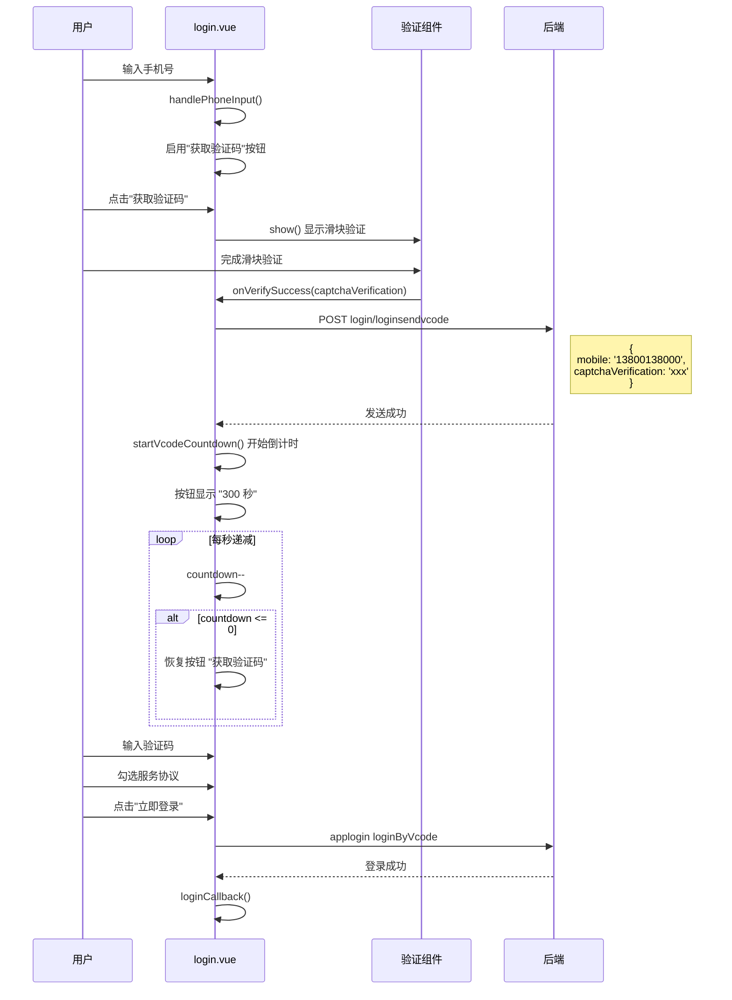
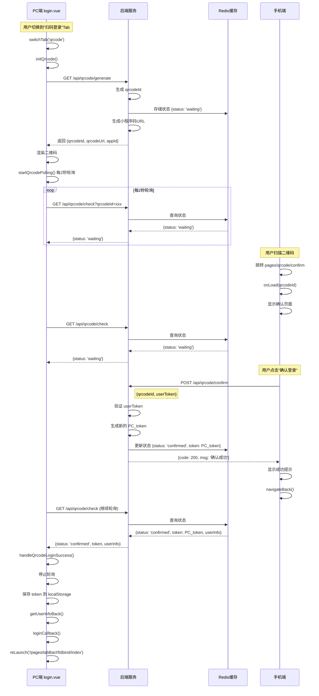

# 登录系统逻辑深度分析文档

## 前言

针对 当前架构的 `app.vue`    `globaldata.js`   `start.vue`   `login.vue`

这篇文档主要是解决这两次遇到的问题

## 一、项目架构全景解析

### 1.1 核心文件职责矩阵

| 文件            | 代码行数 | 核心职责                                 | 关键依赖                     |
| --------------- | -------- | ---------------------------------------- | ---------------------------- |
| `globaldata.js` | 35行     | 环境配置中心                             | process.env                  |
| `App.vue`       | 600+行   | 应用生命周期、全局状态管理、网络请求封装 | moment.js, ase.js, smutil.js |
| `start.vue`     | 70行     | 启动页/场景路由分发                      | App.globalData               |
| `login.vue`     | 500+行   | 多模式登录UI + 业务逻辑                  | verify.vue, uqrcode.vue      |

### 1.2 环境配置详解 (globaldata.js)

```javascript
// 开发环境 (当前使用)
var dev = {
    ossPrefix: 'https://btkjtest.oss-cn-beijing.aliyuncs.com/',
    requrl: 'http://192.168.1.37:8078',  // 👈 你的本地IP
    updir: 'appuid',
    xcxtype: 'appuid',                   // 小程序类型标识
    env_version: "develop"
}

// 测试环境
var test = {
    requrl: 'https://testuniuid.bt-z.com',
    xcxtype: 'xcxuid',
    env_version: "trial"
}

// 生产环境
var prod = {
    requrl: 'https://uniuid.bt-z.com',
    xcxtype: 'xcxuid',
    env_version: "release"
}

// 环境选择逻辑
global = process.env.ENV_TYPE === 'test' ? test : 
         (process.env.NODE_ENV === 'development' ? dev : prod);
```

**环境切换机制**:

- `process.env.NODE_ENV === 'development'` → dev
- `process.env.ENV_TYPE === 'test'` → test
- 其他 → prod

------

## 二、App.vue 登录体系完整解析

### 2.1 应用启动完整流程图



### 2.2 登录方法矩阵 (App.vue 核心)

#### 2.2.1 `loginByToken` - Token自动登录 (第111-125行)

```javascript
loginByToken(token, cb) {
    if (token) {
        var param = {
            zhtype: _this.globalData.xcxtype,  // 'appuid' 或 'xcxuid'
            logintype: "autologin",
            token: token
        }
        _this.globalData.applogin(param, null, cb);
    } else {
        cb && cb();  // 无token直接执行回调
    }
}
```

**触发时机**: 应用启动时 (onLaunch 第57行)
 **参数来源**: `uni.getStorageSync('token')`
 **成功标志**: 返回用户信息并更新 `globalData.objuserinfo`
 **失败处理**: 执行回调 `cb`,进入平台特定登录流程

------

#### 2.2.2 `applogin` - 统一登录入口 (第151-178行)

```javascript
applogin: function(param, succb, errcb) {
    var pobj = {
        route: uni.svs.auth,           // 服务路由 (从 services 配置)
        action: 'login/applogin',      // 控制器路径
        method: 'POST',
        datastring: true               // 👈 参数会被 JSON.stringify
    }
    
    this.smaction((re, err, obj) => {
        uni.hideLoading();
        
        if (err) {
            // 登录失败处理
            if (obj.sid) {
                // 即使失败也保存 session
                _this.globalData.headers['Cookie'] = 'JSESSIONID=' + obj.sid;
            }
            
            // Token登录失败且有 errcb → 继续其他登录方式
            if (param.logintype == "autologin" && errcb) {
                errcb();  // 回到 onLaunch 继续微信/openid登录
            } else {
                // 其他登录失败 → 跳转登录页
                console.log('未登录:', obj);
                if (getCurrentPages()[0].route != 'pages/login/login') {
                    setTimeout(function() {
                        uni.reLaunch({
                            url: "/pages/login/login"
                        })
                    }, 1000)
                }
            }
        } else {
            // 登录成功
            _this.globalData.getUserInfoBack(re);
            succb && succb();
        }
    }, param, pobj)
}
```

**关键特性**:

1. **参数序列化**: `datastring: true` 导致 `param` 会被转为 JSON 字符串
2. **Session管理**: 失败时也会保存 `JSESSIONID`
3. **错误分流**: Token登录失败不跳转,其他登录失败跳登录页
4. **回调链**: `succb` 成功回调, `errcb` 失败回调

------

#### 2.2.3 `getUserInfoBack` - 登录成功处理 (第127-149行)

```javascript
getUserInfoBack: function(obj) {
    console.log(obj);
    if (obj && obj.sid) {
        // 1. 保存到本地存储
        uni.setStorageSync('curmobile', obj.objuser.mobile);
        uni.setStorageSync('token', obj.token);
        if (obj.openid || obj.objuser.openid_xcx) {
            uni.setStorageSync('curopenid', obj.openid || obj.objuser.openid_xcx);
        }
        
        // 2. 设置请求头
        _this.globalData.headers['Cookie'] = 'JSESSIONID=' + obj.sid;
        
        // 3. 保存用户信息到全局
        _this.globalData.objuserinfo = obj.objuser;
        _this.globalData.code = obj.code;
        
        console.log("objuserinfo", _this.globalData.objuserinfo);
        
        // 4. 标记登录完成
        _this.globalData.waitlogin = false;
        
        // 5. 触发回调 (start.vue 在等待)
        if (_this.globalData.userInfoReadyCallback) {
            _this.globalData.userInfoReadyCallback();
            _this.globalData.userInfoReadyCallback = null;
        }
    } else {
        // 静默失败,不提示
    }
}
```

**数据流转**:

```
后端响应 obj
├─ obj.sid → Cookie Header
├─ obj.token → localStorage
├─ obj.objuser.mobile → localStorage
├─ obj.objuser → globalData.objuserinfo
└─ obj.code → globalData.code
```

------

#### 2.2.4 `sm` / `smaction` - 双轨请求系统

##### A. `sm` 方法 (第251-335行) - 传统参数编码方式

```javascript
sm: function(cb, arr, pobj) {
    // 参数容错处理
    if (typeof cb == 'object') {
        var arrtemp = cb;
        cb = arr;
        arr = arrtemp;
    }
    
    // 参数编码逻辑
    var strp = '';
    var ismul = 0;  // 是否多消息
    var msgid = '';
    
    if (typeof arr[0] == 'object') {
        // 多消息模式: [[msg1, p1, p2], [msg2, p3]]
        ismul = 1;
        var arr2 = [];
        for (var i = 0; i < arr.length; i++) {
            for (var j = 0; j < arr[i].length; j++) {
                if (typeof arr[i][j] == 'object') {
                    arr[i][j] = JSON.stringify(arr[i][j]);
                }
            }
            // %15 分隔参数, %18 分隔消息
            arr2.push(smutil.encodeArr(arr[i]).join('%15'));
        }
        strp = arr2.join('%18');
    } else {
        // 单消息模式: [msgid, p1, p2, ...]
        for (var j = 0; j < arr.length; j++) {
            if (typeof arr[j] == 'object') {
                arr[j] = JSON.stringify(arr[j]);
            }
        }
        msgid = arr[0];
        strp = smutil.encodeArr(arr).join('%15');
    }
    
    // 构建请求数据
    var data = {
        "isspChar": 1,  // 特殊字符标记
        arr: strp,
        lan: 'zh'
    };
    
    if (ismul) data.ismul = ismul;
    data.msgid = (pobj && pobj.msgid) || msgid || '';
    if (pobj && pobj.trans) data.trans = pobj.trans;
    if (pobj && pobj.rpc) data.rpc = pobj.rpc;
    
    // 添加 Token
    var token = uni.getStorageSync('token');
    if (token) {
        data.Authorization = 'Bearer ' + token;
    }
    
    // 发起请求
    var url = '/Enter';
    if (pobj && pobj.route) {
        url = '/' + pobj.route + url;
    }
    
    uni.request({
        url: _this.globalData.geturl(pobj.route || "", "Enter"),
        data: data,
        header: _this.globalData.headers,
        success: function(res) {
            // 响应解析 (同 smaction)
        }
    });
}
```

**使用场景示例**:

```javascript
// 单消息
uni.sm((re, err) => {
    console.log(re);
}, ['user.getInfo', userId], { route: 'bzn-xcx-tbpt' });

// 多消息
uni.sm((re, err) => {
    console.log(re);
}, [
    ['user.getInfo', userId],
    ['order.list', pageNum]
], { route: 'bzn-xcx-tbpt', ismul: 1 });
```

##### B. `smaction` 方法 (第180-249行) - RESTful风格

```javascript
smaction: function(cb, param, pobj) {
    // 参数容错
    if (typeof cb == 'object') {
        var arrtemp = cb;
        cb = param;
        param = arrtemp;
    }
    
    if (!pobj || !pobj.action) {
        return cb(null, '路由不能为空');
    }
    
    // 添加 Token 到参数
    var token = uni.getStorageSync('token');
    if (token) {
        param.Authorization = 'Bearer ' + token;
    }
    
    var url = '/' + pobj.route + '/' + pobj.action;
    
    uni.request({
        url: _this.globalData.geturl(pobj.route || "", pobj.action),
        method: pobj.method || "GET",
        data: pobj.datastring ? JSON.stringify(param) : param,
        header: _this.globalData.headers,
        
        success: function(res) {
            if (res.data) {
                // 新版响应格式 (带 code)
                if (res.data.code) {
                    var result = res.data && res.data.data ? 
                                 JSON.parse(res.data.data) : {};
                    if (res.data.code == 200) {
                        return cb(result || res.data.msg, null, result || res.data.msg);
                    } else {
                        return cb(null, res.data.msg, result);
                    }
                }
                
                // 旧版响应格式
                var strtype = Object.prototype.toString.apply(res.data.data);
                if (strtype == '[object Array]') {
                    cb(res.data);
                } else if (strtype == '[object Object]') {
                    if (res.data.error || res.data.code == 500) {
                        if (res.data.error == "nologin") {
                            return uni.navigateTo({
                                url: "/pages/login/login"
                            })
                        }
                        cb(res.data, res.data.error || res.data.msg, res.data);
                    } else {
                        cb(res.data.re || res.data, res.data.error, res.data);
                    }
                } else {
                    cb(null, res.data.error || res.data.msg, res.data);
                }
            } else {
                cb(null, '请求失败');
            }
        },
        fail: function(res) {
            cb(null, '请求失败');
        }
    });
}
```

**对比表**:

| 特性     | sm                     | smaction            |
| -------- | ---------------------- | ------------------- |
| 参数格式 | 数组 `[msgid, p1, p2]` | 对象 `{key: value}` |
| 编码方式 | 自定义 `%15/%18` 分隔  | 标准 JSON           |
| URL      | `/Enter`               | `/{route}/{action}` |
| 适用场景 | 老系统兼容             | 现代RESTful API     |
| 后端要求 | 需要解析特殊编码       | 标准Controller      |

------

### 2.3 完整登录流程时序图



------

## 三、start.vue 启动页深度解析

### 3.1 核心逻辑 (onLoad 第25-36行)

```javascript
onLoad: function(params) {
    this.params = params;
    console.log("-----------", params);
    
    // 关键判断: 是否等待登录完成
    if (app.globalData.waitlogin) {
        // 登录未完成 → 注册回调,等待 App.vue 完成登录
        app.globalData.userInfoReadyCallback = this.init;
    } else {
        // 登录已完成 → 直接执行场景判断
        this.init();
    }
}
```

### 3.2 场景路由逻辑流程图



### 3.3 扫码场景参数解析示例

**场景1: 带礼品码的签到二维码**

```
小程序码参数: scene=123456-GIFT2025
解析结果:
  qrcodeuserid: "123456"
  qrcodegiftcode: "GIFT2025"
跳转: /pages/tabBar/home/index?qrcodeuserid=123456&qrcodegiftcode=GIFT2025
```

**场景2: 普通签到二维码**

```
小程序码参数: scene=789012
解析结果:
  qrcodeuserid: "789012"
  qrcodegiftcode: ""
跳转: /pages/tabBar/home/index?qrcodeuserid=789012&qrcodegiftcode=
```

**场景3: 正常启动**

```
无 scene 参数
延迟 1 秒后跳转: /pages/tabBar/erweima/index
```

------

## 四、login.vue 多模式登录详解

### 4.1 登录模式架构

```javascript
tabs: [
    { name: '账号登录', type: 'account' },
    // { name: '人脸登录', type: 'face' },      // 已注释
    { name: '扫码登录', type: 'qrcode' },
    // { name: '验证码登录', type: 'vcode' }     // 已注释
]
```

**当前启用模式**:

1. ✅ 账号登录 (account)
2. ✅ 扫码登录 (qrcode)
3. ❌ 人脸登录 (face) - UI保留但未启用
4. ❌ 验证码登录 (vcode) - UI保留但未启用

### 4.2 账号密码登录完整流程



**关键代码** (login.vue 第216-248行):

```javascript
handleAccountLogin() {
    const { phone, password } = this.accountLogin;

    // 1. 表单验证
    if (!phone) {
        return uni.showToast({ title: '请输入手机号', icon: 'none' });
    }

    if (!this.validatePhone(phone)) {
        return uni.showToast({ title: '请输入正确的手机号', icon: 'none' });
    }

    if (!password) {
        return uni.showToast({ title: '请输入密码', icon: 'none' });
    }

    if (password.length < 6) {
        return uni.showToast({ title: '密码长度不能少于6位', icon: 'none' });
    }

    uni.showLoading({ title: '登录中...' });

    // 2. 构建登录参数
    const param = {
        zhtype: app.globalData.xcxtype,  // 'appuid'
        logintype: "loginByPassword",
        mobile: phone,
        password: password
    };

    // 3. 调用统一登录
    app.globalData.applogin(param, () => {
        uni.hideLoading();
        this.loginCallback();  // 跳转到 rfidbind/index
    });
}
```

**手机号验证规则** (第455-458行):

```javascript
validatePhone(phone) {
    const reg = /^1(3[0-9]|4[01456879]|5[0-35-9]|6[2567]|7[0-8]|8[0-9]|9[0-35-9])\d{8}$/;
    return phone.length === 11 && reg.test(phone);
}
```

支持的号段:

- 13x, 14[01456879], 15[0-35-9]
- 16[2567], 17[0-8], 18x, 19[0-35-9]

------

### 4.3 二维码登录现有实现分析

#### 4.3.1 数据结构 (第129-140行)

```javascript
qrcodeLogin: {
    content: '',                    // 二维码内容
    size: 260,                      // 二维码尺寸 (rpx)
    timestamp: '',                  // 显示的时间戳文本
    timer: null,                    // 定时刷新计时器
    refreshInterval: 1 * 60 * 1000, // 刷新间隔 60秒
    options: {
        margin: 10,
        background: '#ffffff',
        foreground: '#000000',
    }
}
```

#### 4.3.2 二维码生成逻辑 (第269-279行)

```javascript
generateQrcode() {
    const timestamp = new Date().getTime();
    const virtualUnionId = "88888888888888";  // 👈 硬编码虚拟ID
    const qrcodeData = virtualUnionId + timestamp;

    this.qrcodeLogin.content = qrcodeData;
    this.qrcodeLogin.timestamp = moment(timestamp).format("YYYY年MM月DD日 HH:mm:ss");

    console.log('二维码内容已更新:', this.qrcodeLogin.content);
}
```

**问题分析**:

1. ❌ **无后端交互**: 二维码内容完全由前端生成
2. ❌ **无状态轮询**: 生成后无法知道是否被扫描
3. ❌ **无验证机制**: 虚拟ID无法与真实用户关联
4. ⚠️ **仅为UI演示**: 当前实现不具备实际登录功能

#### 4.3.3 定时刷新机制

```javascript
// 启动定时器 (第281-287行)
startQrcodeTimer() {
    this.clearQrcodeTimer();
    this.qrcodeLogin.timer = setInterval(() => {
        this.generateQrcode();  // 每60秒重新生成
    }, this.qrcodeLogin.refreshInterval);
}

// Tab切换时的初始化 (第196-206行)
switchTab(index) {
    this.currentTab = index;

    if (this.tabs[index].type === 'qrcode') {
        this.$nextTick(() => {
            this.initQrcode();  // 生成二维码并启动定时器
        });
    } else {
        this.clearQrcodeTimer();  // 切走时清理定时器
    }
}
```

------

### 4.4 验证码登录流程 (已注释但逻辑完整)



**关键代码** (第425-438行):

```javascript
handleVcodeLogin() {
    if (!this.vcodeLogin.agreed) {
        return uni.msg("请先勾选协议");
    }

    if (!this.validatePhone(this.vcodeLogin.phone)) {
        return uni.msg("请输入正确的手机号");
    }
    
    if (!this.vcodeLogin.code) {
        return uni.msg("请输入正确的验证码");
    }

    uni.showLoading({ title: '登录中...' });

    const param = {
        zhtype: app.globalData.xcxtype,
        logintype: "loginByVcode",
        mobile: this.vcodeLogin.phone,
        vcode: this.vcodeLogin.code
    };

    app.globalData.applogin(param, () => {
        uni.hideLoading();
        this.loginCallback();
    });
}

```

**验证码倒计时逻辑** (第390-408行):

```javascript
startVcodeCountdown() {
    this.clearVcodeTimer();
    this.vcodeLogin.btnDisabled = true;

    this.vcodeLogin.timer = setInterval(() => {
        this.vcodeLogin.countdown--;
        this.vcodeLogin.btnText = this.vcodeLogin.countdown + ' 秒';

        if (this.vcodeLogin.countdown <= 0) {
            this.clearVcodeTimer();
            this.vcodeLogin.btnDisabled = false;
            this.vcodeLogin.btnText = "获取验证码";
            this.vcodeLogin.countdown = 300;  // 重置为300秒
        }
    }, 1000);
}
```

------

## 五、场景问题完整解决方案

### 5.1 场景1: 跳过启动页的4种方案

#### 方案A: 修改启动延迟 (最简单) ⭐⭐⭐⭐⭐

**修改位置**: `start.vue` 第56-62行

```javascript
// 原代码
setTimeout(function() {
    uni.reLaunch({
        url: "/pages/tabBar/erweima/index"
    })
}, 1000)

// 方案1: 直接移除延迟
uni.reLaunch({
    url: "/pages/tabBar/erweima/index"
})

// 方案2: 缩短延迟至100ms
setTimeout(function() {
    uni.reLaunch({
        url: "/pages/tabBar/erweima/index"
    })
}, 100)
```

**优点**:

- 代码改动最小
- 保留启动页逻辑用于扫码场景
- 开发调试时快速进入

**缺点**:

- 启动页UI会闪现

------

#### 方案B: 修改目标页面 (保留启动页) ⭐⭐⭐⭐

**修改位置**: `start.vue` 第56-62行

```javascript
setTimeout(function() {
    uni.reLaunch({
        url: "/pages/tabBar/home/index"  // 👈 改为你想要的首页
    })
}, 100)  // 建议缩短延迟
```

**适用场景**:

- 改变默认首页路径
- 保留启动页用于处理扫码等特殊场景

------

#### 方案C: pages.json 配置法 (彻底移除) ⭐⭐⭐

**修改位置**: `pages.json`

```json
{
  "pages": [
    // 方法1: 注释掉启动页
    // {
    //   "path": "pages/start/start",
    //   "style": {
    //     "navigationBarTitleText": "启动页"
    //   }
    // },
    
    // 方法2: 将首页移到第一位
    {
      "path": "pages/tabBar/home/index",  // 👈 应用启动时会进入第一个页面
      "style": {
        "navigationBarTitleText": "首页"
      }
    },
    {
      "path": "pages/start/start",
      "style": {
        "navigationBarTitleText": "启动页"
      }
    }
  ]
}
```

**影响**:

- ⚠️ **扫码场景失效**: `start.vue` 的扫码解析逻辑将无法执行
- ⚠️ **需要迁移逻辑**: 需将扫码处理移至新首页的 `onLoad`

------

#### 方案D: 条件跳过法 (最灵活) ⭐⭐⭐⭐⭐

**修改位置**: `start.vue` 第43-67行

```javascript
init() {
    var scene = 0;
    
    // #ifdef MP-WEIXIN
    var options = wx.getLaunchOptionsSync();
    console.log(options);
    scene = options.scene;
    // #endif
    
    var qrcodeuserid = "";
    var qrcodegiftcode = "";
    
    // 👇 新增: 开发环境判断
    var isDev = app.globalData.env_version === 'develop';
    
    if (scene && this.params.scene) { 
        // 扫码进入场景 (保持原逻辑)
        var arrscene = this.params.scene.split('-');
        qrcodeuserid = arrscene[0];
        if (arrscene.length > 1) {
            qrcodegiftcode = arrscene[1];
        }
        uni.reLaunch({
            url: "/pages/tabBar/home/index?qrcodeuserid=" + qrcodeuserid + 
                 "&qrcodegiftcode=" + qrcodegiftcode
        });
    } else { 
        // 正常启动场景
        if (isDev) {
            // 👈 开发环境: 立即跳转,无延迟
            uni.reLaunch({
                url: "/pages/tabBar/home/index"
            });
        } else {
            // 生产环境: 保留延迟,展示品牌
            setTimeout(function() {
                uni.reLaunch({
                    url: "/pages/tabBar/home/index"
                });
            }, 1000);
        }
    }
}
```

**优点**:

- ✅ 开发环境快速跳过
- ✅ 生产环境保留品牌展示
- ✅ 扫码场景不受影响
- ✅ 可通过配置文件控制

**进阶版: 使用配置文件**

在 `globaldata.js` 中添加:

```javascript
var dev = {
    // ...其他配置
    skipStartPage: true,        // 👈 新增配置项
    startPageDelay: 0           // 启动页延迟(ms)
}

var prod = {
    // ...其他配置
    skipStartPage: false,
    startPageDelay: 1000
}
```

在 `start.vue` 中使用:

```javascript
init() {
    // ...前面代码不变
    
    if (scene && this.params.scene) { 
        // 扫码逻辑...
    } else {
        var delay = app.globalData.skipStartPage ? 
                    0 : app.globalData.startPageDelay;
        
        setTimeout(function() {
            uni.reLaunch({
                url: "/pages/tabBar/home/index"
            });
        }, delay);
    }
}
```

------

### 5.2 场景2: 同事访问你的本地接口

#### 当前配置分析

```javascript
// globaldata.js 第2-7行
var dev = {
    ossPrefix: 'https://btkjtest.oss-cn-beijing.aliyuncs.com/',
    requrl: 'http://192.168.1.37:8078',  // 👈 你当前的IP
    updir: 'appuid',
    xcxtype: 'appuid',
    env_version: "develop"
}
```

#### 完整解决步骤

##### 步骤1: 确认你的实际IP地址

**Windows系统**:

```bash
# 方法1: CMD
ipconfig

# 输出示例
无线局域网适配器 WLAN:
   IPv4 地址 . . . . . . . . : 192.168.1.100  👈 这个是你的IP
   子网掩码  . . . . . . . . : 255.255.255.0
   默认网关. . . . . . . . . : 192.168.1.1

# 方法2: PowerShell
Get-NetIPAddress -AddressFamily IPv4 | Where-Object {$_.InterfaceAlias -like "*WLAN*"}
```

**Mac/Linux系统**:

```bash
# 方法1
ifconfig | grep "inet " | grep -v 127.0.0.1

# 方法2
ip addr show | grep "inet " | grep -v 127.0.0.1

# 输出示例
inet 192.168.1.100/24 brd 192.168.1.255 scope global dynamic en0
```

##### 步骤2: 检查后端服务监听地址

**问题诊断**:

```bash
# 检查端口监听情况
# Windows
netstat -ano | findstr "8078"

# Mac/Linux
lsof -i :8078
# 或
netstat -tulpn | grep 8078
```

**输出解读**:

```bash
# ❌ 错误示例 (仅监听 localhost)
TCP    127.0.0.1:8078    0.0.0.0:0    LISTENING

# ✅ 正确示例 (监听所有网卡)
TCP    0.0.0.0:8078      0.0.0.0:0    LISTENING
TCP    [::]:8078         [::]:0       LISTENING
```

**修正方法**:

根据你的后端框架修改启动配置:

```javascript
// Node.js (Express/Koa)
app.listen(8078, '0.0.0.0', () => {  // 👈 不要写 'localhost'
    console.log('Server running on 0.0.0.0:8078');
});

// Java Spring Boot (application.yml)
server:
  address: 0.0.0.0  # 👈 或直接删除此行,默认就是 0.0.0.0
  port: 8078

// Python Flask
app.run(host='0.0.0.0', port=8078)  # 👈 默认是 127.0.0.1

// .NET Core (Program.cs)
builder.WebHost.UseUrls("http://0.0.0.0:8078");  // 👈 或 http://*:8078
```

##### 步骤3: 修改 globaldata.js

```javascript
var dev = {
    ossPrefix: 'https://btkjtest.oss-cn-beijing.aliyuncs.com/',
    requrl: 'http://192.168.1.100:8078',  // 👈 改为你的实际IP
    updir: 'appuid',
    xcxtype: 'appuid',
    env_version: "develop"
}
```

##### 步骤4: 验证网络连通性

**在你的电脑上**:

```bash
# 测试后端服务是否正常
curl http://localhost:8078/health
# 或用浏览器访问 http://localhost:8078

# 测试是否可通过IP访问
curl http://192.168.1.100:8078/health
```

**在同事电脑上**:

```bash
# 1. 测试网络连通性
ping 192.168.1.100

# 2. 测试端口是否开放
# Windows (需要安装 telnet 客户端)
telnet 192.168.1.100 8078

# Mac/Linux
nc -zv 192.168.1.100 8078
# 或
telnet 192.168.1.100 8078

# 3. 测试HTTP接口
curl http://192.168.1.100:8078/health
# 或用浏览器访问
```

**预期结果**:

```bash
# ping 成功
正在 Ping 192.168.1.100 具有 32 字节的数据:
来自 192.168.1.100 的回复: 字节=32 时间<1ms TTL=64

# telnet 成功
Trying 192.168.1.100...
Connected to 192.168.1.100.

# curl 成功
{"status": "ok", "message": "Service is running"}
```

##### 步骤5: 防火墙配置

**Windows防火墙**:

```powershell
# 方法1: 临时关闭防火墙 (不推荐)
# 控制面板 → Windows Defender 防火墙 → 启用或关闭 Windows Defender 防火墙

# 方法2: 添加入站规则 (推荐)
# 1. Win + R 输入 wf.msc
# 2. 入站规则 → 新建规则
# 3. 端口 → TCP → 特定本地端口 → 8078
# 4. 允许连接 → 所有配置文件 → 命名为 "开发服务器8078"

# 方法3: PowerShell命令
New-NetFirewallRule -DisplayName "Dev Server 8078" -Direction Inbound -LocalPort 8078 -Protocol TCP -Action Allow
```

**Mac防火墙**:

```bash
# 1. 系统偏好设置 → 安全性与隐私 → 防火墙
# 2. 点击锁图标解锁
# 3. 防火墙选项 → 添加你的后端进程

# 或使用命令 (需要sudo)
sudo /usr/libexec/ApplicationFirewall/socketfilterfw --add /path/to/your/app
sudo /usr/libexec/ApplicationFirewall/socketfilterfw --unblockapp /path/to/your/app
```

**Linux防火墙**:

```bash
# UFW (Ubuntu)
sudo ufw allow 8078/tcp
sudo ufw reload

# firewalld (CentOS/RHEL)
sudo firewall-cmd --zone=public --add-port=8078/tcp --permanent
sudo firewall-cmd --reload

# iptables
sudo iptables -A INPUT -p tcp --dport 8078 -j ACCEPT
sudo iptables-save
```

##### 步骤6: 同事端配置

**方法A: 同事也修改 globaldata.js**

```javascript
// 同事的 globaldata.js
var dev = {
    requrl: 'http://192.168.1.100:8078',  // 👈 改为你的IP
    // ...其他配置
}
```

**方法B: 使用环境变量 (推荐团队协作)**

修改 `globaldata.js`:

```javascript
var dev = {
    ossPrefix: 'https://btkjtest.oss-cn-beijing.aliyuncs.com/',
    // 👇 从环境变量读取,fallback到默认值
    requrl: process.env.VUE_APP_API_URL || 'http://192.168.1.37:8078',
    updir: 'appuid',
    xcxtype: 'appuid',
    env_version: "develop"
}
```

每个人创建自己的 `.env.local` 文件 (不提交到git):

```bash
# 你的 .env.local
VUE_APP_API_URL=http://192.168.1.100:8078

# 同事的 .env.local
VUE_APP_API_URL=http://192.168.1.100:8078

# 另一个同事运行自己的后端
VUE_APP_API_URL=http://192.168.1.200:8078
```

在 `.gitignore` 中添加:

```
.env.local
.env.*.local
```

------

#### 常见问题排查

**问题1: ping通但curl失败**

```bash
# 可能原因
1. 防火墙阻止了8078端口
2. 后端监听了 127.0.0.1 而非 0.0.0.0
3. 后端服务未启动

# 解决方法
netstat -ano | findstr "8078"  # 检查端口状态
```

**问题2: 偶尔能访问,偶尔超时**

```bash
# 可能原因
1. 你的电脑IP动态变化 (DHCP)
2. 网络不稳定
3. 后端进程崩溃重启

# 解决方法 - 设置静态IP
# Windows: 控制面板 → 网络适配器 → IPv4属性 → 使用下面的IP地址
# Mac: 系统偏好设置 → 网络 → 高级 → TCP/IP → 配置IPv4: 手动
```

**问题3: 微信小程序无法访问局域网IP**

```bash
# 微信小程序限制
1. 真机调试时,request域名必须在白名单
2. 线上版本不允许访问 IP 地址,必须用域名

# 解决方法
# 1. 开发阶段: 使用微信开发者工具,勾选"不校验合法域名"
# 2. 生产阶段: 使用内网穿透工具
```

------

#### 内网穿透方案 (可选)

如果需要让外网或微信小程序真机访问:

```bash
# 方案1: ngrok (国外)
ngrok http 8078
# 会生成类似 https://abc123.ngrok.io 的临时域名

# 方案2: frp (国内,需要自己的服务器)
# 配置较复杂,适合长期使用

# 方案3: natapp (国内,免费有限制)
./natapp -authtoken=你的token

# 方案4: 花生壳 (付费)
# GUI工具,操作简单
```

使用后修改 `globaldata.js`:

```javascript
var dev = {
    requrl: 'https://abc123.ngrok.io',  // 👈 使用穿透后的域名
    // ...
}
```

------

### 5.3 场景3: 改造二维码扫码登录

#### 现状分析

**当前代码问题** (login.vue 第269-279行):

```javascript
generateQrcode() {
    const timestamp = new Date().getTime();
    const virtualUnionId = "88888888888888";  // ❌ 硬编码虚拟ID
    const qrcodeData = virtualUnionId + timestamp;  // ❌ 无业务意义

    this.qrcodeLogin.content = qrcodeData;  // ❌ 无法被后端识别
    this.qrcodeLogin.timestamp = moment(timestamp).format("YYYY年MM月DD日 HH:mm:ss");
}
```

**缺失的功能**:

1. ❌ 后端二维码生成接口
2. ❌ 二维码状态轮询机制
3. ❌ 手机端扫码确认页面
4. ❌ 登录成功回调处理

------

#### 完整改造方案

##### 阶段1: 后端接口设计

你需要后端提供3个接口:

```javascript
/**
 * 接口1: 生成登录二维码
 * GET /api/qrcode/generate
 */
{
    "code": 200,
    "data": {
        "qrcodeId": "QR_20251219_abc123",     // 二维码唯一标识
        "qrcodeUrl": "weixin://dl/scan/QR_20251219_abc123",  // 小程序扫码跳转URL
        "appId": "wx1234567890",              // 小程序AppID (从后端获取)
        "appSecret": "secret_abc123",         // 👈 注意:不应返回给前端,仅后端使用
        "timestamp": 1702999999000,           // 生成时间戳
        "expireTime": 300,                    // 有效期(秒)
        "status": "waiting"                   // 初始状态
    },
    "msg": "生成成功"
}

/**
 * 接口2: 轮询二维码状态
 * GET /api/qrcode/check?qrcodeId=QR_20251219_abc123
 */
{
    "code": 200,
    "data": {
        "qrcodeId": "QR_20251219_abc123",
        "status": "waiting",    // waiting | scanned | confirmed | expired | cancelled
        "token": null,          // confirmed状态时返回
        "userInfo": null        // confirmed状态时返回
    }
}

// 状态变化示例
// 1. 初始: {"status": "waiting"}
// 2. 扫码: {"status": "scanned", "mobile": "138****8000"}
// 3. 确认: {"status": "confirmed", "token": "eyJhbG...", "userInfo": {...}}
// 4. 过期: {"status": "expired"}

/**
 * 接口3: 手机端确认登录
 * POST /api/qrcode/confirm
 */
Request:
{
    "qrcodeId": "QR_20251219_abc123",
    "userToken": "当前用户的token"  // 从手机端本地存储获取
}

Response:
{
    "code": 200,
    "data": {
        "token": "eyJhbGciOiJIUzI1NiIsInR5cCI6...",  // 新的登录token
        "userInfo": {
            "id": 12345,
            "mobile": "13800138000",
            "nickname": "张三",
            "avatar": "https://..."
        }
    },
    "msg": "确认成功"
}
```

**后端实现要点 扫码后续处理**:

```javascript
// 伪代码示例 (Node.js)
// 1. 生成二维码
app.get('/api/qrcode/generate', async (req, res) => {
    const qrcodeId = `QR_${Date.now()}_${generateRandomString(6)}`;
    
    // 存储到Redis,设置过期时间
    await redis.setex(
        `qrcode:${qrcodeId}`,
        300,  // 5分钟过期
        JSON.stringify({
            status: 'waiting',
            createTime: Date.now()
        })
    );
    
    // 构建小程序跳转URL
    const qrcodeUrl = `weixin://dl/scan/${qrcodeId}`;  // 或使用小程序码
    
    res.json({
        code: 200,
        data: {
            qrcodeId,
            qrcodeUrl,
            appId: process.env.WECHAT_APP_ID,  // 从环境变量读取
            timestamp: Date.now(),
            expireTime: 300,
            status: 'waiting'
        }
    });
});

// 2. 轮询状态
app.get('/api/qrcode/check', async (req, res) => {
    const { qrcodeId } = req.query;
    
    const data = await redis.get(`qrcode:${qrcodeId}`);
    if (!data) {
        return res.json({
            code: 200,
            data: { status: 'expired' }
        });
    }
    
    const qrcodeData = JSON.parse(data);
    res.json({
        code: 200,
        data: {
            qrcodeId,
            status: qrcodeData.status,
            token: qrcodeData.token || null,
            userInfo: qrcodeData.userInfo || null
        }
    });
});

// 3. 手机端确认
app.post('/api/qrcode/confirm', async (req, res) => {
    const { qrcodeId, userToken } = req.body;
    
    // 验证用户token
    const user = await verifyToken(userToken);
    if (!user) {
        return res.json({ code: 401, msg: '未登录' });
    }
    
    // 生成新的登录token (用于PC端)
    const newToken = generateToken(user.id);
    
    // 更新二维码状态
    await redis.setex(
        `qrcode:${qrcodeId}`,
        60,  // 确认后60秒内PC端需取走token
        JSON.stringify({
            status: 'confirmed',
            token: newToken,
            userInfo: {
                id: user.id,
                mobile: user.mobile,
                nickname: user.nickname
            }
        })
    );
    
    res.json({
        code: 200,
        data: {
            token: newToken,
            userInfo: user
        },
        msg: '确认成功'
    });
});
```

------

##### 阶段2: 前端 login.vue 改造

**第1步: 修改数据结构**

```javascript
// login.vue data() 中修改 (第129-140行)
qrcodeLogin: {
    qrcodeId: '',                // 👈 新增: 二维码唯一标识
    appId: '',                   // 👈 新增: 小程序AppID
    content: '',                 // 二维码内容URL
    size: 260,
    timestamp: '',
    timer: null,                 // 定时刷新计时器
    pollingTimer: null,          // 👈 新增: 轮询计时器
    refreshInterval: 1 * 60 * 1000,  // 刷新间隔
    pollingInterval: 2000,       // 👈 新增: 轮询间隔2秒
    expireTime: 300,             // 👈 新增: 有效期
    status: 'waiting',           // 👈 新增: 当前状态
    options: {
        margin: 10,
        background: '#ffffff',
        foreground: '#000000',
    }
}
```

**第2步: 重写二维码生成方法**

```javascript
// 替换原 generateQrcode 方法 (第269-279行)
async generateQrcodeFromBackend() {
    try {
        uni.showLoading({ title: '生成二维码中...' });
        
        // 调用后端接口生成二维码
        const app = getApp();
        app.globalData.smaction(
            (re, err, obj) => {
                uni.hideLoading();
                
                if (err) {
                    console.error('生成二维码失败:', err);
                    uni.showToast({ 
                        title: err || '生成失败,请重试', 
                        icon: 'none' 
                    });
                    return;
                }
                
                // 更新二维码数据
                this.qrcodeLogin.qrcodeId = re.qrcodeId;
                this.qrcodeLogin.appId = re.appId;
                this.qrcodeLogin.content = re.qrcodeUrl;  // 👈 使用后端返回的URL
                this.qrcodeLogin.timestamp = moment(re.timestamp)
                    .format("YYYY年MM月DD日 HH:mm:ss");
                this.qrcodeLogin.expireTime = re.expireTime;
                this.qrcodeLogin.status = 'waiting';
                
                console.log('二维码生成成功:', {
                    id: this.qrcodeLogin.qrcodeId,
                    url: this.qrcodeLogin.content
                });
                
                // 生成成功后立即开始轮询
                this.startQrcodePolling();
            },
            {},  // GET请求无body参数
            {
                route: uni.svs.auth,          // 使用统一的auth路由
                action: 'api/qrcode/generate',  // 控制器路径
                method: 'GET'
            }
        );
        
    } catch (error) {
        uni.hideLoading();
        console.error('生成二维码异常:', error);
        uni.showToast({ title: '网络异常', icon: 'none' });
    }
}
```

**第3步: 新增状态轮询方法**

```javascript
// 在 methods 中新增 (建议放在第300行左右)
startQrcodePolling() {
    console.log('开始轮询二维码状态');
    
    // 先清除旧的轮询
    this.clearQrcodePolling();
    
    const app = getApp();
    
    // 立即执行一次
    this.checkQrcodeStatus();
    
    // 设置定时轮询 (每2秒)
    this.qrcodeLogin.pollingTimer = setInterval(() => {
        this.checkQrcodeStatus();
    }, this.qrcodeLogin.pollingInterval);
},

checkQrcodeStatus() {
    const app = getApp();
    
    app.globalData.smaction(
        (re, err, obj) => {
            if (err) {
                console.error('轮询失败:', err);
                // 轮询失败不提示,静默处理
                return;
            }
            
            const prevStatus = this.qrcodeLogin.status;
            this.qrcodeLogin.status = re.status;
            
            // 状态变化时打印日志
            if (prevStatus !== re.status) {
                console.log(`二维码状态变化: ${prevStatus} → ${re.status}`);
            }
            
            switch(re.status) {
                case 'waiting':
                    // 等待扫码 - 继续轮询
                    break;
                    
                case 'scanned':
                    // 已扫码待确认
                    if (prevStatus === 'waiting') {
                        uni.showToast({ 
                            title: '已扫码,请在手机上确认登录', 
                            icon: 'none',
                                                        duration: 3000
                        });
                    }
                    break;
                    
                case 'confirmed':
                    // 确认成功 - 执行登录
                    this.handleQrcodeLoginSuccess(re.token, re.userInfo);
                    break;
                    
                case 'expired':
                    // 二维码过期 - 停止轮询并提示
                    this.clearQrcodePolling();
                    uni.showToast({ 
                        title: '二维码已过期,请点击刷新', 
                        icon: 'none',
                        duration: 2000
                    });
                    break;
                    
                case 'cancelled':
                    // 用户取消 - 停止轮询
                    this.clearQrcodePolling();
                    uni.showToast({ 
                        title: '已取消登录', 
                        icon: 'none' 
                    });
                    break;
                    
                default:
                    console.warn('未知状态:', re.status);
            }
        },
        { qrcodeId: this.qrcodeLogin.qrcodeId },
        {
            route: uni.svs.auth,
            action: 'api/qrcode/check',
            method: 'GET'
        }
    );
},

// 处理扫码登录成功
handleQrcodeLoginSuccess(token, userInfo) {
    console.log('扫码登录成功:', { token, userInfo });
    
    // 停止所有定时器
    this.clearQrcodePolling();
    this.clearQrcodeTimer();
    
    uni.showLoading({ title: '登录中...' });
    
    // 保存token和用户信息到本地
    uni.setStorageSync('token', token);
    uni.setStorageSync('curmobile', userInfo.mobile);
    
    // 调用全局登录回调 (同步globalData)
    const app = getApp();
    app.globalData.getUserInfoBack({
        sid: 'session_' + Date.now(),  // 如果后端返回了sid则使用
        token: token,
        objuser: userInfo,
        code: 0
    });
    
    uni.hideLoading();
    
    // 延迟一下显示成功提示
    uni.showToast({
        title: '登录成功',
        icon: 'success',
        duration: 1500
    });
    
    // 跳转到主页
    setTimeout(() => {
        this.loginCallback();
    }, 1500);
},

// 清除轮询定时器
clearQrcodePolling() {
    if (this.qrcodeLogin.pollingTimer) {
        console.log('清除轮询定时器');
        clearInterval(this.qrcodeLogin.pollingTimer);
        this.qrcodeLogin.pollingTimer = null;
    }
}
```


**第4步: 修改初始化和刷新方法**

```javascript
// 修改 initQrcode (第265-268行)
initQrcode() {
    console.log('初始化二维码');
    this.generateQrcodeFromBackend();  // 👈 改为从后端生成
    this.startQrcodeTimer();           // 启动定时刷新
    // 不在这里启动轮询,等生成成功后再启动
},

// 修改 refreshQrcode (第295-299行)
refreshQrcode() {
    console.log('手动刷新二维码');
    
    // 停止旧的轮询
    this.clearQrcodePolling();
    
    // 重新生成 (生成成功后会自动开始轮询)
    this.generateQrcodeFromBackend();
    
    // 重启定时刷新
    this.startQrcodeTimer();
}
```

**第5步: 修改页面卸载逻辑**

```javascript
// 修改 onUnload (第37-41行)
onUnload() {
    this.clearQrcodeTimer();
    this.clearQrcodePolling();  // 👈 新增: 清理轮询
    this.clearVcodeTimer();
}
```

**第6步: 修改Tab切换逻辑**

```javascript
// 修改 switchTab (第196-206行)
switchTab(index) {
    this.currentTab = index;

    if (this.tabs[index].type === 'qrcode') {
        this.$nextTick(() => {
            this.initQrcode();
        });
    } else {
        // 切走时清理二维码相关定时器
        this.clearQrcodeTimer();
        this.clearQrcodePolling();  // 👈 新增
    }
}
```

**第7步: 优化UI状态显示**

```vue
<!-- 在 login.vue 的二维码区域添加状态显示 (第99-120行附近) -->
<view v-if="tabs[currentTab].type === 'qrcode'" class="form-content qrcode-content">
    <view class="qrcode-area">
        <!-- 二维码容器 -->
        <view class="qrcode-wrapper">
            <uqrcode
                ref="qrcode"
                canvas-id="qrcode"
                :value="qrcodeLogin.content"
                :size="qrcodeLogin.size"
                :options="qrcodeLogin.options"
            ></uqrcode>
            
            <!-- 👇 新增: 状态遮罩层 -->
            <view v-if="qrcodeLogin.status === 'expired'" class="qrcode-mask">
                <image 
                    class="expired-icon" 
                    src="/static/image/login/expired.png"
                ></image>
                <text class="expired-text">二维码已过期</text>
            </view>
            
            <view v-if="qrcodeLogin.status === 'scanned'" class="qrcode-mask scanned">
                <image 
                    class="scanned-icon" 
                    src="/static/image/login/scanned.png"
                ></image>
                <text class="scanned-text">已扫码,请在手机上确认</text>
            </view>
        </view>

        <!-- 时间显示 -->
        <view class="timetxt">{{ qrcodeLogin.timestamp }}</view>

        <!-- 👇 修改提示文字 -->
        <view class="qrcode-status-wrapper">
            <text class="qrcode-tip" v-if="qrcodeLogin.status === 'waiting'">
                请使用手机微信扫描二维码登录
            </text>
            <text class="qrcode-tip success" v-if="qrcodeLogin.status === 'scanned'">
                扫码成功,请在手机上确认登录
            </text>
            <text class="qrcode-tip expired" v-if="qrcodeLogin.status === 'expired'">
                二维码已失效,请点击下方刷新
            </text>
        </view>
    </view>
    
    <!-- 刷新按钮 -->
    <view class="refreshcode weui-flex_center" @click="refreshQrcode">
        <image 
            src="/static/image/home/reload.png" 
            style="width:25rpx;height:25rpx;margin-right:5px;"
        ></image>
        刷新二维码
    </view>
</view>
```

**第8步: 添加对应样式**

```css
/* 在 login.vue 的 <style scoped> 中添加 (第600行左右) */

/* 二维码遮罩层 */
.qrcode-mask {
    position: absolute;
    top: 0;
    left: 0;
    right: 0;
    bottom: 0;
    background: rgba(255, 255, 255, 0.95);
    display: flex;
    flex-direction: column;
    align-items: center;
    justify-content: center;
    border-radius: 8rpx;
}

.qrcode-mask.scanned {
    background: rgba(96, 202, 187, 0.1);
}

.expired-icon,
.scanned-icon {
    width: 80rpx;
    height: 80rpx;
    margin-bottom: 16rpx;
}

.expired-text {
    font-size: 28rpx;
    color: #999999;
}

.scanned-text {
    font-size: 28rpx;
    color: #60CABB;
    font-weight: bold;
}

.qrcode-status-wrapper {
    min-height: 60rpx;
    display: flex;
    align-items: center;
    justify-content: center;
}

.qrcode-tip.success {
    color: #60CABB;
    font-weight: bold;
}

.qrcode-tip.expired {
    color: #FF6B6B;
}

/* 刷新按钮hover效果 */
.refreshcode:active {
    opacity: 0.7;
    transform: scale(0.98);
}
```

------

##### 阶段3: 手机端扫码确认页面

**第1步: 创建确认页面**

在 `pages/qrcode/` 目录下创建 `confirm.vue`:

```vue
<template>
    <view class="confirm-container">
        <!-- 顶部状态 -->
        <view class="header">
            <image 
                class="logo" 
                src="/static/image/home/img_defaultlogo.jpg"
            ></image>
            <text class="app-name">智慧食堂仓库</text>
        </view>

        <!-- 主内容 -->
        <view class="content">
            <!-- 设备信息卡片 -->
            <view class="device-card">
                <view class="card-title">
                    <image 
                        class="device-icon" 
                        src="/static/image/login/pc_icon.png"
                    ></image>
                    <text class="title-text">确认登录</text>
                </view>
                
                <view class="device-info">
                    <view class="info-row">
                        <text class="label">设备类型:</text>
                        <text class="value">PC端浏览器</text>
                    </view>
                    <view class="info-row">
                        <text class="label">登录时间:</text>
                        <text class="value">{{ loginTime }}</text>
                    </view>
                    <view class="info-row">
                        <text class="label">设备位置:</text>
                        <text class="value">{{ location }}</text>
                    </view>
                </view>

                <view class="warning-box">
                    <image 
                        class="warning-icon" 
                        src="/static/image/login/warning.png"
                    ></image>
                    <text class="warning-text">
                        如果不是您本人操作,请点击取消并修改密码
                    </text>
                </view>
            </view>

            <!-- 用户信息 -->
            <view class="user-info" v-if="userInfo">
                <image 
                    class="avatar" 
                    :src="userInfo.avatar || '/static/image/default_avatar.png'"
                ></image>
                <text class="nickname">{{ userInfo.nickname || userInfo.mobile }}</text>
                <text class="mobile">{{ formatMobile(userInfo.mobile) }}</text>
            </view>
        </view>

        <!-- 底部按钮 -->
        <view class="footer">
            <button 
                class="cancel-btn" 
                @click="handleCancel"
                :disabled="loading"
            >
                取消登录
            </button>
            <button 
                class="confirm-btn" 
                @click="handleConfirm"
                :loading="loading"
            >
                {{ loading ? '确认中...' : '确认登录' }}
            </button>
        </view>
    </view>
</template>

<script>
const app = getApp();

export default {
    data() {
        return {
            qrcodeId: '',           // 二维码ID
            loginTime: '',          // 登录时间
            location: '未知',       // 地理位置
            loading: false,         // 加载状态
            userInfo: null          // 当前用户信息
        }
    },
    
    onLoad(options) {
        console.log('扫码确认页面参数:', options);
        
        // 获取二维码ID
        this.qrcodeId = options.qrcodeId || options.scene;
        
        if (!this.qrcodeId) {
            uni.showModal({
                title: '提示',
                content: '二维码参数错误',
                showCancel: false,
                success: () => {
                    uni.navigateBack();
                }
            });
            return;
        }
        
        // 设置登录时间
        this.loginTime = this.formatDateTime(new Date());
        
        // 获取用户信息
        this.getUserInfo();
        
        // 获取地理位置 (可选)
        this.getLocation();
    },
    
    methods: {
        // 获取用户信息
        getUserInfo() {
            // 方法1: 从globalData获取
            if (app.globalData.objuserinfo) {
                this.userInfo = app.globalData.objuserinfo;
                return;
            }
            
            // 方法2: 从本地存储获取
            const mobile = uni.getStorageSync('curmobile');
            if (mobile) {
                this.userInfo = {
                    mobile: mobile,
                    nickname: mobile.replace(/(\d{3})\d{4}(\d{4})/, '$1****$2')
                };
                return;
            }
            
            // 方法3: 未登录,提示并跳转
            uni.showModal({
                title: '提示',
                content: '请先登录',
                showCancel: false,
                success: () => {
                    uni.reLaunch({
                        url: '/pages/login/login'
                    });
                }
            });
        },
        
        // 获取地理位置
        getLocation() {
            uni.getLocation({
                type: 'wgs84',
                success: (res) => {
                    // 这里可以调用地图API反向解析地址
                    this.location = `${res.latitude.toFixed(2)}, ${res.longitude.toFixed(2)}`;
                },
                fail: () => {
                    this.location = '定位失败';
                }
            });
        },
        
        // 确认登录
        handleConfirm() {
            if (this.loading) return;
            
            const token = uni.getStorageSync('token');
            
            if (!token) {
                uni.showModal({
                    title: '提示',
                    content: '登录状态已失效,请重新登录',
                    showCancel: false,
                    success: () => {
                        uni.reLaunch({
                            url: '/pages/login/login'
                        });
                    }
                });
                return;
            }
            
            this.loading = true;
            
            app.globalData.smaction(
                (re, err, obj) => {
                    this.loading = false;
                    
                    if (err) {
                        console.error('确认登录失败:', err);
                        uni.showModal({
                            title: '确认失败',
                            content: err || '网络异常,请重试',
                            showCancel: false
                        });
                        return;
                    }
                    
                    // 确认成功
                    uni.showToast({
                        title: '确认成功',
                        icon: 'success',
                        duration: 2000
                    });
                    
                    // 延迟返回
                    setTimeout(() => {
                        uni.navigateBack();
                    }, 2000);
                },
                {
                    qrcodeId: this.qrcodeId,
                    userToken: token
                },
                {
                    route: uni.svs.auth,
                    action: 'api/qrcode/confirm',
                    method: 'POST',
                    datastring: true  // 👈 POST请求需要序列化
                }
            );
        },
        
        // 取消登录
        handleCancel() {
            uni.showModal({
                title: '确认取消',
                content: '确定要取消本次登录吗?',
                success: (res) => {
                    if (res.confirm) {
                        // 调用取消接口 (可选)
                        app.globalData.smaction(
                            (re, err) => {
                                // 无论成功失败都返回
                                uni.navigateBack();
                            },
                            { qrcodeId: this.qrcodeId },
                            {
                                route: uni.svs.auth,
                                action: 'api/qrcode/cancel',
                                method: 'POST',
                                datastring: true
                            }
                        );
                    }
                }
            });
        },
        
        // 格式化手机号
        formatMobile(mobile) {
            if (!mobile) return '';
            return mobile.replace(/(\d{3})\d{4}(\d{4})/, '$1****$2');
        },
        
        // 格式化日期时间
        formatDateTime(date) {
            const year = date.getFullYear();
            const month = String(date.getMonth() + 1).padStart(2, '0');
            const day = String(date.getDate()).padStart(2, '0');
            const hour = String(date.getHours()).padStart(2, '0');
            const minute = String(date.getMinutes()).padStart(2, '0');
            const second = String(date.getSeconds()).padStart(2, '0');
            
            return `${year}-${month}-${day} ${hour}:${minute}:${second}`;
        }
    }
}
</script>

<style scoped>
page {
    background: #F5F7FA;
}

.confirm-container {
    min-height: 100vh;
    display: flex;
    flex-direction: column;
    padding: 40rpx;
}

/* 顶部 */
.header {
    display: flex;
    flex-direction: column;
    align-items: center;
    padding: 60rpx 0 80rpx;
}

.logo {
    width: 160rpx;
    height: 160rpx;
    border-radius: 50%;
    margin-bottom: 24rpx;
}

.app-name {
    font-size: 36rpx;
    font-weight: bold;
    color: #333333;
}

/* 主内容 */
.content {
    flex: 1;
}

.device-card {
    background: #FFFFFF;
    border-radius: 20rpx;
    padding: 40rpx;
    margin-bottom: 30rpx;
    box-shadow: 0 2rpx 12rpx rgba(0, 0, 0, 0.05);
}

.card-title {
    display: flex;
    align-items: center;
    margin-bottom: 30rpx;
    padding-bottom: 20rpx;
    border-bottom: 1rpx solid #F0F0F0;
}

.device-icon {
    width: 48rpx;
    height: 48rpx;
    margin-right: 16rpx;
}

.title-text {
    font-size: 32rpx;
    font-weight: bold;
    color: #333333;
}

.device-info {
    margin-bottom: 30rpx;
}

.info-row {
    display: flex;
    justify-content: space-between;
    align-items: center;
    padding: 20rpx 0;
}

.info-row .label {
    font-size: 28rpx;
    color: #666666;
}

.info-row .value {
    font-size: 28rpx;
    color: #333333;
    font-weight: 500;
}

.warning-box {
    background: #FFF5E6;
    border-radius: 12rpx;
    padding: 20rpx;
    display: flex;
    align-items: flex-start;
}

.warning-icon {
    width: 32rpx;
    height: 32rpx;
    margin-right: 12rpx;
    flex-shrink: 0;
}

.warning-text {
    flex: 1;
    font-size: 24rpx;
    color: #FF9800;
    line-height: 1.6;
}

/* 用户信息 */
.user-info {
    background: #FFFFFF;
    border-radius: 20rpx;
    padding: 40rpx;
    display: flex;
    flex-direction: column;
    align-items: center;
    box-shadow: 0 2rpx 12rpx rgba(0, 0, 0, 0.05);
}

.avatar {
    width: 120rpx;
    height: 120rpx;
    border-radius: 50%;
    margin-bottom: 20rpx;
}

.nickname {
    font-size: 32rpx;
    font-weight: bold;
    color: #333333;
    margin-bottom: 12rpx;
}

.mobile {
    font-size: 28rpx;
    color: #999999;
}

/* 底部按钮 */
.footer {
    display: flex;
    gap: 20rpx;
    padding: 40rpx 0 20rpx;
}

.cancel-btn,
.confirm-btn {
    flex: 1;
    height: 88rpx;
    border-radius: 44rpx;
    font-size: 32rpx;
    font-weight: bold;
    border: none;
    display: flex;
    align-items: center;
    justify-content: center;
}

.cancel-btn {
    background: #F5F5F5;
    color: #666666;
}

.cancel-btn:active {
    background: #E8E8E8;
}

.confirm-btn {
    background: linear-gradient(135deg, #60CABB 0%, #4AB5A5 100%);
    color: #FFFFFF;
}

.confirm-btn:active {
    opacity: 0.8;
}

.confirm-btn::after,
.cancel-btn::after {
    border: none;
}
</style>
```

**第2步: 配置页面路由**

在 `pages.json` 中添加:

```json
{
    "pages": [
        // ...其他页面
        {
            "path": "pages/qrcode/confirm",
            "style": {
                "navigationBarTitleText": "扫码登录确认",
                "navigationBarBackgroundColor": "#60CABB",
                "navigationBarTextStyle": "white"
            }
        }
    ]
}
```

**第3步: 生成小程序码**

后端生成小程序码时,设置跳转路径:

```javascript
// 后端伪代码 (Node.js)
const WxBizDataCrypt = require('wechat-api');

app.post('/api/qrcode/generateMiniCode', async (req, res) => {
    const qrcodeId = req.body.qrcodeId;
    
    // 调用微信接口生成小程序码
    const result = await axios.post(
        `https://api.weixin.qq.com/wxa/getwxacodeunlimit?access_token=${accessToken}`,
        {
            scene: qrcodeId,  // 👈 二维码ID作为scene参数
            page: 'pages/qrcode/confirm',  // 👈 跳转到确认页面
            width: 280,
            auto_color: false,
            line_color: { r: 96, g: 202, b: 187 }  // 主题色
        },
        { responseType: 'arraybuffer' }
    );
    
    // 上传到OSS或返回base64
    const base64 = Buffer.from(result.data).toString('base64');
    res.json({
        code: 200,
        data: {
            qrcodeImage: `data:image/png;base64,${base64}`
        }
    });
});
```

------

##### 阶段4: 完整流程时序图



------

##### 阶段5: App.vue 中添加扫码登录类型

App.vue 的 `applogin` 方法已经支持任意 `logintype`,**无需修改**。

当前支持的登录类型:

```javascript
// App.vue 已支持的 logintype (通过 param 参数传入)
{
    logintype: 'autologin',        // Token自动登录
    logintype: 'loginBycode',      // 微信code登录
    logintype: 'loginByopenid',    // OpenID登录
    logintype: 'loginByPassword',  // 密码登录
    logintype: 'loginByVcode',     // 验证码登录
    logintype: 'loginByQrcode'     // 👈 新增: 扫码登录 (后端需支持)
}
```

**如果需要明确支持扫码登录**,可以在 login.vue 的 `handleQrcodeLoginSuccess` 中添加:

```javascript
handleQrcodeLoginSuccess(token, userInfo) {
    // ...前面代码

    // 方式1: 直接使用返回的token (推荐)
    uni.setStorageSync('token', token);
    app.globalData.getUserInfoBack({
        sid: userInfo.sessionId || 'qrcode_session',
        token: token,
        objuser: userInfo,
        code: 0
    });
    
    // 方式2: 再次调用 applogin 验证 (不推荐,多一次请求)
    // const param = {
    //     zhtype: app.globalData.xcxtype,
    //     logintype: "loginByQrcode",
    //     qrcodeId: this.qrcodeLogin.qrcodeId,
    //     token: token
    // };
    // app.globalData.applogin(param, () => {
    //     this.loginCallback();
    // });
}
```

------

## 六、调试指南

### 6.1 开发环境配置检查清单

```bash
✅ 环境变量检查
- [ ] globaldata.js 中 requrl 是否正确
- [ ] process.env.NODE_ENV 是否为 'development'
- [ ] 后端服务是否在 0.0.0.0:8078 监听

✅ 网络连通性检查
- [ ] ping 192.168.1.100 (你的IP)
- [ ] curl http://192.168.1.100:8078/health
- [ ] 浏览器访问 http://192.168.1.100:8078

✅ 防火墙检查
- [ ] Windows防火墙是否允许 8078 端口
- [ ] 杀毒软件是否拦截
- [ ] 公司网络是否有限制

✅ 小程序配置
- [ ] 开发者工具是否勾选"不校验合法域名"
- [ ] app.globalData.services.auth 是否正确配置
- [ ] Token是否正确保存到Storage
```

### 6.2 调试技巧

#### 技巧1: 全局请求日志

在 `App.vue`


