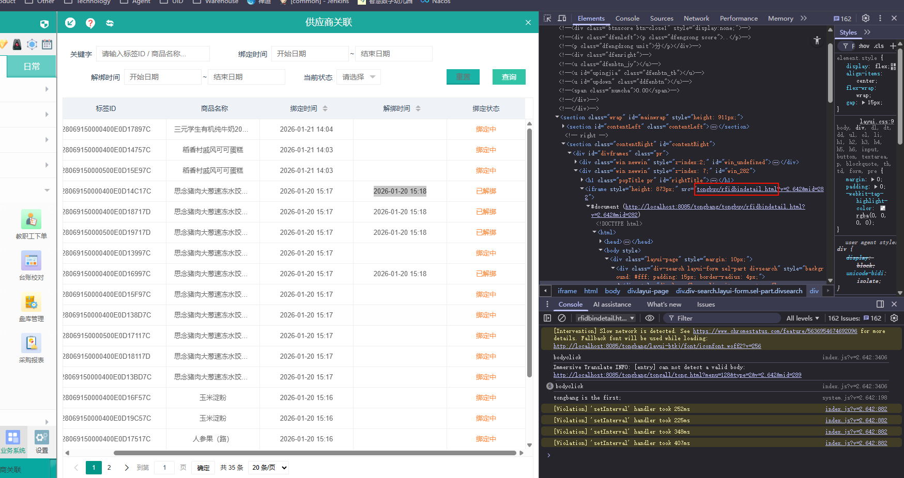

## 创建栏目


给我看麻木了，


栏目图标，点击选择，原以为是从本地的文件中选择   点开啥也没有，勾选不了


URL地址   tongall/tong.html?menu=魔法数字&type=魔法数字2   编辑都费力，算了先写个消息吧

 tongall/tong.html?menu=188&type=2


桌面图标   images/desktop/menu/????.png              images/desktop/menu/rfidbindetail.png

栏目图标   ../images/function/????.png

栏目编号   ../images/function/zdytjfx.png

### 疑问

1. 创建栏目的时候栏目图标选择是需要在哪里配置吗？点击选择后是空白，也不能在自己的电脑上选择图标上传
2. URL地址的menu=  以及 type = 2    这里设置是有规律的吗？还是随意的呢


## 暂且这样实现



将图中的html换为自己写的页面

### rfidbindetail.html

```html
<!DOCTYPE html>
<html>
<head>
    <meta charset="utf-8" />
    <title>采购管理</title>
    <link rel="stylesheet" href="../css/reset.css" />
    <link rel="stylesheet" href="../css/style.css" />
    <link rel="stylesheet" href="../css/icon.css" />
    <link rel="stylesheet" href="../layui-btkj/css/layui.css">
    <link rel="stylesheet" type="text/css" href="../css/commonstyle-layui-btkj.css" />
</head>
<body>
<div class="layui-page" style="margin: 10px;">
    <div class="div-search layui-form sel-part divsearch" style="background: #fff; padding: 15px; border-radius: 4px;">
        <div style="display: flex; align-items: center; flex-wrap: wrap; gap: 15px;">
            <div style="display: flex; align-items: center;">
                <label style="white-space: nowrap; margin-right: 8px;">关键字</label>
                <input type="text" id="txtkey" autocomplete="off" class="layui-input" placeholder="请输入标签ID / 商品名称..." style="width: 220px;" />
            </div>

            <div style="display: flex; align-items: center;margin:0 8px 0 40px;">
                <label style="white-space: nowrap; margin-right: 8px;">绑定时间</label>
                <input type="text" id="bindtimeStart" autocomplete="off" class="layui-input" placeholder="开始日期" readonly style="width: 150px; background: #fff; cursor: pointer;" />
                <span style="margin: 0 2px;">~</span>
                <input type="text" id="bindtimeEnd" autocomplete="off" class="layui-input" placeholder="结束日期" readonly style="width: 150px; background: #fff; cursor: pointer;" />
            </div>

            <div style="display: flex; align-items: center;">
                <label style="white-space: nowrap; margin:0 8px 0 40px;">解绑时间</label>
                <input type="text" id="unbindtimeStart" autocomplete="off" class="layui-input" placeholder="开始日期" readonly style="width: 150px; background: #fff; cursor: pointer;" />
                <span style="margin: 0 2px;">~</span>
                <input type="text" id="unbindtimeEnd" autocomplete="off" class="layui-input" placeholder="结束日期" readonly style="width: 150px; background: #fff; cursor: pointer;" />
            </div>

            <div style="display: flex; align-items: center; width: 150px;text-align: center ;margin:0 8px 0 20px; ">
                <label style="white-space: nowrap; margin-right: 8px;">当前状态</label>
                <select id="selStatus" lay-filter="selStatus" style="width: 80px;">
                    <option value="">请选择</option>
                    <option value="1">绑定中</option>
                    <option value="0">已解绑</option>
                </select>
            </div>

            <button id="btnreset" class="layui-btn layui-btn-primary" style="margin-left: auto;">重置</button>
            <button id="btnSearch" class="layui-btn" style="background: #1abc9c; border-color: #1abc9c;">查询</button>
        </div>
    </div>
    <div>
        <table id="laytable" lay-filter="laytable" class="layui-table" style="margin: 0;"></table>
    </div>
</div>
<script data-main="../js/tongbuy/rfidbindetail" src="../sys/require.min.js"></script>
</body>
</html>
```

### rfidbindetail.js

```js
/*
日期:2021-
作者:
功能:
*/
var objdata = {
};

require.config({
    paths: {
        jquery: '../../sys/jquery',
        system: '../../sys/system',
        function: '../../sys/function',
        arg: '../../sys/arg',
        layui: "../../layui-btkj/layui"
    },
    shim: {
        "system": {
            deps: ["jquery"]
        }
    },
    waitSeconds: 0
});

require(["jquery", "system", "function", "layui"], function () {
    layui.use(['table', 'form', 'laydate'], function () {
        var laydate = layui.laydate;
        var form = layui.form;

        laydate.render({
            elem: '#bindtimeStart',
            type: 'datetime',
            format: 'yyyy-MM-dd HH:mm:ss'
        });

        laydate.render({
            elem: '#bindtimeEnd',
            type: 'datetime',
            format: 'yyyy-MM-dd HH:mm:ss'
        });

        laydate.render({
            elem: '#unbindtimeStart',
            type: 'datetime',
            format: 'yyyy-MM-dd HH:mm:ss'
        });

        laydate.render({
            elem: '#unbindtimeEnd',
            type: 'datetime',
            format: 'yyyy-MM-dd HH:mm:ss'
        });

        $('.search').on('keydown', function (event) {
            if (event.keyCode == 13) {
                search();
                return false;
            }
        });

        $("#btnSearch").click(function () {
            search();
        });

        $("#btnreset").click(function () {
            $("#txtkey").val('');
            $("#bindtimeStart").val('');
            $("#bindtimeEnd").val('');
            $("#unbindtimeStart").val('');
            $("#unbindtimeEnd").val('');
            $("#selStatus").val('');
            form.render('select');
            search();
        });

        $("#btnadd").click(function () {
            openwin("add");
        });

        initlist();
    });
});

function initlist() {
    var table = layui.table;
    table.render({
        elem: '#laytable',
        url: $.smurl + "?" + $.getSmStr(["buy_foodstoragedetail_rfid.rfidbinddetail"]),
        where: {
            fields: 'r.id',
            types: 'desc'
        },
        height: 'full-' + ($("#laytable").offset().top + 20),
        autoSort: false,
        cols: [[ //标题栏
            { type: 'numbers', width: 50 },
            { field: 'rfidnum', title: '标签ID', width: 320, align: 'center' },
            { field: 'relatename', title: '商品名称', width: 280, align: 'center' },
            { field: 'bindtime', title: '绑定时间', width: 180, align: 'center', sort: true },
            { field: 'unbindtime', title: '解绑时间', width: 180, align: 'center', sort: true },
            // 绑定状态   status 0:已解绑  1:绑定中
            {
                field: 'status', title: '绑定状态', width: 150, align: 'center', templet: function (d) {
                    if (d.status == 0) {
                        return '<span style="background:rgba(122,122,122,0.1);border-radius: 5px;padding: 6px 18px;">已解绑</span>';
                   } else {
                        return '<span style="background:rgba(122,195,246,0.2);border-radius: 5px;padding: 6px 18px; color: #43cafc">绑定中</span>';
                    }
                }
            }
        ]],
        skin: 'row', //表格风格
        countNumberBool: true,
        even: true,
        page: true, //是否显示分页
        limits: [10, 20, 30, 50, 100],
        limit: 20 //每页默认显示的数量
    });

    // 监听排序事件
    table.on('sort(laytable)', function(obj) {
        var sortField = 'r.id'; // 默认排序字段
        var sortType = 'desc';   // 默认排序类型

        // 根据点击的字段设置对应的排序字段
        if (obj.field === 'bindtime') {
            sortField = 'r.bindtime';
        } else if (obj.field === 'unbindtime') {
            sortField = 'r.unbindtime';
        }

        // 设置排序类型
        sortType = obj.type === 'asc' ? 'asc' : 'desc';

        // 重新加载表格
        table.reload('laytable', {
            initSort: obj,
            where: {
                swhere: $.msgwhere(objdata.objwhere),
                fields: sortField,
                types: sortType
            }
        });
    });
}

function search() {
    objdata.objwhere = {};

    var key = $("#txtkey").val();
    if (key) {
        objdata.objwhere.searchkey = [key];
    }

    var bindtimeStart = $("#bindtimeStart").val();
    if (bindtimeStart) {
        objdata.objwhere.bindtimeStart = [bindtimeStart];
    }

    var bindtimeEnd = $("#bindtimeEnd").val();
    if (bindtimeEnd) {
        objdata.objwhere.bindtimeEnd = [bindtimeEnd];
    }

    var unbindtimeStart = $("#unbindtimeStart").val();
    if (unbindtimeStart) {
        objdata.objwhere.unbindtimeStart = [unbindtimeStart];
    }

    var unbindtimeEnd = $("#unbindtimeEnd").val();
    if (unbindtimeEnd) {
        objdata.objwhere.unbindtimeEnd = [unbindtimeEnd];
    }

    var status = $("#selStatus").val();
    if (status !== '') {
        objdata.objwhere.status = [status];
    }

    layui.table.reload('laytable', {
        where: {
            swhere: $.msgwhere(objdata.objwhere),
            fields: 'r.id',
            types: 'desc'
        }
    });
}
```

### xml

```xml
        <!-- 标签绑定详情       -->
        <msg id="buy_foodstoragedetail_rfid.rfidbinddetail" type="layuitable" d="y" did="{guid}" v="r.id,f.relatename,r.rfidnum,to_char(r.bindtime,'yyyy-mm-dd HH24:MI') as bindtime,to_char(r.unbindtime,'yyyy-mm-dd HH24:MI') as unbindtime,r.status %16 buy_foodstoragedetail_rfid r left join buy_foodstoragedetail f on r.detailid = f.id %16 f.isdel = 0" >
            <where idx="laywhere">
                <p key="searchkey">and (r.rfidnum='{0}' or f.relatename like '%{0}%')</p>
                <p key="status">and r.status={0}</p>
                <p key="bindtimeStart">and r.bindtime>='{0}'</p>
                <p key="bindtimeEnd">and r.bindtime&lt;='{0}'</p>
                <p key="unbindtimeStart">and r.unbindtime>='{0}'</p>
                <p key="unbindtimeEnd">and r.unbindtime&lt;='{0}'</p>
            </where>
        </msg>
```

## 效果


