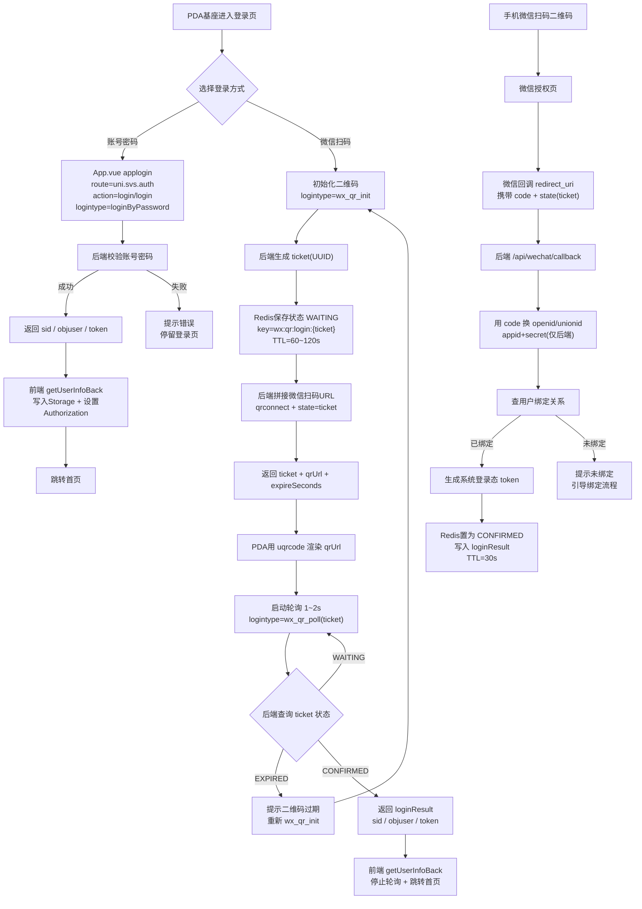

可以的。我看了你现在这套结构：

- **前端（PDA，uni-app）**：`login.vue` 里“扫码登录”目前只是生成了 `virtualUnionId + timestamp`，本质上是个“自定义字符串二维码”，**不会触发微信 OAuth**。
- **统一登录入口**：`App.vue` 里 `applogin()` 固定打 `route: uni.svs.auth`、`action: login/login`，靠 `logintype` 分支做不同登录。
- **后端**：你给的 `LoginPcServiceImpl` 里 `login(LoginBody)` 已支持 `autologin` + 用户名密码；但**没有“扫码登录”分支**，且 `login(AppLoginBody)` 直接 `not support`。

下面给你一个“跟你当前体系最贴合”的改法：**把扫码登录也做成 login/login 的一个 logintype 状态机**，前端只负责展示二维码 + 轮询，**AppSecret 永远只在后端**。

------

## 目标：新增 3 个后端能力（尽量不破坏现有统一流程）

1. `logintype = wx_qr_init`
   后端生成 `ticket`，写入 Redis（WAITING），返回：

- `ticket`
- `qrUrl`（微信扫码登录的 URL，前端用 uqrcode 生成二维码）

1. `logintype = wx_qr_poll`
   前端带 `ticket` 轮询，返回状态：

- `WAITING`：继续等
- `CONFIRMED`：返回你系统已有的 `{sid, objuser, token}` 结构（跟密码登录成功一致）
- `EXPIRED`：提示刷新二维码

1. 一个独立回调接口（微信会跳回这里）：
   `GET /api/wechat/callback?code=...&state=ticket`
   后端用 `code` + `appid/secret` 换 openid/unionid，匹配系统用户，生成 token，然后把 Redis 的 ticket 状态置为 CONFIRMED。

------

## 一、后端怎么改（以你这个 `LoginPcServiceImpl` 为中心改最少）

### 1）在 LoginBody / AppLoginBody 增加字段

你轮询需要带 `ticket`：

```java
private String ticket; // 扫码登录票据
```

（如果你不想改 DTO，也可以“暂时借用 uuid 字段当 ticket”，但不建议，后面容易踩坑。）

------

### 2）LoginPcServiceImpl：在 `login(LoginBody)` 里加分支

**核心：把扫码作为 logintype 分支提前 return，不走用户名密码那套。**

```java
public AjaxResult login(HttpServletRequest request, LoginBody loginBody) {
    String logintype = loginBody.getLogintype();

    // 1) 扫码登录：初始化二维码
    if ("wx_qr_init".equals(logintype)) {
        return wechatQrInit(request);
    }

    // 2) 扫码登录：轮询状态
    if ("wx_qr_poll".equals(logintype)) {
        return wechatQrPoll(loginBody.getTicket());
    }

    // 3) 你现有的自动登录
    if ("autologin".equals(logintype)) {
        ...
    }

    // 4) 你现有的用户名密码登录（loginByPassword 也会走到这里）
    ...
}
```

然后实现这两个方法（利用你现成的 `RedisUtils`）：

```java
@Value("${wechat.open.appid}")
private String wxAppId;

@Value("${wechat.open.secret}")
private String wxSecret; // 只在后端用

@Value("${wechat.open.redirect-uri}")
private String wxRedirectUri; // 必须是开放平台配置的回调域

private static final String WX_QR_KEY_PREFIX = "wx:qr:login:";

private AjaxResult wechatQrInit(HttpServletRequest request) {
    String ticket = IdUtils.getUUID();

    // WAITING 状态，TTL 90 秒（你可以按需要调）
    JSONObject obj = new JSONObject();
    obj.put("status", "WAITING");
    obj.put("createTime", System.currentTimeMillis());
    redisUtils.setCacheObject(WX_QR_KEY_PREFIX + ticket, obj.toString(), 90);

    // 微信扫码登录 URL（网站应用用 qrconnect）
    // 注意 redirect_uri 要 urlencode（这里建议用 URLEncoder）
    String redirect = java.net.URLEncoder.encode(wxRedirectUri, java.nio.charset.StandardCharsets.UTF_8);
    String qrUrl = "https://open.weixin.qq.com/connect/qrconnect"
            + "?appid=" + wxAppId
            + "&redirect_uri=" + redirect
            + "&response_type=code"
            + "&scope=snsapi_login"
            + "&state=" + ticket
            + "#wechat_redirect";

    AjaxResult ajax = AjaxResult.success();
    JSONObject data = new JSONObject();
    data.put("ticket", ticket);
    data.put("qrUrl", qrUrl);
    data.put("expireSeconds", 90);
    ajax.put("data", data.toString());
    return ajax;
}

private AjaxResult wechatQrPoll(String ticket) {
    if (StringUtils.isEmpty(ticket)) {
        return AjaxResult.error("ticket不能为空");
    }
    String key = WX_QR_KEY_PREFIX + ticket;
    String val = redisUtils.getCacheObject(key);

    if (val == null) {
        return AjaxResult.error("EXPIRED"); // 前端收到后刷新二维码
    }
    JSONObject obj = new JSONObject(val);
    String status = obj.optString("status", "WAITING");

    if ("WAITING".equals(status)) {
        AjaxResult ajax = AjaxResult.success();
        JSONObject data = new JSONObject();
        data.put("status", "WAITING");
        ajax.put("data", data.toString());
        return ajax;
    }

    if ("CONFIRMED".equals(status)) {
        // 这里直接返回和你现有登录成功一致的数据结构
        AjaxResult ajax = AjaxResult.success();
        ajax.put("data", obj.getJSONObject("loginResult").toString());

        // 可选：成功后删掉 ticket，防止复用
        redisUtils.deleteObject(key);
        return ajax;
    }

    return AjaxResult.error("EXPIRED");
}
```

------

### 3）新增一个回调 Controller（微信 OAuth 回调必需）

你需要一个 `redirect_uri` 指向的接口，比如：

```
/api/wechat/callback
```

伪代码（重点是：换 openid/unionid -> 找你系统用户 -> 生成 token -> 写回 Redis）：

```java
@GetMapping("/api/wechat/callback")
public String wechatCallback(@RequestParam String code, @RequestParam String state) {
    String ticket = state;
    String key = WX_QR_KEY_PREFIX + ticket;
    String cache = redisUtils.getCacheObject(key);
    if (cache == null) {
        return "二维码已过期，请在设备端刷新";
    }

    // 1) 用 code 换 access_token/openid/unionid（HTTP 调微信接口）
    // 2) 用 openid/unionid 找到你系统用户（例如 user.openid 字段 / 绑定表）
    // 3) 生成你系统 token：tokenService.createToken(loginUser)

    // TODO: 这里你需要接入你项目已有的“按 openid 找用户”的逻辑
    LoginUser loginUser = ...; 
    String token = tokenService.createToken(loginUser);

    JSONObject loginResult = new JSONObject();
    loginResult.put("sid", "");                 // 你现有返回里有 sid（可按你体系填）
    loginResult.put("objuser", loginUser.getUser());
    loginResult.put("token", token);

    JSONObject obj = new JSONObject();
    obj.put("status", "CONFIRMED");
    obj.put("loginResult", loginResult);

    redisUtils.setCacheObject(key, obj.toString(), 30); // 再给 30 秒让 PDA 轮询拿走

    // 返回一个简单页面给手机端提示成功（可做成 html）
    return "登录成功，可返回设备端";
}
```

> 注意：这里有个关键点：你现在 token 的创建依赖 `LoginUser`。
> 最干净的做法是：**新增一个“微信扫码认证”的 AuthenticationToken + Provider**，让它像密码登录一样产出 LoginUser，然后复用现有 tokenService 流程。
> 如果你现在先求快，也可以走“查用户 -> 手工组装 LoginUser”的捷径，但要搞清楚 LoginUser 需要哪些字段。

------

## 二、App.vue 怎么配合（保留你的统一登录流程，不乱改其它页面）

你现有 `applogin()` 一旦 err 就会弹 toast 并跳转登录页。
但“轮询 wx_qr_poll”不能算错误，最多是 WAITING。

所以建议在 `globalData` 里新增两个轻量方法，**直接用 smaction**，不要走 applogin 的“失败即重定向”。

在 `App.vue` 的 `globalData` 里加：

```js
wxQrInit(cb) {
  const pobj = { route: uni.svs.auth, action: 'login/login', method: 'POST', datastring: true }
  const param = { zhtype: _this.globalData.xcxtype, logintype: 'wx_qr_init' }

  _this.globalData.smaction((re, err) => {
    if (err) return cb && cb(null, err)
    cb && cb(re, null)
  }, param, pobj)
},

wxQrPoll(ticket, cb) {
  const pobj = { route: uni.svs.auth, action: 'login/login', method: 'POST', datastring: true }
  const param = { zhtype: _this.globalData.xcxtype, logintype: 'wx_qr_poll', ticket }

  _this.globalData.smaction((re, err) => {
    if (err) return cb && cb(null, err)
    cb && cb(re, null)
  }, param, pobj)
},
```

------

## 三、login.vue 怎么改（把“生成字符串二维码”换成“后端给的 qrUrl”+ 轮询）

你现在的二维码相关结构里加两个字段：

```js
qrcodeLogin: {
  content: '',
  ticket: '',
  pollTimer: null,
  ...
}
```

然后把 `generateQrcode()` 改成：

```js
generateQrcode() {
  app.globalData.wxQrInit((re, err) => {
    if (err) {
      return uni.showToast({ title: err.message || '获取二维码失败', icon: 'none' })
    }
    const data = typeof re.data === 'string' ? JSON.parse(re.data) : re.data
    this.qrcodeLogin.ticket = data.ticket
    this.qrcodeLogin.content = data.qrUrl
    this.qrcodeLogin.timestamp = moment().format("YYYY年MM月DD日 HH:mm:ss")

    // 启动轮询
    this.startPoll()
  })
},
```

新增轮询：

```js
startPoll() {
  this.clearPoll()

  this.qrcodeLogin.pollTimer = setInterval(() => {
    const ticket = this.qrcodeLogin.ticket
    if (!ticket) return

    app.globalData.wxQrPoll(ticket, (re, err) => {
      if (err) return  // 轮询别疯狂 toast

      const data = typeof re.data === 'string' ? JSON.parse(re.data) : re.data
      if (data.status === 'WAITING') return

      // CONFIRMED：后端直接返回登录成功同款结构
      // 这里 data 可能就是 {sid,objuser,token} 或被包一层，你按后端定
      const loginObj = data.loginResult ? data.loginResult : data

      app.globalData.getUserInfoBack(loginObj)
      this.clearPoll()
      this.loginCallback()
    })
  }, 1200)
},

clearPoll() {
  if (this.qrcodeLogin.pollTimer) {
    clearInterval(this.qrcodeLogin.pollTimer)
    this.qrcodeLogin.pollTimer = null
  }
},
```

并且在 `clearQrcodeTimer()` / `onUnload()` 里把 `clearPoll()` 也调用一下，避免内存泄漏。

最后，你原来的 “1分钟刷新二维码” 可以保留：到点重新 `generateQrcode()`（会生成新 ticket 并重置轮询）。

------

## 你这套方案的“哲学”（也是为什么它跟你现有架构合拍）

- **统一入口不变**：仍然是 `login/login` + `logintype` 分支。
- **PDA 端很轻**：只负责展示二维码和轮询结果。
- **敏感信息不下发**：AppSecret 永远在后端，前端最多拿到 appid（其实连 appid 都不用显式拿，只要拿到 qrUrl 就行）。
- **返回结构复用**：扫码确认后返回 `{sid, objuser, token}`，直接走你现成的 `getUserInfoBack()` + `Authorization` 头逻辑。

------

如果你后端目前还没有“按 openid/unionid 找用户”的绑定逻辑，建议你先定义一个最简单的绑定规则：
**用户表加 openid/unionid 字段** 或者 **单独做 user_wechat_bind 表**，扫码回调里查到就登录，查不到就返回“未绑定账号，请先绑定”。这样不会把登录流程拖成泥潭。

## 流程




