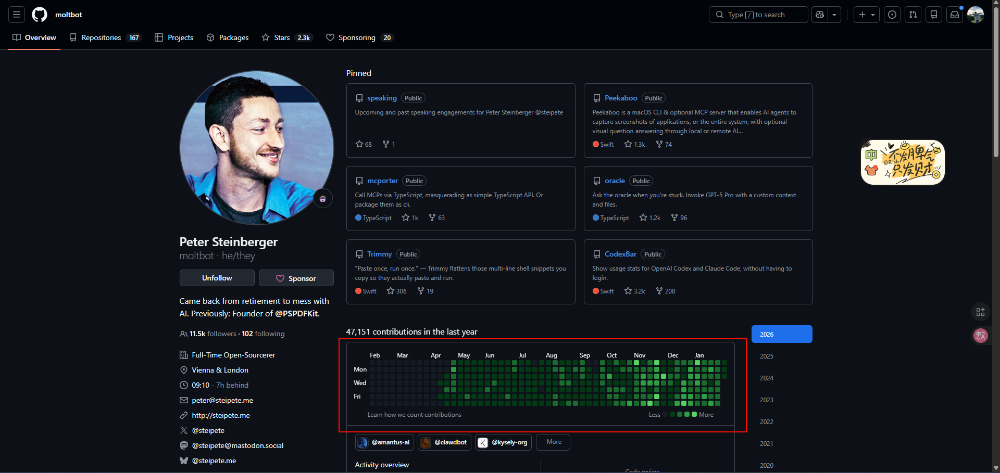

## NotebookLM

主要效果类似搭建知识库的效果，基于提供的pdf或者网站自主总结 

## 添加.claude  || skills  || 提交规范等

上面的都是vibe coding 的高级用法          需要去了解  和  掌握    

未来工作上能使用到 

之所以想了解这些，主要看了一个使用者    [github 上的神人](https://github.com/moltbot)   的文章

发现其使用.claude   用于规范代码结构    

目前自己只停留在  使用ai 得到一段能跑通的代码    所以需要提升自己使用ai的层次

## .claude  下添加skills 

[链接](https://www.cnblogs.com/javastack/p/19176207) 

可以下载相应的特定功能的技能   然后

