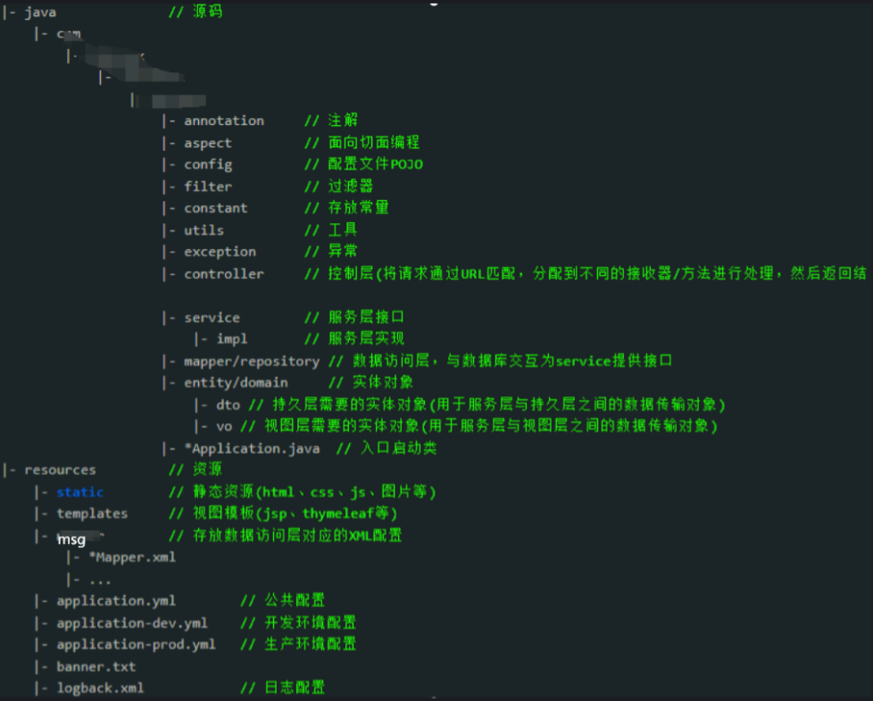

# WHOAMI框架3.0

## 开发前必读

### TODO.List

> 1.消息记录回收站功能
>
>  2.条件消息
>
>  3.敏感词过滤
>
>  4.特殊数据加密

### 修订记录

> 2024-12-20 版本：3.0.1
>
> 1. 新增batch、batchtrans、batchtransdb规则，增加批量发送规则
>
> 2. 新增多种组件引用，增加starter引用方式
>
> 3. 配置文件整理至whoami.db下
>
> 4. 删掉login、inituser、datatable、files等规则
>
> 5. 统一返回参数，后端使用AjaxResult返回格式为：{code:200, msg: "", data:[]}
>
> 6. $.sm函数去掉参数 t, did
>
> 7. session获取与设置改成工具类
>
> 8. Layuitable发送路由使用 $.layurl
>
> 9. system.js增加$.smaction函数，支持请求后台controller

| 方法                               | 替代方法                    |
| :--------------------------------- | :-------------------------- |
| request.getSession().getId()       | SecurityUtils.getId()       |
| request.getSession().getAttribute( | SecurityUtils.getAttribute( |
| request.getSession().setAttribute( | SecurityUtils.setAttribute( |

### 开发环境搭建

#### 1.搭建maven

\192.168.1.10\share01\开发环境搭建\apache-maven-3.8.4-bin.zip
安装教程：
https://blog.csdn.net/weixin_44080187/article/details/122933194
修改配置：apache-maven-3.8.4\conf\settings.xml
配置本地仓库：

```
<localRepository>D:\java\maven-repository</localRepository>
增加用户：用户名：全拼  密码：
<server>
      <id>butian-release</id>
      <username>用户名</username>
      <password>密码</password>
    </server>
	<server>
      <id>butian-snapshots</id>
      <username>用户名</username>
      <password>密码</password>
    </server>
	<server>
      <id>butian-maven</id>
      <username>用户名</username>
      <password>密码</password>
</server>
镜像地址配置：
<!--补天私有镜像-->
	 <mirror>
        <!--对应上面的用户名和密码-->
        <id>butian-maven</id>
        <name>butian nexus maven</name>
        <!--镜像采用配置好的组的地址-->
        <url>http://maven.bt-z.com/repository/java-group/</url>
        <mirrorOf>*</mirrorOf>
     </mirror>
```

开发搜索包地址：https://search.maven.org/

```
公司框架jar包引入：
<dependency>
    <groupId>com.btkjframe</groupId>
    <artifactId>whoami</artifactId>
    <version>2.0.0-SNAPSHOT</version>
</dependency>
开发时可以使用此版本，jar包有更新自动更新不需要删除。
配置快照版本库：
<profile>
    <!-- 开发环境 -->
    <id>dev</id>
    <properties>
        <profileActive>dev</profileActive>
        <profile.enviroment>dev</profile.enviroment>
    </properties>
    <repositories>
        <repository>
            <id>butian-snapshots</id>
            <url>http://maven.bt-z.com/repository/java-snapshout/</url>
            <releases><enabled>true</enabled></releases>
            <snapshots><enabled>true</enabled></snapshots>
        </repository>
    </repositories>
    <activation>
        <activeByDefault>true</activeByDefault>
    </activation>
</profile>
```

#### 2、idea安装

#### 3、前后端分离项目如何启动前端

1. vnginx代理

2. 软连接至后端项目内

```
1).进入后端项目src/main 文件浏览器内cmd，打开命令提示窗输入
语法：mklink /J "要创建的文件夹目录" "源文件目录"

>>mklink /J webapp E:\java\workspace2\zhongxiaoxue\zxx-web\src\main\webapp 

2).将创建出来的webapp文件添加到git ignore list中
```


### SpringBoot项目目录介绍

#### Spingboot项目目录结构



命名规范：
	包规范：com.btkj + 项目名
	入口类：*Application.java

文件目录说明：
	Java：后台文件目录
	resources：
配置文件、
	msg消息文件夹、
	META-INF/services
	db.properties 和 sys.properties 在jar包内用Global变量，包外用Config变量

#### 1、META-INF/services 下需要实现com.wrules.MyRuleDefine接口类

```java
public class MyRuleDefineImpl implements com.wrules.MyRuleDefine
type() 方法 return "whoami";
```

#### 2、入口函数做servlet扫描、访问文件映射

```java
@Configuration
@SpringBootApplication
@ServletComponentScan({"com.btkj", "com.whoami", "com.baidu"})
public class GroupEnter extends SpringBootServletInitializer implements WebMvcConfigurer {
    private static Logger log = Logger.getLogger(GroupEnter.class);
    private static String runtype = "";//运行方式
    private static String dirPath = "";//根目录

    public static void main(String[] args) throws Exception {
        log.info("------Start项目Jar启动！-------");
        checkWebAppPath();
        GroupEnter.runtype = "jar";
        SpringApplication.run(GroupEnter.class, args);
    }

    @Override
    protected SpringApplicationBuilder configure(SpringApplicationBuilder application) {
        log.info("------Start项目War启动！-------");
        GroupEnter.runtype = "war";
        return application.sources(GroupEnter.class);
    }

    /**
     * jar包启动文件映射
     *
     * @param registry
     */
    @Override
    public void addResourceHandlers(ResourceHandlerRegistry registry) {
        if (GroupEnter.runtype.equals("jar")) {
            log.info("------Start项目文件映射-------" + dirPath);
            // upload 文件映射
            registry.addResourceHandler("/upload/**").addResourceLocations("file:" + dirPath + File.separator + "upload" + File.separator);
            // userfiles 文件映射
            registry.addResourceHandler("/userfiles/**").addResourceLocations("file:" + dirPath + File.separator + "userfiles" + File.separator);
        }
    }

    /**
     * 使用redis存储session时
     * 希望服务器与浏览器的sessionId一模一样，设置变量 useBase64Encoding 为false
     * cookiename: JSESSIONID
     *
     * @return
     */
    @Bean
    public DefaultCookieSerializer defaultCookieSerializer() {
        log.info("------Start项目CookieSerializer-------");
        DefaultCookieSerializer defaultCookieSerializer = new DefaultCookieSerializer();
        defaultCookieSerializer.setUseBase64Encoding(false);
        defaultCookieSerializer.setCookieName("JSESSIONID");
        return defaultCookieSerializer;
    }

    /**
     * 检查文件夹
     */
    private static void checkWebAppPath() {
        dirPath = System.getProperty("user.dir") + File.separator + "src" + File.separator + "main" + File.separator + "webapp";
        try {
            File filepath = new File(dirPath);
            if (!filepath.exists()) {
                filepath.mkdirs();
            }
        } catch (Exception e) {
            log.error("------启动创建src/main/webapp出错-------");
        }
    }
}
```

#### 3、webapp: 前端目录

templates 前端模板文件夹
upload、userfiles 用户上传文件夹，文件夹内不应有代码文件，项目内可以没有此文件夹

#### 4、本地上传修改：

```properties
$.projectpath + '/plugin/ueditor/jsp/controller.jsp?action=uploadimage',// 文件接收服务端。
改为
$.projectpath + '/ueditorController?action=uploadimage',// 文件接收服务端。
```

## 编码规范

### 公司开发产品功能流程

- step1：功能的增加确认（产品）

> 确认需要增加的重点功能及模块
>
> 确认预计上线时间（对内，对外）

- step2：设计功能原型以及对应PRD需求文档说明（产品）

- step3：产品，开发，测试开会碰功能内容（产品主导宣讲）

- step4：

> 开发及测试人员进行功能需求的分析（参照原型和PRD文档）--整理问题
>
> 产品同步配合UI进行出图
>
> 开发订开发计划（包含所有内容的开发）
>
> 测试订测试计划

- step5：开会解答问题、设计评审、开会碰计划

- step6：前端静态开发

> 开发开始进行数据库设计等开发工作-》开发
>
> 测试整理流程图-功能点-测试用例（基本可以省略，前提功能点整理基本完整）
>
> 产品需配合前端进行样式的调整（在开发和测试过程中仍会存在流程缺陷等问题）
>
> 产品配合更新所有东西
>
> 静态页面开发完，提供可访问路径，由设计、产品进行设计还原度比差，尽可能在前期发现问题

- step7：开发进行功能的提测，测试开始（标准：基本功能流程跑通，测试过程中不报错）

- step8：开会碰进度等--多次会议

- step9：Bug的修改、测试人员的测试

- step10：开会碰延期原因（穿插工作的记录）

- step11：测试完毕-与产品确认，哪些遗留问题是都可以不在本期上线

- step12：测试报告发出，产品上线

- step13：迭代工作的持续进行。。。。。。

### CSS编写规范

#### 一、XHTML书写规范

1. **所有标签的元素和属性的名字都必须使用小写**

与HTML不一样，XHTML对大小写是敏感的，`<h>` 和`<H>`是不同的标签。XHTML要求所有的标签和属性的名字都必须使用小写。例如：`<BODY>`应写成`<body>` ，大小写夹杂也是不被认可的（包括CSS样式定义中也要使用小写字母）。

2. **正确嵌套所有元素**

同样因为XHTML要求有严谨的结构，因此所有的嵌套都必须按顺序，以前我们这样写的代码：
`<p><b></p>/b>`
必须修改为：
`<p><b></b>/p>`
就是说，一层一层的嵌套必须是严格对称。

3. **所有的标记都必须要有一个相应的结束标记**

以前在HTML中，你可以打开许多标签，例如`<p>`和`<li>`而不一定写对应的`</p>`和`</li>`来关闭它们。但在XHTML中这是不合法的。XHTML要求有严谨的结构，所有标签必须关闭。如果是单独不成对的标签，在标签最后加一个"/"来关闭它。例如:

```xml
    <br /> 
```

4. **所有的属性必须用引号" "括起来**

在HTML中，你可以不需要给属性值加引号，但是在XHTML中，它们必须被加引号。例如:
`<height=80>`
必须修改为：
`<height="80">`

5. **明确所有属性的值**

XHTML规定所有属性都必须有一个值，没有值的就重复本身。例如：
`<td nowrap> <input type="checkbox" name="shirt" value="medium" checked>`
必须修改为：
`<td nowrap="nowrap"> <input type="checkbox" name="shirt" value="medium" checked="checked">`

6. **特殊字符要用编码表示**

在XHTML中，页面内容含有的特殊字符都要用编码表示。如：
任何小于号（<），不是标签的一部分，都必须被编码为& l t ;
任何大于号（>），不是标签的一部分，都必须被编码为& g t ;
任何与号（&），不是实体的一部分的，都必须被编码为& a m p;

7. **使用页面注释**

XHTML中使用`<!--和-->`作为页面注释，其示例代码如下：
`<!--这是一个注释 -->`

#### 二、CSS书写规范

1. **CSS基本书写规范**

> - 在使用CSS时，建议使用调用的CSS，而不是把CSS写在XHTML文档里
> - 在书写每个属性时，使用换行并使用相同的缩进
> - CSS所有的长度值都要注明单位，当值是0时除外。
> - 注释的语法为：`/*这是CSS中的一个注释*/`

2. **CSS命名参考**


3. **CSS样式表书写顺序**

> - 显示属性（display、list-style、position、float、clear）
> - 自身属性（width、height、margin、padding、border、background），其中width、height、margin、padding最好写在对应的html的style代码里.
> - 文本属性（color、font、text-decoration、text-align、vertical-align）

4. **多人在同一样式表中定义样式书写规范**

> - 先写注释，注释中写上自己的名字，如：`/*王明--新闻页面样式*/`
> - 浏览下已有的样式，可以重用的要尽量重用。
> - 定义样式名时，注意别和已有的样式名重合。
> - 样式属性能缩写时，尽量缩写（见三.CSS代码优化—代码缩写）。

#### 三、CSS代码优化

##### 1.代码缩写

- 1)颜色的缩写

如果颜色的值是成对出现，则可以缩写，如：
\#666666可缩写为：#666，#ffooee可缩写为：#foe

- 2)列表和背景的缩写：

```css
列表和背景属性可以用复合属性替代多个单项属性，例如：
#newslist {
list-style-type: circle;
list-style-image: url(star.img);
list-style-position: inside;}
可以说缩写为：
#newslist {
list-style: circle url(star.img) inside;}
.bg{
    background-color：#FFFFFF;
    background-image：url (background.gif);
   background-repeat：no-repeat;
   background-attachment：fixed;
   background-position：0 0; }
可以缩写为：
.bg{
background：#FFF url (background.gif) no-repeat fixed 0 0; } 
上面这些属性值没有先后顺序，也不管单项属性有几个，都可以用复合属性压缩代替。
```

- 3)边框的缩写

```css
比如：.border{
border-width：1px;
border-style：solid; 
border-color：#FFFFFF; }
可以简写成：.bordr{
 border：1px solid #FFF; }
又比如：.border{
border-top-color: red;
border-top-width: 100px;
border-top-style: dotted;
}
可以缩写为：.border{
border-top: red 100px dotted;}
```

- 4)边界的缩写

```css
比如：.mg{ margin-top:10px;
margin-left:20px;
margin-right:20px;
margin-bottom:10px; }
可以写成：.mg{ margin:10px 20px 10px 20px; }顺序是：“上-右-下-左”
或者： .mg{ margin:10px 20px; }顺序是：“上下-左右”
```

- 5)补白的缩写：同上

- 6)字体样式的缩写

```css
比如：.font{ font-weight:bold;
font-size:12px; 
line-height:120%; 
font-family:”宋体”,”Arial”;  }
可以写成：.font{ font：bold 12px/120% “宋体”,”Arial”; }
注意：如果仅定义部分属性，同样也可以缩写，但要保证定义font-size和font-family两个属性值，且位置按顺序排在值列表的最后。另外，font-size和line-height应用斜杠连接在一起。
```

##### 2.合理利用选择符

- 1)使用选择符分组

```css
使用选择符分组，可以统一定义几个选择符的属性，节约大量的代码。使用选择符分组的前提是，几个选择符具有完全（或部分）相同的属性。把相同的部分定义在一起，然后把特殊的部分单独定义。如：
h1{ font-family:“黑体”；}
h2{ font-family:“黑体”；
font-size: 12px;}
.content{ font-family:“黑体”；}
#news{ font-family:“黑体”；}
可以优化为：
h1,h2,.content.#news{ font-family:“黑体”；}
h2{ font-size: 12px;}
```

- 2)使用子选择符

合理的使用子选择符，不但可以说节省代码，同时也减少了自定义选择符的数量，使页面结构更加清晰。

- 3)同一个元素的多重定义

有时，会在一个元素中使用多个CSS选择符，这样可以减少自定义选择符的数量。一个元素同时使用多个选择符的示例如下：
`<div class=”one two”></div>`
最终的表现效果是两个类中属性的叠加。

#### 四、CSS实用技巧

1. 通常中编写CSS文档时，会首先定义基础样式，这些样式不但可以提高代码的重用率，同时取消了可能存在的兼容问题元素的补白和边界。如：

```css
*{
    list-style-type: none;
    margin: 0;
    padding: 0;
    font-size: 12px;
    text-decoration: none;
  }
img{
    border: 0px;
}
ul{
    margin: 0;
    padding: 0;
}
form{
    padding: 0;
    margin: 0;
}
.clear{ clear: both;}
```

2. 在列表中可以使用list-style-image属性定义项目符号，但有很多缺点，最主要的是无法灵活控制项目符号的位置。解决方法是使用background-image设置背景属性，并配合back-position属性来精确定位背景图像的位置。

3. 在实际调试中，使用背景颜色的方法是很常用的技巧，不使用边框，是考虑到边框要占用一定的空间。

4. 当类选择符与类型选择符同时使用时，类选择符的优先级高于类型选择符。字体简体样式定义： `.text{font：bold 24px/160% “宋体”}`

5. 为了有更好的扩展性，在页面内容中大的布局区域和可能会设置动作的地方使用ID（方便使用JavaScript等脚本），在页面内容部分使用Class.

6. 链接的顺序：:link、:visited类、:hover、:active

7. 链接过长使用省略号语句：

```scss
a {width：200px;
overflow：hidden；
white-space：nowrap；
text-overflow：ellipsis；}
```

#### 五、浏览器及兼容问题

以下主要是对IE6.0,IE7.0,FireFox,三种浏览器的兼容问题。

1. ! important的使用

使用了! important的属性将具有较高的优先权。IE6.0不支持这个属性，IE7.0和FireFox支持这个属性。所以可以用来兼容IE6.0和IE7.0,FireFox,浏览器。其语法如下：
属性：属性值 ! important;
如：

```css
.content{
width:300px;
           width:500px  ! important; /*注意important放在下边*/}
```

则最终的效果是，IE中宽为300px, IE7.0,FireFox中宽为500px。

2. CSS hack

```maxima
例如：.content {height：20px;/*IE6,IE7,FF兼可*/
              *height：25px ！important;/仅IE7*/
              *height：30px /仅IE6*/}
```

3. 水平居中的问题

在CSS中，控制水平居中的属性是text-align:center;,在IE中，不但可以使元素中的文本水平居中，同时也可以使元素内嵌的块元素居中。但是在FireFox中，却只能使文本内容居中，所以要使用margin属性来解决IE和FireFox浏览器的块元素的水平居中。如：

```css
.content{
width:300px;
margin:0 auto;/*使用margin属性的左右边界取值为auto,就可以实现水平居中*/
}
```

4. 垂直居中的问题

如果是单行文本，可以通过设置line-height等于元素的高度值即可。
即：div{height: 40px; line-height: 40px;}
如果父元素高度固定，也可通过上下边界取值来实现。
也可以用vertical-align属性实现垂直居中，但在非IE浏览器中，需要配合display属性使用。例如：

```css
div{
vertical-align: middle;/*垂直居中，必须条件*/
display: table-cell;/*以表格单元格方式显示，必须设置*/
height: 40px;
width: 50px;}
```

5. 解决链接外围虚框

点击超链接时会在外围出现一个虚线轮廓。解决方法：

```xml
FF：a{outline：none;}
IE：<a hidefocus=”true”>去掉虚线</a>
```

6. IE浮动下边界双倍

IE6在浮动状态下边界为双倍的Bug，解决方法：加上属性：display：inline。

7. 手形显示

显示手形：FF、IE下cursor：pointer；值为hand时，仅IE可以。

8. 浏览器解释相差2px

FF、IE7与IE6解释相差2px，解决方法：

```css
div {margin：30px ! important；
margin：28px；}顺序不可写反。
```

9. ul默认定义

ul在FF下有padding，在IE中默认有margin；应先定义：

```css
ul{margin：0；padding：0；}
```

10. IE6多余字符Bug

在IE6中，有时会出现多余字符Bug，解决方法：

- 在最后一个字符后面添加一个空格，或把span元素改为div。
- 若在浮动元素中添加注释也会出现此类问题：去掉注释即可。

### 数据库规范

#### 一、命名规范：

- 框架所用到的命名均以w_开头，其他不能以此开头。

- 为兼容unix系统，在程序代码中会涉及到的数据库的相关命名全部用小写字母，如表名，字段名,名称各部分均以下划线分隔，如w_user_property。英文字母不能使用关键字。

- 前缀：根据具体项目定义前缀，以下命名可以加或者不加这个前缀，字母小写，如j。

- 表名：前缀_英文字母组合，最好加前缀。

- 字段名：前缀_英文字母组合，一般情况不加。

- 如果字段名只在本表中使用，不是主键或者外键，省略表名，如果该字段是主键或者外键，命名不能省略表名，如article表的article_id字段（文章编号，主键）以及title字段（文章标题，普通字段）

- 存储过程：前缀_sp_表名_操作名 如：j_sp_user_delete

- 视图：前缀_vi_实际意义名 如：j_vi_user_info

- 索引：前缀_idx_索引字段名 如j_idx_username

- 函数：前缀_fun_实际意义名 如j_fun_getformatdate

- 外键：前缀_fk_父表名_子表名 如 j_fk_juser_jbloguser

- 触发器：前缀_ tr _实际意义名 如：j_tr_userinfo

- 语句关键字全部小写，如：select 、update等

- Xml数据字段要大写

- SQL语句起别名 加上as 、 别名尽量短

#### 二、字段类型和长度规范：

##### 1.基本类型

( 1 )varchar(2) ：长度：根据字段意义 例如：20（名称类） 50（标题类） 500（简介类），其他特殊要求的，有明确长度的（如邮编）
( 2 )integer ：用于id等自动增长 smallint：用于状态位标识
( 3 )numeric(x,y)： 带小数类型的，小数点精确到实际意义所要求位数
( 4 )timestamp：视具体的情况精确到天或者秒等等
( 5 )bool：就是布尔类型，true or false

#### 三、常用中英文对照数据字典（大小写参见表名和字段名规则）：

### Java代码规范


### Js代码规范


## 公司组件

### whoami-spring-boot-starter

消息机制，自启动引用

```xml
    <dependency>
        <groupId>com.btkjframe</groupId>
        <artifactId>whoami-spring-boot-starter</artifactId>
        <version>3.0.1</version>
    </dependency>
```

#### 1. 前端消息请求入口，定义Controller 接口

```java
package com.btkj.admin.controller;

import com.btkj.admin.core.domain.AjaxResult;
import com.btkj.admin.security.service.TokenService;
import com.btkj.admin.security.utils.SecurityUtils;
import com.btkj.admin.service.impl.EnterRpcImpl;
import com.whoami.core.MsgEnter;
import com.whoami.entity.ReqData;
import com.whoami.util.ServletUtils;
import com.alibaba.fastjson2.JSONObject;
import com.whoami.util.StringUtil;
import org.springframework.beans.factory.annotation.Autowired;
import org.springframework.web.bind.annotation.GetMapping;
import org.springframework.web.bind.annotation.PostMapping;
import org.springframework.web.bind.annotation.RestController;

import javax.servlet.http.HttpServletRequest;
import javax.servlet.http.HttpServletResponse;
import java.io.UnsupportedEncodingException;


/**
 * Enter
 * 前端消息请求入口
 *
 * @whoami 2024/06/28
 */
@RestController
public class EnterController {

    @Autowired
    MsgEnter msgEnter;

    @Autowired
    EnterRpcImpl enterRpc;

    @Autowired
    private TokenService tokenService;

    /**
     * 消息请求
     *
     * @param request
     * @param response
     * @return
     */
    @PostMapping("/Enter")
    public AjaxResult enterPost(HttpServletRequest request, HttpServletResponse response) throws UnsupportedEncodingException {
        String rpc = request.getParameter("rpc");
        ReqData req = new ReqData(tokenService.getToken(request), ServletUtils.getParamMap(request), SecurityUtils.getLogUserMap());
        JSONObject jsonRe;
        Object res;
        if (StringUtil.notNull(rpc)) {
            res = enterRpc.getMsgData(req);
            //跳转外部请求
        } else {
            res = msgEnter.doMsgObj(req, request, response);
        }

        if (res instanceof String) {
            jsonRe = JSONObject.parse(String.valueOf(res));
        } else {
            jsonRe = (JSONObject) res;
        }

        if (jsonRe.containsKey("error")) {
            return AjaxResult.error(jsonRe.getString("error"));
        } else {
            return AjaxResult.success(jsonRe.containsKey("re") ? jsonRe.get("re") : jsonRe);
        }
    }

    /**
     * Layui消息请求
     *
     * @param request 1
     * @param response 2
     * @return 3
     */
    @GetMapping("/LayEnter")
    public JSONObject laytablePost(HttpServletRequest request, HttpServletResponse response) throws UnsupportedEncodingException {
        String rpc = request.getParameter("rpc");
        ReqData req = new ReqData(tokenService.getToken(request), ServletUtils.getParamMap(request), SecurityUtils.getLogUserMap());
        JSONObject jsonRe;
        Object res;
        if (StringUtil.notNull(rpc)) {
            res = enterRpc.getMsgData(req);
            //跳转外部请求
        } else {
            res = msgEnter.doMsgObj(req, request, response);
        }

        if (res instanceof String) {
            jsonRe = JSONObject.parse(String.valueOf(res));
        } else {
            jsonRe = (JSONObject) res;
        }
        return jsonRe;
    }

    /**
     * RPC消息请求
     *
     * @param request
     * @param response
     * @return
     */
    @PostMapping("/EnterRpc")
    @GetMapping("/EnterRpc")
    public String enterRpcPost(HttpServletRequest request, HttpServletResponse response) throws UnsupportedEncodingException {
        request.setCharacterEncoding("utf-8");
        ReqData req = new ReqData(tokenService.getToken(request), ServletUtils.getParamMap(request), SecurityUtils.getLogUserMap());
        String strre = (String) enterRpc.getMsgData(req);
        response.setContentType("text/html;charset=utf-8");
        return strre;
    }
}
```

#### 2. 支持后端调用消息，尽量不在java中拼接sql

MsgUtils.sm模拟前端发送格式，使用方法同前端发消息一样

```java
public class testController {

    @Autowired
    MsgUtils msgUtils;

    /**
     * 消息请求
     *
     * @param request
     * @param response
     * @return
     */
    @RequestMapping(value = "/test", method = {RequestMethod.GET, RequestMethod.POST})
    public String enterGet(HttpServletRequest request, HttpServletResponse response) throws UnsupportedEncodingException {
        JSONArray arrmsg = new JSONArray();
        arrmsg.put("index.getholidays");
        JSONObject objwhere = new JSONObject();
        JSONArray arryear = new JSONArray();
        arryear.put("2023");
        arryear.put("2024");
        objwhere.put("intyear", Global.msgpJoin(arryear));
        arrmsg.put(Global.msgwhere(objwhere, null));//$.msgwhere({intyear: $.msgpJoin(year)})
        JSONObject msgObj = msgUtils.sm(arrmsg, "", "", null, "", request, response, SecurityUtils.getLogUserMap());
        System.out.println(msgObj.toString());
        return msgObj.toString();
    }
}
```

### easycaptcha-spring-boot-starter

**登录验证码，自启动引用**

```xml
    <dependency>
        <groupId>com.btkjframe</groupId>
        <artifactId>easycaptcha-spring-boot-starter</artifactId>
        <version>3.0.1</version>
    </dependency>
```

#### 1. 可选配置

```yaml
whoami:
  # 验证码配置
  easycaptcha:
    # 验证码开关
    Enabled: true
    # 长度
    length: 4
    # 验证码类型
    codeType: GIF
    # 验证码宽度
    width: 111
    # 验证码高度
    height: 36
    # 验证码字体
    fontName: 
    # 字体大小
    fontSize: 25
```

#### 2.Controller 接口

```java
import com.whoami.captcha.service.EasyCaptchaService;


/**
 * 验证码操作处理
 *
 * @author whoami
 */
@Configuration
@RestController
public class CaptchaController {
    // 是否使用验证码
    @Value("${whoami.easycaptcha.Enabled:false}")
    private boolean captchaEnabled;

    @Autowired
    private EasyCaptchaService easyCaptchaService;

    @Autowired
    private RedisUtils redisUtils;
    
    /**
     * 生成验证码
     */
    @GetMapping("/captcha")
    public AjaxResult getCode(HttpServletResponse response) throws IOException {
        AjaxResult ajax = AjaxResult.success();

        ajax.put("captchaEnabled", captchaEnabled);
        if (!captchaEnabled) {
            return ajax;
        }

        String uuid = IdUtils.simpleUUID();
        String verifyKey = CacheConstants.CAPTCHA_CODE_KEY + uuid;

        String capStr;
        String code;
        Map<String, String> mpCaptcha = easyCaptchaService.getCaptchaValueAndBase64(CodeTypeEnum.GIF);
        code = mpCaptcha.get("code");
        capStr = mpCaptcha.get("base64");

        // 保存验证码信息
        redisCache.setCacheObject(verifyKey, code, Constants.CAPTCHA_EXPIRATION, TimeUnit.MINUTES);

        ajax.put("uuid", uuid);
        ajax.put("img", capStr);
        return ajax;
    }

    //1、算术类型
    @GetMapping("/captcha1")
    public Map getGifcCaptcha1() {
        return easyCaptchaService.getCaptchaValueAndBase64(null);
    }

    //2、Gif
    @GetMapping("/captcha2")
    public Map getGifcCaptcha2() {
        return easyCaptchaService.getCaptchaValueAndBase64(CodeTypeEnum.GIF);
    }

    //3、png类型
    @GetMapping("/captcha3")
    public Map getGifcCaptcha3() {
        return easyCaptchaService.getCaptchaValueAndBase64(CodeTypeEnum.SPEC);
    }

    //4、chinese文字类型
    @GetMapping("/captcha4")
    public Map getGifcCaptcha4() {
        return easyCaptchaService.getCaptchaValueAndBase64(CodeTypeEnum.CHINESE);
    }

    //4、chinese Gif类型
    @GetMapping("/captcha5")
    public Map getGifcCaptcha5() {
        return easyCaptchaService.getCaptchaValueAndBase64(CodeTypeEnum.CHINESE_GIF);
    }
}
```

### redisutil-spring-boot-starter

**reidis工具，自启动引用**

```xml
    <dependency>
        <groupId>com.btkjframe</groupId>
        <artifactId>redisutil-spring-boot-starter</artifactId>
        <version>3.0.1</version>
    </dependency>
```

#### 1. 配置

```yaml
spring:
  redis:
    host: 192.168.1.115
    password: nwbt@123
    port: 31111
    timeout: 7200
    lettuce:
      pool:
        # 连接池中的最小空闲连接
        min-idle: 0
        # 连接池中的最大空闲连接
        max-idle: 8
        # 连接池的最大数据库连接数
        max-active: 8
        # #连接池最大阻塞等待时间（使用负值表示没有限制）
        max-wait: -1ms
```

#### 2. 调用

```java
import com.whoami.redisutil.service.RedisUtils;

@Component
public class Test{
    @Autowired
    private RedisUtils redisUtils;
    
    public String get(){
        //更多方法参见RedisUtils
        redisUtils.setCacheObject(...);
        ...
    }
    
}
```

### smsfactory-spring-boot-starter

短信工厂启动引用[#](https://share.apifox.cn/98badc4f-73a4-4f9c-ac97-0248ed8f5d2f/doc-5662329#短信工厂启动引用)

```xml
    <dependency>
        <groupId>com.btkjframe</groupId>
        <artifactId>smsfactory-spring-boot-starter</artifactId>
        <version>3.0.1</version>
    </dependency>
```

#### 1. 可选配置

```yaml
whoami:
  # 验证码配置
  sendsms:
    arracount:
        id: #ID，可自定义标识
            platform:        #平台类型:ALIYUN、TENCENT、QINIU、HUAWEI
            groupName:       #分组名称
            signName:        #短信签名
            templateId:      #短信模板
            appId:           #短信应用的ID，如：腾讯云等
            senderId:        #腾讯云国际短信、华为云等需要
            url:             #接入地址，如：华为云
            accessKey:       #AccessKey
            secretKey:       #SecretKey
        id2: #ID，可自定义标识
            platform:        #平台类型:ALIYUN、TENCENT、QINIU、HUAWEI
            groupName:       #分组名称
            signName:        #短信签名
            templateId:      #短信模板
            appId:           #短信应用的ID，如：腾讯云等
            senderId:        #腾讯云国际短信、华为云等需要
            url:             #接入地址，如：华为云
            accessKey:       #AccessKey
            secretKey:       #SecretKey
```

#### 2.使用

```java
@service
public class SmsTest {
    
    @Autowired
    private SmsStrategyFactory smsStrategyFactory;

    
    /**
     * 测试验证码
     */
    public static void main(String[] args) {
        try {
            //手机号
            String mobile = "13120160000";
            //参数
            Map<String, String> params = new HashMap<>();
            params.put("code", "123456");
            params.put("name", "张三");
            //发送
            String code = smsStrategyFactory.getByID("id2").send(mobile, params);
            if("OK".equals(code)){
                log.info("success");
            }
        } catch (Exception ex) {
            ex.printStackTrace();
        }
    }
}
```

### sms-spring-boot-starter

阿里大于短信验证  **<font color=red>已经弃用</font>**

### aliyunoss-spring-boot-starter

**阿里云oss启动引用**

```xml
    <dependency>
        <groupId>com.btkjframe</groupId>
        <artifactId>aliyunoss-spring-boot-starter</artifactId>
        <version>3.0.1</version>
    </dependency>
```

#### 1. 可选配置

```yaml
whoami:
  # oss配置
  oss:
    OSS_ACCESS_ID: LTt8b********j3pqoZ8m
    OSS_ACCESS_KEY: RKVFWey8**********630fnlk
    OSS_URI: oss-cn-beijing.aliyuncs.com/
    OSS_BUCKETNAME: alot-zxx
```

#### 2. 测试使用

```java
@service
public class AliyunTest {
    
    @Autowired
    private OSSUtil ossUtil;

    
    /**
     * 测试
     */
    public static void main(String[] args) {
        try {
            ossUtil.
        } catch (Exception ex) {
            ex.printStackTrace();
        }
    }
}
```

### whoami-java

**whoami消息机制jar包，可以直接引用jar包，实现消息机制，也可以由whoami-spring-boot-starter自动装配。**

#### 1. 直接引用方式：

```
    <dependency>
        <groupId>com.btkjframe</groupId>
        <artifactId>whoami-java</artifactId>
        <version>3.0.1</version>
    </dependency>
```

#### 2. Controller 接口

```
DBConfig dBConfig = new dBConfig();
MsgEnter enter = new MsgEnter(dBconfig);
```

### baidu

**baidu工具jar包，提供百度Ueditor后台接口**

```xml
    <dependency>
        <groupId>com.btkjframe</groupId>
        <artifactId>baidu</artifactId>
        <version>3.0.1</version>
    </dependency>
```

####  项目需实现Controller 接口

```java
import com.baidu.ueditor.ActionEnter;

@RestController
public class UeditorController {

    /**
     * ueditor请求
     *
     * @param request  1
     * @param response 2
     * @return 3
     */
    @PostMapping("/ueditorController")
    public String ueditpost(HttpServletRequest request, HttpServletResponse response) throws UnsupportedEncodingException {
        request.setCharacterEncoding("utf-8");
        response.setHeader("Content-Type", "text/html");
        return new ActionEnter(request, request.getServletContext().getRealPath("/")).exec();
    }

    /**
     * ueditor请求
     *
     * @param request  1
     * @param response 2
     * @return 3
     */
    @GetMapping("/ueditorController")
    public String ueditget(HttpServletRequest request, HttpServletResponse response) throws UnsupportedEncodingException {
        request.setCharacterEncoding("utf-8");
        response.setHeader("Content-Type", "text/html");
        return new ActionEnter(request, request.getServletContext().getRealPath("/")).exec();
    }
}
```

### aliyun

**aliyun OSS工具jar包**

```xml
    <dependency>
        <groupId>com.btkjframe</groupId>
        <artifactId>aliyun-java</artifactId>
        <version>3.0.1</version>
    </dependency>
```

## 消息机制

### WHOAMI消息框架 前往 --> [00.WHOAMI消息框架.md](./00.WHOAMI消息框架.md)

### 单个消息发送示例

> 📌.*sm*=.fn.sm = function (cb, arr, pobj, timeout, trans) {}
> cb: 回调函数
> arr: 消息数组
> pobj: 拓展对象，如异步类型async、远程rpc
> timeout: 超时时间
> trans: 事务类型，1.单库批量事务执行 2.多库批量事务执行

#### 1. 普通异步消息

**发送普通异步消息举例**

```js
$.sm(function (re1, err1) {
    if (re1) {
        //返回值为数组，和消息位数相对应
    } else {
        jQuery.getparent().layer.msg(err1, {icon: 5});
    }
}, ["user.list"]);
```

#### 2. 同步消息

**发送同步消息举例 async:false**

```js
$.sm(function (re1, err1) {
    if (re1) {
        //返回值为数组，和消息位数相对应
    } else {
        jQuery.getparent().layer.msg(err1, {icon: 5});
    }
}, ["user.list"], {async: false});
```

### 批量消息发送示例

**多个消息一块发送后台执行，可以减少请求次数**

> 📌.*sm*=.fn.sm = function (cb, arr, pobj, timeout, trans) {}
> cb: 回调函数
> arr: 消息数组
> pobj: 拓展对象，批量消息msgid（必填）、trans事务执行
> timeout: 超时时间
> trans: 事务类型，1.单库批量事务执行 2.多库批量事务执行

#### 1.【查询类型】批量消息

**普通批量查询消息，可以使用batch消息，加msgid；也可以直接发送批量消息**

```xml
<msg id="user.list" type="batch" title="查询用户" businesstype="SELECT">
    <include id="user.getDepart"/>
    <include id="user.role_user"/>
    <include id="user.post_user"/>
</msg>
```

##### 前端调用

```js
var arrsm = [];
arrsm.push(['user.getDepart']);
arrsm.push(['user.role_user']);
arrsm.push(['user.post_user']);
$.sm(function (re1, err1) {
    if (re1) {
        //返回值为数组，和消息位数相对应
    } else {
        jQuery.getparent().layer.msg(err1, {icon: 5});
    }
}, arrsm);
```

#### 2.【操作类型】批量消息

**添加、修改、删除类型的消息批量发送，**

**要使用批量消息类型batch、batchtrans、batchtransdb，加msgid**

```xml
<msg id="user.add" type="batchtransdb" perms="sys:user:add" title="添加用户" businesstype="INSERT">
    <include id="deptlist.add"/>
    <include id="postlist.add"/>
    <include id="user.save" insertfromids="deptlist.add,postlist.add" insertkeys="depart_id,post_id"/>
</msg>
```

##### 前端调用

```js
var arrpm = [];
arrpm.push(["deptlist.add", JSON.stringify({
        depart_name: "技术部"
    }), $.msgwhere()]);
arrpm.push(["postlist.add", JSON.stringify({
        post_code: "123",
        post_name: "开发岗",
        post_sort: 123,
        status: 1
    }), $.msgwhere()]);
arrpm.push(["user.save", JSON.stringify({
        uname: "lihongli",
        nick_name: "李红利",
        depart_id:0,
        status:0
    }), $.msgwhere()]);
    
$.sm(function (re, err) {
    console.log("btnlogin - re -> " + re);
    console.log("btnlogin - err -> " + err);
}, arrpm, {msgid: "user.add"});
```

#### 3.【RPC远程调用】消息

**框架新增内部系统之间调用消息方式，规则如下：**

```xml
/**
 * 通过前端消息形式请求外部系统，直接复用外部系统消息id，消息上需要加rpc标识，等于调用系统名称，sm函数传参调用
 * 需要传递t, did, rpc参数， 外部系统消息不能带{session}信息
 * rpc 传入方式system.js中sm函数带入"rpc": (pobj && pobj.rpc) || ""
 * rpc: 系统标识 如tongbang  fuyou  fyyypt等，注意在sys.properties中要有对应系统地址(标识+Address) 如tongbangAddress
 */
 
<msg id="tong.people" type="select" v="" rpc="buy"/>
$.sm(function(re, err){
    if(re){
    }
}, ["其他系统消息"], {rpc: 'fuyou'});
```

### 其他接口消息发送示例

**请求自定义后台接口，封装了统一调用ajax方法**

> 📌/**
>
> 请求controller的方法
>
> @param {Object} cb 调用结束后的回调
>
> @param {Object} param 请求的参数 json对象格式
>
> @param {Object} pobj 必填，包含route(路由，既微服务名称)、action(controller路径)，其他key自定。 例如：{route:'bzn-xcx-tbpt', action: 'yey/list'}
> */
> .*s**ma**c**t**i**o**n*=.fn.smaction = function(cb, param, pobj, timeout){}

#### 【请求示例】

规则如下：

```js
var param = {
    name: '张三'
};
$.smaction(function(re, err){
    if(err){
        parent.layer.closeAll("loading");
        return parent.layer.msg(err);
    }
    console.log(re);
    cb && cb(dataset_id);
}, param, {route: "rag", action: "dataset/update", datastring: true, })
```

### 消息类型  前往--> [00.架构文档(非常重要).md](./00.架构文档(非常重要).md)

## Util工具类 前往 --> [00.util工具类.md](00.util工具类.md)

## 公共服务类

### 短信服务

#### 配置短信服务地址

```
    #短信接口
    smsAddress=http://localhost:8111/sms/send
    #测试环境
    smsAddress=https://sms.bt-z.com/sms/send
```

#### 对外提供短信服务列表

| 名称                           | 服务smsid   | 模板ID        | 模板内容                                                     |
| :----------------------------- | :---------- | :------------ | :----------------------------------------------------------- |
| 入园关注通知                   | inscholl    | SMS_194056048 | {code}已在{yname}入园成功，请关注“健康童帮”微信公众号，查看宝宝在园信息。立即绑定h.tb-n.com |
| 登录确认验证码                 | logincode   | SMS_15990007  | 验证码{code}，您正在登录{product}，若非本人操作，请勿泄露。  |
| 上报结果反馈                   | fyiiiup     | SMS_463590836 | {name}上报妇幼处理{status}，成功率{percent}%，详情请登录童帮软件查看 |
| 认证受理通知                   | certaccept  | SMS_36210017  | 尊敬的用户{name}，您申请的{rzname}的信息我们已经受理，如有疑问，请致电{tel} |
| 开通幼儿园通知                 | openyey     | SMS_27905038  | 亲爱的{name}，已成功创建{yey}。用户名：{phone}，密码：{pw}。为了账户安全，请及时修改密码！ |
| 园所端开通                     | openlabyey  | SMS_207971411 | 您申请的开放实验室已通过，网址：yey.tb-n.org，用户名：{phone}，密码：{pw} |
| 政府端开通                     | openlaborg  | SMS_207961048 | 您申请的开放实验室已通过，网址：openlab.tb-n.org，用户名：{phone}，密码：{pw} |
| 少儿膳食健康计划幼儿园开通通知 | ssjkjh      | SMS_115045021 | 您好，您园所的管理平台已开通，用户名：{u} 密码：{p}， 请登陆 adm.ssjkjh.cn |
| 绑定验证码                     | bindcode    | SMS_16025001  | 绑定验证码为{code}，感谢您的支持！                           |
| 园培通登录验证                 | yptlogin    | SMS_246835485 | 您的登录验证码是:{code}，请勿泄露给他人。如非本人操作，请忽略本条信息。 |
| 区域托幼健康平台               | chdcAcount  | SMS_106185002 | 您的账户已由{c}创建完成，用户名：{u} 密码：{p}， 请登陆 chdc.tb-n.org 修改密码，谢谢配合 |
| 开放实验室                     | chdcOpenLab | SMS_207500578 | 验证码：{code}（教育局开放实验室申请验证码，请不要向任何人透漏！） |

#### 接口参数

**params**

| 参数名 | 内容     | 是否必填 |
| :----- | :------- | :------- |
| sys    | 系统标识 | 是       |

**body JSON**

| 参数名 | 内容                   | 是否必填 |
| :----- | :--------------------- | :------- |
| mobile | 手机号                 | 是       |
| smsid  | 短信ID，获取见上面列表 | 是       |
| 其他   | 短信内容参数           | 是       |

#### 使用

```java
@service
public class SmsTest {
    
     /**
     * 根据配置参数和手机号发送随指定验证码
     *
     * @param param 发送参数
     * @param sys 系统标识 如：tongbang
     * @return
     */
    public static String send_sms(JSONObject param, String sys) {
        Map<String, String> headers = new HashMap<>();
        headers.put("Content-Type", "application/json");
        String resultStr = HttpUtil.doPost(headers, Global.map.get("smsAddress") + "?sys=" + sys, param);
        if (StringUtil.notNull(resultStr)) {
            JSONObject resObj = new JSONObject(resultStr);
            return resObj.optString("code");
        } else {
            return "500";
        }
    }
    
    /**
     * 发送验证码
     *
     * @param p
     * @param cp
     * @param request
     * @return
     */
    public static String sendVcode(String[] p, String[] cp, HttpServletRequest request) {
        log.info("sendVcode");
        String mobile = p[1];
        // 1. 生成验证码
        int randNum = (int) ((Math.random() * 9 + 1) * 100000);
        String valCode = String.valueOf(randNum);
        log.info("mobile:" + p[1] + "valCode:" + valCode);
        //2. 发送验证码
        JSONObject param = new JSONObject();
        param.put("code", valCode);// 短信模板的内容 "{\"code\":\"123456\"}";
        param.put("product", "童帮系统");//系统名称
        param.put("mobile", mobile);//必填参数：手机号
        param.put("smsid", "logincode");//必填参数：短信服务对应服务ID,
        String isok = send_sms(param, "tongbang");
        if ("200".equals(isok)) {
            //3. 缓存验证码
            log.info("发送验证码成功");
            return new JSONObject().put("re", "发送验证码成功").toString();
        } else {
            log.info("发送验证码失败");
            return new JSONObject().put("error", "发送验证码失败").toString();
        }
    }
}
```


