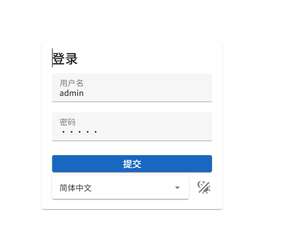
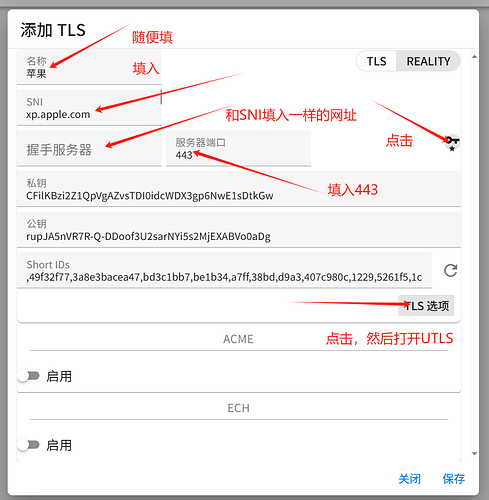
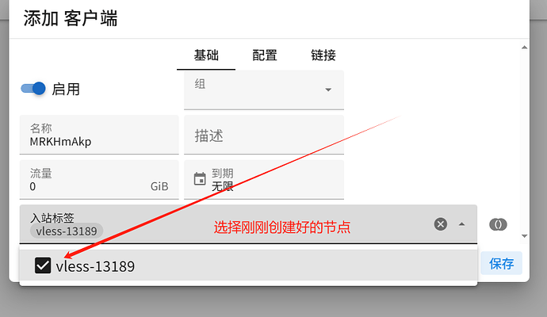
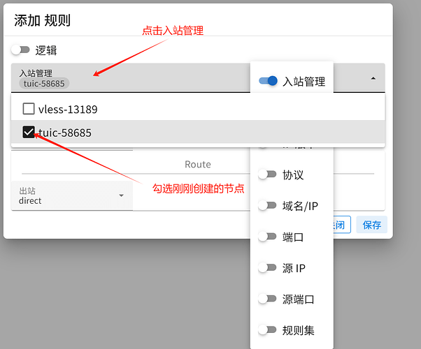
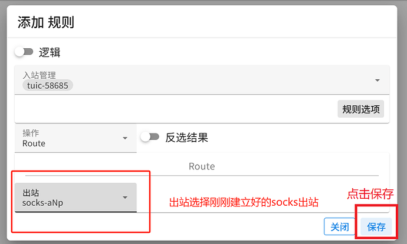
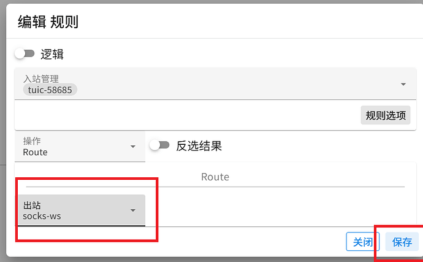

# VPS安全加固与代理搭建完整教程

> 本教程记录了从零开始搭建安全VPS代理服务器的完整过程，包括安全加固、代理协议配置和流媒体解锁等内容。

------

## 命令快捷复制工具

为了简化命令的编辑和复制流程，我制作了一个单HTML网页工具。

- **在线使用**: [点击直接使用](https://raw.githack.com/ccxkai233/Tutorial/main/vps_helper.html)
- **本地下载**: [下载链接](https://github.com/ccxkai233/Tutorial/releases/download/v1.0.0/vps_helper.html)

**使用说明**: 在页面顶部输入框填入VPS信息(IP、端口等),下方会自动生成对应命令,省去手动编辑的麻烦。

> ⚠️ **重要提示**: 强烈建议先完整阅读本教程,理解各步骤含义后再使用该工具。

------

## VPS安全加固

拿到VPS后的第一步,也是最重要的一步,就是从默认的密码登录切换到更安全的密钥登录。

**环境说明**:

- 操作系统: Ubuntu 24
- 演示工具: PowerShell

### 1. 首次登录

**步骤**:

1. 打开PowerShell,输入登录命令:

   ```bash
   ssh root@YOUR_SERVER_IP
   ```

2. 首次连接会提示:

   ```
   Are you sure you want to continue connecting (yes/no/[fingerprint])?
   ```

   输入 `yes` 并回车

3. 提示输入密码:

   ```
   root@YOUR_SERVER_IP's password:
   ```

4. 复制密码后,在PowerShell窗口**右键单击**即可粘贴

   > ⚠️ 注意: 密码粘贴后不会显示,这是正常的安全机制

5. 回车后,看到类似 `root@XXXXXXX:~` 的提示符,说明登录成功

------

### 2. 系统更新与基础防护

#### 2.1 更新系统

执行以下命令更新软件包:

```bash
sudo apt update && sudo apt upgrade -y
```

> 过程中一路回车即可

#### 2.2 安装Fail2Ban防护

Fail2Ban可以自动屏蔽尝试暴力破解的恶意IP:

```bash
sudo apt install fail2ban -y
```

#### 2.3 检查服务状态

```bash
sudo systemctl status fail2ban
```

看到绿色的 `active (running)`,说明服务已启动。按 `Ctrl+C` 退出。

如果未运行,使用以下命令启动:

```bash
sudo systemctl start fail2ban && sudo systemctl enable fail2ban
```

------

### 3. SSH密钥登录配置

**为什么要配置密钥登录?**

- 密码登录容易被暴力破解
- root用户是黑客的首要攻击目标
- 密钥登录几乎无法被破解

**配置流程概览**:

1. 在本地生成密钥对
2. 上传公钥到服务器
3. 测试密钥登录
4. 更改SSH端口并禁用密码登录
5. 配置防火墙
6. 使用新配置登录

------

#### 3.1 生成SSH密钥对

推荐使用 **[PuTTYgen](https://www.puttygen.com/)** 工具:

1. 打开PuTTYgen:

   

2. 确保设置:

   - 密钥类型: RSA
   - 强度: 至少2048位

   

3. 点击 **Generate**,然后在窗口内快速移动鼠标直到进度条完成

> ⚠️ 重要: 生成后**不要关闭PuTTYgen窗口**!

------

#### 3.2 上传公钥到服务器

回到服务器终端,依次执行:

1. 创建.ssh目录并设置权限:

   ```bash
   mkdir -p /root/.ssh && chmod 700 /root/.ssh
   ```

2. 编辑授权密钥文件:

   ```bash
   nano /root/.ssh/authorized_keys
   ```

3. 粘贴公钥:

   - 复制PuTTYgen窗口中 `ssh-rsa` 开头的全部内容
   - 在nano编辑器中右键粘贴
   - 按 `Ctrl+X`, `Y`, `Enter` 保存退出

4. 设置文件权限(至关重要):

   ```bash
   chmod 600 /root/.ssh/authorized_keys
   ```

------

#### 3.3 测试密钥登录

在禁用密码前,**必须**先测试密钥是否配置成功!

1. 修改SSH配置启用密钥登录:

   ```bash
   nano /etc/ssh/sshd_config
   ```

   找到以下行,确保没有 `#` 注释且值为 `yes`:

   ```ini
   PubkeyAuthentication yes
   ```

   按 `Ctrl+X`, `Y`, `Enter` 保存退出

2. 重新加载SSH服务:

   ```bash
   systemctl reload sshd
   ```

3. 导出私钥:

   - 回到PuTTYgen窗口
   - 点击 **Conversions** → **Export OpenSSH key**
   - 保存为 `id_rsa` (不要加后缀)
   - 建议保存在 `C:\Users\YourUsername\.ssh\`

4. **测试密钥登录**:

   > ⚠️ 重要: **不要关闭当前的root终端!**

   另开一个新PowerShell窗口,执行:

   ```bash
   ssh -i "C:\Path\To\Your\PrivateKey" root@YOUR_SERVER_IP
   ```

   将路径和IP替换为实际信息。确认成功登录后可以关闭测试窗口。

   > ⚠️ 只有此步骤成功后才能继续!

------

#### 3.4 终极安全加固

回到原来的root终端,进行最后的安全设置。

##### 修改SSH配置

```bash
nano /etc/ssh/sshd_config
```

进行三项关键修改:

1. **更改端口**: 找到 `#Port 22`,去掉 `#` 并改为高位端口:

   ```ini
   Port 12345
   ```

2. **限制Root登录方式**: 找到 `PermitRootLogin`,改为:

   ```ini
   PermitRootLogin prohibit-password
   ```

3. **禁用密码登录**: 找到 `PasswordAuthentication`,改为:

   ```ini
   PasswordAuthentication no
   ```

按 `Ctrl+X`, `Y`, `Enter` 保存退出。

------

##### 配置防火墙

> ⚠️ **极度重要**: 必须严格按顺序操作,否则会被锁在门外!

**按以下顺序执行**:

1. **放行新SSH端口** (将12345替换为你设置的端口):

   ```bash
   sudo ufw allow 12345/tcp
   ```

2. **(可选)放行Web服务端口**:

   ```bash
   sudo ufw allow http
   sudo ufw allow https
   ```

3. **设置默认拒绝策略**:

   ```bash
   sudo ufw default deny incoming
   ```

4. **启用防火墙** (提示时输入 `y`):

   ```bash
   sudo ufw enable
   ```

5. **重启SSH服务** (最后一步):

   ```bash
   systemctl restart ssh
   ```

------

#### 3.5 使用新配置登录

> ⚠️ 再次提醒: 不要关闭当前root终端!

另开新PowerShell窗口,使用新端口和密钥登录:

```bash
ssh -i "C:\Path\To\Your\PrivateKey" root@YOUR_SERVER_IP -p 12345
```

将路径、IP和端口替换为实际信息。

**成功登录则配置完成!** 现在可以安心关闭旧终端了。

##### 登录失败排查

如果登录失败:

1. 不要关闭原root终端
2. 检查 `/etc/ssh/sshd_config` 配置
3. 检查防火墙状态: `ufw status`
4. 查看实时日志: `sudo journalctl -u ssh -f`
5. 在另一终端尝试登录,将日志发给AI分析

------

## 代理协议科普

### GFW (防火长城)工作原理

GFW部署在中国与国际互联网接口处,主要检测手段:

- **DNS污染**: 返回错误IP导致域名无法访问
- **SNI阻断**: 通过明文SNI识别并阻断HTTPS连接
- **IP封锁**: 直接拉黑目标服务器IP
- **深度包检测(DPI)**: 分析流量特征识别代理协议
- **关键字过滤**: 检测敏感词并切断连接
- **主动探测**: 模拟访问可疑IP,未返回合法响应则封锁

### 主流代理协议对比

#### Shadowsocks (SS)

- ✅ 优点: 经典、简单、快速、资源占用小
- ❌ 缺点: 流量特征明显,已基本无法直连

#### VMess

- ✅ 优点: 复杂加密和混淆,可伪装成网页流量
- ❌ 缺点: 较容易被识别

#### Trojan

- ✅ 优点: 基于TLS,表面像HTTPS流量,部署简单
- ❌ 缺点: TLS特征易被DPI识别,必须绑定域名和证书

#### VLESS + XTLS/Vision

- ✅ 优点: 性能极高,Vision流控近乎零损耗,延迟更低
- ❌ 缺点: 需要域名和证书

#### Hysteria2

- ✅ 优点: 基于QUIC/HTTP3,内置BBR拥塞控制,高延迟环境表现好
- ❌ 缺点: 消耗更多带宽,流量特征明显

#### TUIC

- ✅ 优点: 基于QUIC+BBR,智能适应网络,延迟极低
- ❌ 缺点: 基于UDP,某些网络可能受限

### 相关技术

- **WebSocket (ws)**: 传输方式,将代理流量伪装成网页浏览

- **Vision**: VLESS专属流控,零拷贝技术实现极致性能

- REALITY

  : 最新伪装技术,无需域名,借用大厂网站身份,隐蔽性极高

  - ❌ 缺点: 无法与CDN配合使用

------

## S-UI面板安装与配置

本教程使用基于 `sing-box` 核心的 `s-ui` 面板。

### 1. 安装S-UI

执行安装脚本:

```bash
bash <(curl -Ls https://raw.githubusercontent.com/alireza0/s-ui/master/install.sh)
```

安装过程询问时选择 `n` 使用默认设置。

安装完成后会显示:

```plaintext
First admin credentials:
    Username:        admin
    Password:        admin
...
You may access the Panel with following URL(s):
Local address:
http://123.456.789.101:2095/app/
```

> ⚠️ 注意: 此时是 `http://`,直接访问会明文传输账号密码,非常不安全!

------

### 2. 通过SSH隧道安全访问

在**本地电脑**新开PowerShell窗口:

```bash
ssh -o ServerAliveInterval=60 -L 8080:127.0.0.1:2095 root@123.456.789.101 -p 12345 -i "C:/Users/ccxkai/.ssh/id_rsa"
```

参数说明:

- `8080`: 本地端口
- `127.0.0.1:2095`: 面板地址和端口
- `12345`: SSH端口
- 最后是私钥路径

**保持这个窗口不要关闭**,然后浏览器访问: `http://localhost:8080/app/`

使用默认账号密码 `admin/admin` 登录:



------

### 3. 配置VLESS + REALITY节点

#### 3.1 设置TLS

点击侧边栏 `设置TLS`:


------

#### 3.2 选择伪装域名

在服务器执行脚本寻找延迟低的域名:

```bash
bash <(curl -sL https://raw.githubusercontent.com/ccxkai233/Domain_Selector/main/domain_check.sh)
```

输出示例:

```plaintext
测试完成,延迟最低的前5个域名:
--------------------------------------------------
  1.186      ms    res-1.cdn.office.net
  1.188      ms    intelcorp.scene7.com
  1.226      ms    xp.apple.com
  1.236      ms    ds-aksb-a.akamaihd.net
  1.243      ms    is1-ssl.mzstatic.com
--------------------------------------------------
```

选择延迟低的域名(如 `xp.apple.com`)。

------

#### 3.3 配置REALITY

填入选择的伪装域名:



------

#### 3.4 添加入站节点

切换到 `入站管理`,按图示添加:


------

#### 3.5 添加用户

切换到 `用户管理`,添加用户:



------

#### 3.6 获取分享链接

1. 点击用户旁的二维码图标
2. 切换到"链接"标签页
3. 再次点击二维码复制分享链接

------

#### 3.7 放行防火墙端口

```bash
sudo ufw allow 443/tcp
```

------

#### 3.8 配置客户端

1. 打开V2rayN客户端
2. `Ctrl+V` 导入节点
3. 右键编辑节点,将地址栏的 `localhost` 改为VPS公网IP


1. 保存后设为活动服务器
2. 测试延迟,成功即配置完成

------

### 4. (可选)配置TUIC节点

如果VPS线路较差,可尝试基于UDP的TUIC改善速度。


配置流程与VLESS类似,关键配置如下:

**TUIC配置**: 

**TUIC入站**: 

**客户端配置**: 

**测速结果**: 

------

## WARP流媒体解锁

通过WARP一键脚本+代理链免费解锁ChatGPT、Netflix等流媒体。

> ⚠️ 注意: 部分VPS可能刷不到可解锁的WARP IP,建议自行购置数据中心代理或静态住宅代理。

### WARP简介

Cloudflare WARP是官方VPN服务,原本用于加密普通用户设备连接。我们利用WARP给VPS套上"伪装",让它看起来像普通家庭用户,从而解锁被拉黑的服务。

**项目地址**: https://github.com/ccxkai233/warp-more-unlocks

------

### 1. 安装WARP客户端

运行菜单脚本:

```bash
wget -N https://raw.githubusercontent.com/ccxkai233/warp-more-unlocks/main/menu.sh && bash menu.sh
```

操作步骤:

1. 选择 `2` (简体中文)
2. 选择 `5` (安装CloudFlare Client并设置为Proxy模式)
3. 之后三个选项全部回车使用默认设置

看到绿色成功信息和 `本地 Socks5: 127.0.0.1:40000` 即安装成功。

------

### 2. 筛选解锁IP

执行 `warp i`,连续按两次回车,脚本会自动筛选支持所有流媒体的IP:


------

### 3. (可选)安装定时任务

设置每天上海时间凌晨4点自动筛选IP:

```bash
sudo sh -c ' \
(command -v apt-get >/dev/null && apt-get update && apt-get install -y expect || yum install -y expect) && \
wget -O /usr/local/sbin/autowarp.exp https://raw.githubusercontent.com/ccxkai233/warp-more-unlocks/main/autowarp.exp && \
chmod +x /usr/local/sbin/autowarp.exp && \
(crontab -l 2>/dev/null | grep -v -F "/usr/local/sbin/autowarp.exp" ; echo "0 20 * * * /usr/bin/expect /usr/local/sbin/autowarp.exp > /tmp/autowarp.log 2>&1") | crontab - && \
echo "自动化脚本已成功部署。" \
'
```

验证定时任务:

```bash
crontab -l
```

返回以下内容说明成功:

```
0 20 * * * /usr/bin/expect /usr/local/sbin/autowarp.exp > /tmp/autowarp.log 2>&1
```

手动测试:

```bash
/usr/bin/expect /usr/local/sbin/autowarp.exp
```

------

### 4. 配置代理链

#### 4.1 添加出站代理

进入S-UI `出站管理`,添加WARP SOCKS5代理:


------

#### 4.2 配置路由规则

进入 `路由列表`,添加规则将特定流量(Netflix、OpenAI等)指向WARP出站:







------

### 5. 验证效果

连接代理后访问 https://ping0.cc/,IP已变为Cloudflare IP:


不用担心危险值94%,全世界都知道这是Cloudflare的VPN,Google和Netflix不会对你的账号怎么样。

此时应该可以正常访问:

- Netflix非自制剧
- Disney+
- ChatGPT等服务

**Netflix测试** - 能打开《绝命毒师》说明非自制剧解锁: [

**Disney+测试** - 《死侍》可以打开: 

**ChatGPT测试** - o3模型正确解决经典问题: 

------

## 住宅IP代理链配置

使用购买的固定住宅IP作为代理出口。

### 1. 添加出站代理

在 `出站管理` 添加SOCKS5出站,填入代理商提供的信息:

- 域名/IP
- 端口
- 账号
- 密码


------

### 2. 配置路由规则

在 `路由列表` 添加规则,将流量指向住宅IP出站:




------

### 3. 验证效果

连接代理后访问 https://ping0.cc/,IP地址应显示为你的住宅代理IP。

------

## VPS性能测试结果

以下是本教程使用的VPS融合怪测试结果:

<details> <summary><b>点击展开完整测试结果</b></summary>

```
VPS融合怪版本：2025.07.10
Shell项目地址：https://github.com/spiritLHLS/ecs
Go项目地址 [推荐]：https://github.com/oneclickvirt/ecs
---------------------基础信息查询--感谢所有开源项目---------------------
 CPU 型号          : AMD EPYC Processor
 CPU 核心数        : 4
 CPU 频率          : 2645.030 MHz
 CPU 缓存          : L1: 128.00 KB / L2: 2.00 MB / L3: 8.00 MB
 AES-NI指令集      : ✔ Enabled
 VM-x/AMD-V支持    : ❌ Disabled
 内存              : 190.95 MiB / 5.79 GiB
 Swap              : [ no swap partition or swap file detected ]
 硬盘空间          : 2.15 GiB / 98.33 GiB
 启动盘路径        : /dev/sda2
 系统在线时间      : 0 days, 1 hour 12 min
 负载              : 0.26, 0.12, 0.09
 系统              : Ubuntu 24.04.2 LTS (x86_64)
 架构              : x86_64 (64 Bit)
 内核              : 6.8.0-63-generic
 TCP加速方式       : cubic
 虚拟化架构        : KVM
 NAT类型           : Full Cone
 IPV4 ASN          : AS30633 Leaseweb USA, Inc.
 IPV4 位置         : Washington / District of Columbia / US
 IPV6 ASN          : AS30633 LEASEWEB-USA-WDC
 IPV6 位置         : Manassas / Virginia / United States
 IPV6 子网掩码     : 128
----------------------CPU测试--通过sysbench测试-------------------------
 -> CPU 测试中 (Fast Mode, 1-Pass @ 5sec)
 1 线程测试(单核)得分: 		2970 Scores
 4 线程测试(多核)得分: 		10990 Scores
---------------------内存测试--感谢lemonbench开源-----------------------
 -> 内存测试 Test (Fast Mode, 1-Pass @ 5sec)
 单线程读测试:		30027.79 MB/s
 单线程写测试:		16863.62 MB/s
------------------磁盘dd读写测试--感谢lemonbench开源--------------------
 -> 磁盘IO测试中 (4K Block/1M Block, Direct Mode)
 测试操作		写速度					读速度
 100MB-4K Block		16.1 MB/s (3921 IOPS, 6.53s)		22.7 MB/s (5535 IOPS, 4.63s)
 1GB-1M Block		552 MB/s (526 IOPS, 1.90s)		552 MB/s (526 IOPS, 1.90s)
---------------------磁盘fio读写测试--感谢yabs开源----------------------
Block Size | 4k            (IOPS) | 64k           (IOPS)
  ------   | ---            ----  | ----           ---- 
Read       | 100.20 MB/s  (25.0k) | 521.99 MB/s   (8.1k)
Write      | 100.46 MB/s  (25.1k) | 524.74 MB/s   (8.1k)
Total      | 200.66 MB/s  (50.1k) | 1.04 GB/s    (16.3k)
           |                      |                     
Block Size | 512k          (IOPS) | 1m            (IOPS)
  ------   | ---            ----  | ----           ---- 
Read       | 498.02 MB/s    (972) | 491.89 MB/s    (480)
Write      | 524.48 MB/s   (1.0k) | 524.65 MB/s    (512)
Total      | 1.02 GB/s     (1.9k) | 1.01 GB/s      (992)
------------流媒体解锁--基于oneclickvirt/CommonMediaTests开源-----------
以下测试的解锁地区是准确的，但是不是完整解锁的判断可能有误，这方面仅作参考使用
----------------Netflix-----------------
[IPV4]
您的出口IP完整解锁Netflix，支持非自制剧的观看
NF所识别的IP地域信息：美国
[IPV6]
您的出口IP完整解锁Netflix，支持非自制剧的观看
NF所识别的IP地域信息：美国
----------------Youtube-----------------
[IPV4]
连接方式: Youtube Video Server
视频缓存节点地域: IAD(IAD23S03)
[IPV6]
连接方式: Youtube Video Server
视频缓存节点地域: IAD(IAD23S03)
---------------DisneyPlus---------------
[IPV4]
当前IPv4出口所在地区即将开通DisneyPlus
[IPV6]
当前IPv4出口所在地区即将开通DisneyPlus
解锁Netflix，Youtube，DisneyPlus上面和下面进行比较，不同之处自行判断
----------------流媒体解锁--感谢RegionRestrictionCheck开源--------------
 以下为IPV4网络测试，若无IPV4网络则无输出
============[ Multination ]============
 Dazn:					IP Banned by Dazn
 Disney+:				No (IP Banned By Disney+ 1)
 Netflix:				Originals Only
 YouTube Premium:			Yes (Region: US)
 Amazon Prime Video:			Yes (Region: US)
 TVBAnywhere+:				Yes
 Spotify Registration:			Yes (Region: US)
 OneTrust Region:			US [District of Columbia]
 iQyi Oversea Region:			US
 Bing Region:				US (Risky)
 Apple Region:				US
 YouTube CDN:				Washington DC
 Netflix Preferred CDN:			Washington DC
 ChatGPT:				Yes
 Google Gemini:				Yes (Region: USA)
 Claude:				Yes
 Wikipedia Editability:			No
 Google Play Store:			United States 
 Google Search CAPTCHA Free:		Yes
 Steam Currency:			USD
 ---Forum---
 Reddit:				No
 ---Game---
 SD Gundam G Generation Eternal:	No
=======================================
 以下为IPV6网络测试，若无IPV6网络则无输出
============[ Multination ]============
 Dazn:					IPv6 Is Not Currently Supported
 Disney+:				IPv6 Is Not Currently Supported
 Netflix:				Originals Only
 YouTube Premium:			No
 Amazon Prime Video:			IPv6 Is Not Currently Supported
 TVBAnywhere+:				IPv6 Is Not Currently Supported
 Spotify Registration:			Failed (Error: PAGE ERROR)
 OneTrust Region:			US [Virginia]
 iQyi Oversea Region:			IPv6 Is Not Currently Supported
 Bing Region:				US (Risky)
 Apple Region:				US
 YouTube CDN:				Washington DC
 Netflix Preferred CDN:			Washington DC
 ChatGPT:				Failed (Network Connection)
 Google Gemini:				No
 Claude:				Yes
 Wikipedia Editability:			No
 Google Play Store:			Iran 
 Google Search CAPTCHA Free:		Yes
 Steam Currency:			IPv6 Is Not Currently Supported
 ---Forum---
 Reddit:				IPv6 Is Not Currently Supported
 ---Game---
 SD Gundam G Generation Eternal:	Failed (Network Connection)
=======================================
--------------------TikTok解锁--感谢lmc999的源脚本----------------------
 Tiktok Region:		【US】
-------------IP质量检测--基于oneclickvirt/securityCheck使用-------------
数据仅作参考，不代表100%准确，如果和实际情况不一致请手动查询多个数据库比对
以下为各数据库编号，输出结果后将自带数据库来源对应的编号
ipinfo数据库  [0] | scamalytics数据库 [1] | virustotal数据库   [2] | abuseipdb数据库   [3] | ip2location数据库    [4]
ip-api数据库  [5] | ipwhois数据库     [6] | ipregistry数据库   [7] | ipdata数据库      [8] | db-ip数据库          [9]
ipapiis数据库 [A] | ipapicom数据库    [B] | bigdatacloud数据库 [C] | dkly数据库        [D] | ipqualityscore数据库 [E]
IPV4:
安全得分:
声誉(越高越好): 0 [2] 
信任得分(越高越好): 0 [8] 
VPN得分(越低越好): 100 [8] 
代理得分(越低越好): 100 [8] 
社区投票-无害: 0 [2] 
社区投票-恶意: 0 [2] 
威胁得分(越低越好): 100 [8] 
欺诈得分(越低越好): 32 [1] 65 [E]
滥用得分(越低越好): 0 [3] 
ASN滥用得分(越低越好): 0.0012 (Low) [A] 
公司滥用得分(越低越好): 0.0006 (Low) [A] 
威胁级别: low [9] 
黑名单记录统计:(有多少黑名单网站有记录):
无害记录数: 0 [2]  恶意记录数: 0 [2]  可疑记录数: 0 [2] 无记录数: 94 [2]  
安全信息:
使用类型: hosting [0 7 8 9 A] hosting - high probability [C] DataCenter/WebHosting/Transit [3]
公司类型: hosting [0 A] isp [7]
是否云提供商: Yes [7] 
是否数据中心: Yes [0 1 5 6 8 A C] 
是否移动设备: Yes [E] No [5 A C]
是否代理: Yes [E] No [0 1 4 5 6 7 8 9 A C]
是否VPN: Yes [A E] No [0 1 6 7 C]
是否Tor: No [0 1 3 6 7 8 A C E] 
是否Tor出口: No [1 7] 
是否网络爬虫: No [9 A E] 
是否匿名: No [1 6 7 8] 
是否攻击者: No [7 8] 
是否滥用者: No [7 8 A C E] 
是否威胁: No [7 8 C] 
是否中继: No [0 7 8 C] 
是否Bogon: No [7 8 A C]
是否机器人: No [E] 
DNS-黑名单: 314(Total_Check) 0(Clean) 8(Blacklisted) 20(Other) 
IPV6:
安全得分:
欺诈得分(越低越好): 32 [1] 
滥用得分(越低越好): 0 [3]
ASN滥用得分(越低越好): 0.0012 (Low) [A] 
公司滥用得分(越低越好): 0 (Very Low) [A] 
安全信息:
使用类型: DataCenter/WebHosting/Transit [3] hosting [A]
公司类型: hosting [A] 
是否数据中心: Yes [1 A] 
是否移动设备: No [A] 
是否代理: No [1 A] 
是否VPN: No [1 A] 
是否Tor: No [1 3 A] 
是否Tor出口: No [1] 
是否网络爬虫: No [A] 
是否匿名: No [1] 
是否滥用者: No [A] 
是否Bogon: No [A]
DNS-黑名单: 314(Total_Check) 0(Clean) 0(Blacklisted) 314(Other) 
Google搜索可行性：NO
-------------邮件端口检测--基于oneclickvirt/portchecker开源-------------
Platform  SMTP  SMTPS POP3  POP3S IMAP  IMAPS
LocalPort ✔     ✔     ✔     ✔     ✔     ✔    
QQ        ✔     ✔     ✔     ✘     ✔     ✘    
163       ✔     ✔     ✔     ✘     ✔     ✘    
Sohu      ✔     ✘     ✔     ✘     ✔     ✘    
Yandex    ✔     ✔     ✔     ✘     ✔     ✘    
Gmail     ✔     ✔     ✘     ✘     ✘     ✘    
Outlook   ✔     ✘     ✔     ✘     ✔     ✘    
Office365 ✔     ✘     ✔     ✘     ✔     ✘    
Yahoo     ✔     ✔     ✘     ✘     ✘     ✘    
MailCOM   ✔     ✔     ✔     ✘     ✔     ✘    
MailRU    ✔     ✔     ✘     ✘     ✔     ✘    
AOL       ✔     ✔     ✘     ✘     ✘     ✘    
GMX       ✔     ✔     ✔     ✘     ✔     ✘    
Sina      ✔     ✔     ✔     ✘     ✔     ✘    
Apple     ✘     ✘     ✘     ✘     ✘     ✘    
FastMail  ✘     ✔     ✘     ✘     ✘     ✘    
ProtonMail✘     ✘     ✘     ✘     ✘     ✘    
MXRoute   ✔     ✘     ✔     ✘     ✔     ✘    
Namecrane ✔     ✔     ✔     ✘     ✔     ✘    
XYAMail   ✘     ✘     ✘     ✘     ✘     ✘    
ZohoMail  ✘     ✔     ✘     ✘     ✘     ✘    
Inbox_eu  ✔     ✔     ✔     ✘     ✘     ✘    
Free_fr   ✘     ✔     ✔     ✘     ✔     ✘    
----------------三网回程--基于oneclickvirt/backtrace开源----------------
北京电信v4 219.141.140.10  检测不到回程路由节点的IPV4地址
北京联通v4 202.106.195.68           联通4837   [普通线路] 
北京移动v4 221.179.155.161          移动CMI    [普通线路] 
上海电信v4 202.96.209.133  检测不到回程路由节点的IPV4地址
上海联通v4 210.22.97.1              联通4837   [普通线路] 
上海移动v4 211.136.112.200          移动CMI    [普通线路] 
广州电信v4 58.60.188.222            电信163    [普通线路] 
广州联通v4 210.21.196.6    检测不到回程路由节点的IPV4地址
广州移动v4 120.196.165.24           移动CMI    [普通线路] 
成都电信v4 61.139.2.69              电信163    [普通线路] 
成都联通v4 119.6.6.6       检测不到回程路由节点的IPV4地址
成都移动v4 211.137.96.205           移动CMI    [普通线路] 
北京电信v6 2400:89c0:1053:3::69     电信163    [普通线路] 
北京联通v6 2400:89c0:1013:3::54     检测不到回程路由节点的IPV6地址
北京移动v6 2409:8c00:8421:1303::55  移动CMI    [普通线路] 
上海电信v6 240e:e1:aa00:4000::24    电信163    [普通线路] 
上海联通v6 2408:80f1:21:5003::a     检测不到回程路由节点的IPV6地址
上海移动v6 2409:8c1e:75b0:3003::26  移动CMI    [普通线路] 
广州电信v6 240e:97c:2f:3000::44     电信163    [普通线路] 
广州联通v6 2408:8756:f50:1001::c    检测不到回程路由节点的IPV6地址
广州移动v6 2409:8c54:871:1001::12   移动CMIN2  [精品线路] 
准确线路自行查看详细路由，本测试结果仅作参考
同一目标地址多个线路时，可能检测已越过汇聚层，除了第一个线路外，后续信息可能无效
-----------------------回程路由--基于nexttrace开源----------------------
依次测试电信/联通/移动经过的地区及线路，核心程序来自nexttrace，请知悉!
广州电信 58.60.188.222
0.46 ms 	AS30633 美国 哥伦比亚特区 华盛顿 leaseweb.com
0.39 ms 	AS30633 美国 弗吉尼亚州 马纳萨斯 leaseweb.com
0.97 ms 	AS30633 美国 弗吉尼亚州 马纳萨斯 leaseweb.com
2.21 ms 	AS174 [COGENT-BONE] 美国 华盛顿DC 华盛顿 cogentco.com
7.02 ms 	AS174 [COGENT-BONE] 美国 纽约州 纽约 cogentco.com
15.33 ms 	AS174 [COGENT-BONE] 美国 俄亥俄 克里夫兰 cogentco.com
22.01 ms 	AS174 [COGENT-BONE] 美国 伊利诺伊州 芝加哥 cogentco.com
30.19 ms 	AS174 [COGENT-BONE] 美国 内布拉斯加 奥马哈 cogentco.com
40.49 ms 	AS174 [COGENT-BONE] 美国 科罗拉多 丹佛 cogentco.com
49.46 ms 	AS174 [COGENT-BONE] 美国 犹他 盐湖城 cogentco.com
65.93 ms 	AS174 [COGENT-BONE] 美国 加利福尼亚 洛杉矶 cogentco.com
67.18 ms 	AS174 [COGENT-BONE] 美国 加利福尼亚 圣何塞 cogentco.com
77.73 ms 	AS174 美国 加利福尼亚 圣克拉拉 cogentco.com
229.23 ms 	AS4134 [CHINANET-BB] 中国 广东 广州 www.chinatelecom.com.cn 电信
225.99 ms 	AS4134 [CHINANET-BB] 中国 广东 广州 www.chinatelecom.com.cn
广州联通 210.21.196.6
0.57 ms 	AS30633 美国 哥伦比亚特区 华盛顿 leaseweb.com
0.44 ms 	AS30633 美国 弗吉尼亚州 马纳萨斯 leaseweb.com
0.88 ms 	AS30633 美国 弗吉尼亚州 马纳萨斯 leaseweb.com
2.02 ms 	AS174 [COGENT-BONE] 美国 华盛顿DC 华盛顿 cogentco.com
6.78 ms 	AS174 [COGENT-BONE] 美国 纽约州 纽约 cogentco.com
15.21 ms 	AS174 [COGENT-BONE] 美国 俄亥俄 克里夫兰 cogentco.com
22.14 ms 	AS174 [COGENT-BONE] 美国 伊利诺伊州 芝加哥 cogentco.com
30.25 ms 	AS174 [COGENT-BONE] 美国 内布拉斯加 奥马哈 cogentco.com
40.73 ms 	AS174 [COGENT-BONE] 美国 科罗拉多 丹佛 cogentco.com
49.57 ms 	AS174 [COGENT-BONE] 美国 犹他 盐湖城 cogentco.com
65.78 ms 	AS174 [COGENT-BONE] 美国 加利福尼亚 洛杉矶 cogentco.com
67.04 ms 	AS174 [COGENT-BONE] 美国 加利福尼亚 圣何塞 cogentco.com
68.75 ms 	AS174 [COGENT-BONE] 美国 加利福尼亚 圣何塞 cogentco.com
78.36 ms 	AS174 [COGENT-BONE] 美国 加利福尼亚 洛杉矶 cogentco.com
78.67 ms 	AS174 [COGENT-BONE] 美国 加利福尼亚 洛杉矶 cogentco.com
261.72 ms 	AS174 美国 加利福尼亚 洛杉矶 cogentco.com
231.77 ms 	AS4837 [CU169-BACKBONE] 中国 广东 广州 chinaunicom.cn
282.54 ms 	AS4837 [CU169-BACKBONE] 中国 广东 广州 X-I chinaunicom.cn 联通
341.41 ms 	AS17816 [APNIC-AP] 中国 广东省 深圳市 chinaunicom.cn 联通
246.39 ms 	AS17623 [APNIC-AP] 中国 广东 深圳 chinaunicom.cn 联通
235.46 ms 	AS17623 中国 广东 深圳 宝安区 chinaunicom.cn 联通
广州移动 120.196.165.24
0.65 ms 	AS30633 美国 哥伦比亚特区 华盛顿 leaseweb.com
0.55 ms 	AS30633 美国 弗吉尼亚州 马纳萨斯 leaseweb.com
0.94 ms 	AS30633 美国 弗吉尼亚州 马纳萨斯 leaseweb.com
0.91 ms 	AS1299 [ARELION-NET] 美国 弗吉尼亚州 马纳萨斯 arelion.com
1.45 ms 	AS1299 [ARELION-NET] 美国 弗吉尼亚 阿什本 arelion.com
61.16 ms 	AS1299 [ARELION-NET] 美国 佐治亚 亚历山大 arelion.com
61.02 ms 	AS1299 [ARELION-NET] 美国 佐治亚 亚历山大 arelion.com
61.31 ms 	AS1299 [ARELION-NET] 美国 德克萨斯 达拉斯 arelion.com
58.42 ms 	AS1299 [ARELION-NET] 美国 加利福尼亚 洛杉矶 arelion.com
108.71 ms 	AS1299 [ARELION-NET] 美国 加利福尼亚 洛杉矶 arelion.com
69.61 ms 	AS1299 [ARELION-NET] 美国 加利福尼亚 洛杉矶 arelion.com
61.82 ms 	AS58453 [CMI-INT] 美国 加利福尼亚 洛杉矶 cmi.chinamobile.com 移动
237.01 ms 	AS58453 [CMI-INT] 中国 广东 广州 cmi.chinamobile.com 移动
237.64 ms 	AS9808 [CMNET] 中国 广东 广州 chinamobileltd.com 移动
242.71 ms 	AS9808 [CMNET] 中国 广东 广州 I-C chinamobileltd.com 移动
241.44 ms 	AS9808 [CMNET] 中国 广东 广州 chinamobileltd.com 移动
247.21 ms 	AS9808 [CMNET] 中国 广东 广州 chinamobileltd.com 移动
251.16 ms 	AS9808 [CMNET] 中国 广东 广州 chinamobileltd.com 移动
246.62 ms 	AS56040 [APNIC-AP] 中国 广东 深圳 gd.10086.cn 移动
--------------------自动更新测速节点列表--本脚本原创--------------------
位置		 上传速度	 下载速度	 延迟
Speedtest.net	 6024.96Mbps	 5582.22Mbps	 936.41ms	
洛杉矶		 455.84Mbps	 436.63Mbps	 56.40ms	
法兰克福	 137.97Mbps	 486.75Mbps	 93.29ms	
联通福州	 7.34 Mbps	 0.00 Mbps	 528.23551.00542.00	
------------------------------------------------------------------------
 总共花费      : 5 分 19 秒
 时间          : Tue Jul 29 07:59:30 UTC 2025
```

</details>

------

## 📚 总结

至此，教程全部完成！感谢你的耐心阅读。

通过本教程，你已经学会了:

- ✅ VPS安全加固与SSH密钥登录配置
- ✅ 防火墙和Fail2Ban防护设置
- ✅ 主流代理协议的特点和选择
- ✅ S-UI面板的安装和VLESS+REALITY节点配置
- ✅ TUIC协议的UDP加速配置
- ✅ WARP代理链解锁流媒体
- ✅ 住宅IP代理链的配置方法

**重要提醒**:

- 定期更新系统和软件
- 备份重要配置文件
- 监控服务器资源使用情况
- 不要泄露你的私钥和配置信息

如有问题欢迎反馈！