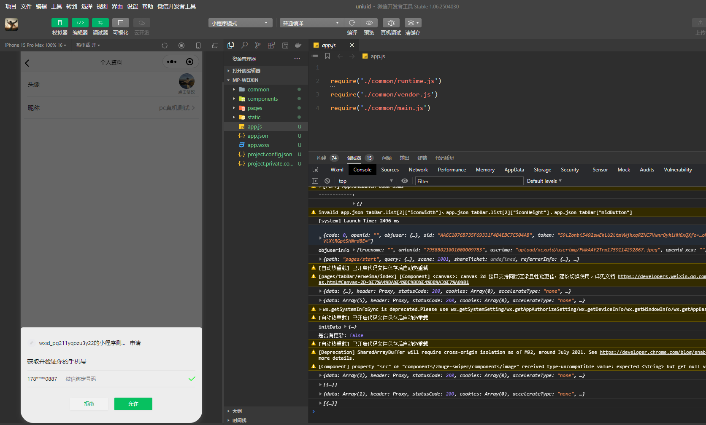
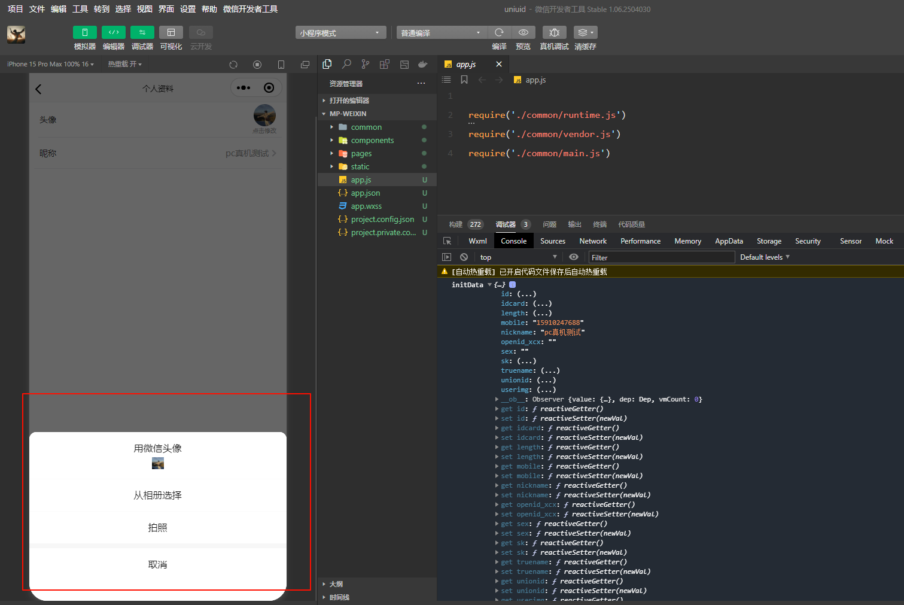

# open-type

## 背景

在微信小程序的开发过程中，**button 组件提供了一个特殊的 open-type 属性，**这个属性让开发者能够调用平台提供的各种系统级功能。当我们需要获取用户的头像、昵称、手机号等信息，或者需要调用分享、客服等功能时，就必须通过这个属性来实现。与普通的 API 调用不同，open-type 必须由用户主动点击按钮触发，这样的设计既保护了用户隐私，又符合各个小程序平台的规范要求。

官方完整文档可以查看：[open-type有效值](https://uniapp.dcloud.net.cn/component/button.html#open-type-有效值)

本文档重点介绍微信小程序中常用的几个 open-type 值。

## 有效值

### 基本语法：

```vue
<button open-type="getPhoneNumber" @getphonenumber="handleGetPhoneNumber">
  获取手机号
</button>
```

### <font color = red>1、getUserProfile</font>

#### 有效值说明：

getUserProfile 是 **[getUserInfo](https://developers.weixin.qq.com/miniprogram/dev/api/open-api/user-info/wx.getUserInfo.html)** 的替代方案，用于获取用户的基本信息。由于微信小程序对用户隐私保护的加强，从基础库 2.10.4 版本开始推出了这个新的开放能力。**与已废弃的 getUserInfo 不同，getUserProfile 每次调用都会弹出授权窗口，让用户确认是否同意提供信息，**即使用户之前已经授权过也会再次弹窗。这种设计确保了用户对自己信息的完全控制权。

需要特别注意的是，getUserProfile 虽然可以获取用户信息，但从基础库 2.27.1 开始，这个接口也逐渐受到限制。现在更推荐的做法是使用 chooseAvatar 获取头像，使用 type="nickname" 的 input 组件获取昵称。不过在一些特定场景下，getUserProfile 仍然可以作为过渡方案使用。

##### 注意点：

1. getUserProfile 每次调用都会弹出授权弹窗，无法实现静默授权
2. **这个接口必须在用户点击行为之后调用，不能在页面加载时自动调用**
3. 从基础库 2.27.1 开始，getUserProfile 返回的头像和昵称可能是默认值
4. **回调参数中包含 userInfo、rawData、signature、encryptedData、iv 等完整字段**
5. 该接口仅在微信小程序中可用，其他平台不支持
6. 建议配合隐私协议使用，让用户明确知道信息的使用目的

#### 适用场景及示例：

**getUserProfile 适用于需要收集用户基本信息的场景，比如用户注册、完善个人资料、参与活动报名等。**虽然这个接口的使用场景正在减少，但在一些需要完整用户信息的老项目中仍然可以看到它的身影。

```vue
<template>
  <view class="container">
    <button 
      type="primary"
      @click="handleGetUserProfile"
    >
      获取用户信息
    </button>
    
    <view v-if="userInfo" class="user-card">
      <image :src="userInfo.avatarUrl" class="avatar"></image>
      <view class="info">
        <text class="nickname">{{ userInfo.nickName }}</text>
        <text class="location">{{ userInfo.province }} {{ userInfo.city }}</text>
      </view>
    </view>
  </view>
</template>

<script>
export default {
  data() {
    return {
      userInfo: null
    }
  },
  methods: {
    handleGetUserProfile() {
      uni.getUserProfile({
        desc: '用于完善会员资料',
        success: (res) => {
          console.log('获取用户信息成功', res);
          this.userInfo = res.userInfo;
          
          // 保存用户信息
          uni.setStorageSync('userInfo', res.userInfo);
          
          // 发送到服务器
          uni.request({
            url: '/api/saveUserInfo',
            method: 'POST',
            data: {
              rawData: res.rawData,
              signature: res.signature,
              encryptedData: res.encryptedData,
              iv: res.iv
            }
          });
        },
        fail: (err) => {
          console.log('用户拒绝授权', err);
          uni.showToast({
            title: '需要授权才能继续',
            icon: 'none'
          });
        }
      });
    }
  }
}
</script>

<style scoped>
.container {
  padding: 40rpx;
}

.user-card {
  margin-top: 60rpx;
  display: flex;
  align-items: center;
  padding: 30rpx;
  background: #f8f8f8;
  border-radius: 16rpx;
}

.avatar {
  width: 120rpx;
  height: 120rpx;
  border-radius: 50%;
  margin-right: 30rpx;
}

.info {
  flex: 1;
  display: flex;
  flex-direction: column;
}

.nickname {
  font-size: 32rpx;
  font-weight: bold;
  color: #333;
  margin-bottom: 10rpx;
}

.location {
  font-size: 28rpx;
  color: #999;
}
</style>
```

#### 效果图

用户点击按钮后会弹出授权对话框，标题显示"XXX申请获取以下权限"，下方列出"你的公开信息（昵称、头像等）"以及开发者设置的用途描述。对话框包含"拒绝"和"允许"两个按钮。用户点击允许后，可以获取到用户的头像、昵称、性别、地区等信息。

------

### <font color =  red>2、getPhoneNumber （常用）</font>

#### 有效值说明：

**getPhoneNumber 是获取用户手机号的开放能力，**支持微信小程序、百度小程序、抖音小程序、支付宝小程序、快手小程序、京东小程序以及小红书小程序。当用户点击按钮时，会弹出授权对话框，用户同意后可以从 @getphonenumber 回调事件中获取到加密的手机号信息。这是一个非常实用的功能，可以让用户无需手动输入手机号，大大简化了注册登录流程。

**返回的数据是经过加密的，包含 code、encryptedData、iv 等字段。开发者需要将这些数据发送到服务器，通过平台提供的官方解密接口才能获取到真实的手机号码。**这种设计确保了用户手机号的安全性，避免在前端环境中暴露敏感信息。

##### 注意点：

1. **返回的手机号信息是加密的，必须在服务器端解密才能得到明文手机号**
2. 每次调用都需要用户主动点击并确认授权，**无法静默获取**
3. 微信小程序中该功能仅对企业认证的小程序开放，个人小程序无法使用
4. 回调参数包含 code、encryptedData、iv，这三个字段都需要传给后端
5. 用户可以拒绝授权，需要处理 detail.errMsg 中的错误信息
6. 不同平台的返回数据结构可能有差异，需要做适配处理

#### 适用场景及示例：

getPhoneNumber 适用于需要手机号进行身份验证的场景，比如用户注册登录、下单时填写联系方式、实名认证、绑定手机号等。通过这个功能可以避免用户手动输入手机号，提升用户体验。

```vue
<template>
  <view class="phone-container">
    <button 
      open-type="getPhoneNumber" 
      @getphonenumber="handleGetPhoneNumber"
      type="primary"
    >
      一键获取手机号
    </button>
  </view>
</template>

<script>
export default {
  methods: {
    handleGetPhoneNumber(e) {
      console.log('获取手机号回调', e.detail);
      
      if (e.detail.code) {
        uni.showLoading({ title: '获取中...' });
        
        uni.request({
          url: '你的接口地址',
          method: 'POST',
          data: {
            code: e.detail.code,
            encryptedData: e.detail.encryptedData,
            iv: e.detail.iv
          },
          success: (res) => {
            uni.hideLoading();
            if (res.data.success) {
              console.log('手机号：', res.data.phoneNumber);
              uni.showToast({
                title: '获取成功',
                icon: 'success'
              });
            }
          },
          fail: (err) => {
            uni.hideLoading();
            uni.showToast({
              title: '获取失败，请重试',
              icon: 'none'
            });
          }
        });
      } else {
        uni.showToast({
          title: '需要授权手机号',
          icon: 'none'
        });
      }
    }
  }
}
</script>
```

#### 效果图

**<font color = red >这并非上面的示例代码运行得到，使用的是一样的语法，示例代码只为说明如何使用,效果图是自己实际工作中用到的</font>**



------

### <font color = red>3、chooseAvatar (常用）</font>

#### 有效值说明：

chooseAvatar 是微信小程序基础库 2.21.2 版本新增的获取用户头像的开放能力。这是目前推荐的获取用户真实头像的标准方式，用于替代已失效的 getUserInfo 获取头像功能。用户点击按钮后会打开系统的图片选择器，可以从相册选择图片或直接拍照，选择后系统会提供裁剪界面。通过 @chooseavatar 回调可以获取到头像的临时文件路径。

该功能支持微信小程序和支付宝小程序。返回的是临时文件路径，开发者需要将其上传到服务器保存，否则小程序关闭后临时文件会被清理。

##### 注意点：

1. 仅支持微信小程序基础库 2.21.2 及以上版本
2. **返回的 avatarUrl 是临时文件路径，需要上传到服务器保存**
3. **临时文件仅在小程序本次运行期间有效，关闭后会被清理**
4. **系统会自动提供裁剪界面，用户可以调整头像显示区域**
5. 不需要额外的授权流程，用户体验更流畅
6. 可以配合 type="nickname" 的 input 组件使用

#### 适用场景及示例：

**chooseAvatar 用于用户设置或修改头像的场景，比如个人信息编辑页面、用户注册流程、个人中心等。这是目前微信小程序中获取用户真实头像的标准方法。**

```vue
<template>
  <view class="avatar-wrapper">
    <button 
      open-type="chooseAvatar" 
      @chooseavatar="handleChooseAvatar"
      class="avatar-btn"
    >
      <image 
        :src="avatarUrl || '/static/default-avatar.png'" 
        class="avatar"
      ></image>
      <text class="tip">点击更换头像</text>
    </button>
  </view>
</template>

<script>
export default {
  data() {
    return {
      avatarUrl: ''
    }
  },
  methods: {
    handleChooseAvatar(e) {
      const { avatarUrl } = e.detail;
      this.avatarUrl = avatarUrl;
      
      uni.showLoading({ title: '上传中...' });
    
      uni.uploadFile({
        url: '/v1/....',
        filePath: avatarUrl,
        name: 'file',
        success: (res) => {
          const data = JSON.parse(res.data);
          this.avatarUrl = data.url;
          uni.setStorageSync('avatarUrl', data.url);
          uni.hideLoading();
          uni.showToast({
            title: '上传成功',
            icon: 'success'
          });
        }
      });
    }
  }
}
</script>

<style scoped>
.avatar-wrapper {
  padding: 40rpx;
  display: flex;
  justify-content: center;
}

.avatar-btn {
  padding: 0;
  background: transparent;
  border: none;
  display: flex;
  flex-direction: column;
  align-items: center;
}

.avatar {
  width: 200rpx;
  height: 200rpx;
  border-radius: 50%;
}

.tip {
  margin-top: 20rpx;
  font-size: 28rpx;
  color: #666;
}
</style>
```

#### 效果图

**<font color = red >这并非上面的示例代码运行得到，使用的是一样的语法，示例代码只为说明如何使用,效果图是自己实际工作中用到的</font>**



------

### 4、share

#### 有效值说明：

share 用于触发小程序的转发分享功能。设置了 open-type="share" 的按钮被点击时，会调用页面的 onShareAppMessage 生命周期函数，用户可以将小程序分享给微信好友或群聊。这是小程序获取流量、实现裂变传播的重要功能。

该功能支持微信小程序、百度小程序、支付宝小程序、抖音小程序、飞书小程序、QQ小程序、快手小程序、京东小程序、360小程序、小红书小程序等多个平台。

##### 注意点：

- 使用前需要在页面中定义 onShareAppMessage 函数
- 不定义 onShareAppMessage 时，点击按钮不会有任何效果
- 可以在 onShareAppMessage 中自定义分享的标题、路径和图片
- 分享路径中可以携带参数，用于实现分享追踪等功能
- 只能分享给好友或群聊，不能分享到朋友圈（朋友圈需要使用 onShareTimeline）
- 无法获知用户是否完成了分享操作

#### 适用场景及示例：

share 适用于各种需要用户主动分享的场景，比如分享优惠活动、邀请好友助力、分享商品详情、传播活动海报等。

```vue
<template>
  <view class="share-container">
    <button 
      open-type="share"
      type="primary"
    >
      分享给好友
    </button>
  </view>
</template>

<script>
export default {
  onShareAppMessage(options) {
    console.log('触发分享', options);
    
    return {
      title: '发现一个好东西，推荐给你',
      path: '/pages/detail/detail?id=123&shareUserId=' + this.userId,
      imageUrl: '/static/share-cover.png'
    };
  },
  
  data() {
    return {
      userId: ''
    }
  },
  
  onLoad() {
    this.userId = uni.getStorageSync('userId');
  }
}
</script>
```

#### 效果图

**<font color = red >这并非上面的示例代码运行得到，使用的是一样的语法，示例代码只为说明如何使用,效果图是自己实际工作中用到的</font>**


------

### 5、contact

#### 有效值说明：

contact 用于打开小程序的客服会话功能。用户点击按钮后会进入客服会话页面，可以向小程序客服发送消息。如果用户在会话中点击了消息卡片，小程序可以从 @contact 回调中获取相关信息。

该功能支持微信小程序、百度小程序、快手小程序、抖音小程序、小红书小程序。需要注意的是，使用前需要在微信小程序后台开通客服功能。

##### 注意点：

1. **需要在小程序管理后台开通客服消息功能才能使用**
2. 可以通过 session-from、send-message-title 等属性自定义会话来源和消息卡片
3. **客服消息需要在48小时内回复，超时无法发送**
4. 可以通过服务器接口接收和发送客服消息
5. **个人小程序不支持客服功能，仅企业小程序可用**
6. **用户发送的消息会实时推送到客服后台**

#### 适用场景及示例：

contact 适用于需要人工客服介入的场景，比如售前咨询、售后服务、投诉建议、订单问题等。

```vue
<template>
  <view class="contact-container">
    <button 
      open-type="contact"
      @contact="handleContact"
      session-from="order-page"
      send-message-title="咨询订单问题"
      send-message-path="/pages/order/detail?id=123"
      send-message-img="/static/order-img.png"
      show-message-card
    >
      联系客服
    </button>
  </view>
</template>

<script>
export default {
  methods: {
    handleContact(e) {
      console.log('客服会话回调', e.detail);
      // e.detail.path 为用户点击的消息卡片路径
      // e.detail.query 为消息卡片路径中的参数
    }
  }
}
</script>
```

#### 效果图

用户点击按钮后会跳转到客服会话页面，界面类似于微信聊天界面。如果设置了 show-message-card 为 true，右下角会显示"可能要发送的小程序"提示，点击后可以快速发送小程序卡片给客服。


------

### 6、openSetting

#### 有效值说明：

**openSetting 用于打开小程序的授权设置页面。当用户之前拒绝了某些权限授权（如位置、相册、摄像头等），**可以通过这个按钮引导用户重新开启权限。设置页面会列出小程序申请过的所有权限，用户可以逐项开启或关闭。

该功能支持微信小程序、QQ小程序、百度小程序、快手小程序、京东小程序、360小程序、小红书小程序、鸿蒙元服务。

##### 注意点：

1. 只能显示用户已经拒绝过的权限，未申请过的权限不会出现
2. 用户在设置页面修改权限后，可以通过 @opensetting 回调获取最新的授权状态
3. **无法直接跳转到系统设置，只能打开小程序自己的设置页面**
4. 建议在用户拒绝权限后，通过弹窗引导用户打开设置页面
5. 设置页面的样式和内容由平台统一提供，开发者无法自定义
6. 部分敏感权限（如手机号）不会出现在设置页面中

#### 适用场景及示例：

openSetting 适用于用户拒绝授权后的二次引导场景，比如拒绝位置权限后无法使用定位功能、拒绝相册权限后无法上传图片等。

```vue
<template>
  <view class="setting-container">
    <view class="tip-text">
      检测到您未开启定位权限，部分功能无法使用
    </view>
    <button 
      open-type="openSetting"
      @opensetting="handleOpenSetting"
      type="primary"
    >
      前往设置
    </button>
  </view>
</template>

<script>
export default {
  methods: {
    handleOpenSetting(e) {
      console.log('授权设置回调', e.detail.authSetting);
      
      // 检查用户是否开启了定位权限
      if (e.detail.authSetting['scope.userLocation']) {
        uni.showToast({
          title: '已开启定位权限',
          icon: 'success'
        });
        // 重新获取位置信息
        this.getLocation();
      } else {
        uni.showToast({
          title: '请开启定位权限',
          icon: 'none'
        });
      }
    },
    
    getLocation() {
      uni.getLocation({
        type: 'gcj02',
        success: (res) => {
          console.log('位置信息', res);
        }
      });
    }
  }
}
</script>

<style scoped>
.setting-container {
  padding: 40rpx;
  text-align: center;
}

.tip-text {
  margin-bottom: 40rpx;
  font-size: 30rpx;
  color: #666;
  line-height: 1.6;
}
</style>
```

#### 效果图

**<font color = red >这并非上面的示例代码运行得到，使用的是一样的语法，示例代码只为说明如何使用,效果图是自己实际工作中用到的</font>**


------

### 7、launchApp

#### 有效值说明：

launchApp 用于从小程序打开已安装的 APP。这个功能可以实现小程序与 APP 之间的跳转，适合已有 APP 的企业通过小程序引流到 APP。用户点击按钮后，如果手机上已安装目标 APP，会直接打开 APP；如果未安装，则不会有任何反应。可以通过 app-parameter 属性向 APP 传递参数。

该功能支持微信小程序、QQ小程序、快手小程序、京东小程序、鸿蒙元服务。需要注意的是，目标 APP 需要接入对应平台的 OpenSDK 才能被打开。

##### 注意点：

1. **目标 APP 必须接入微信 OpenSDK，并配置正确的 AppID**
2. 需要在小程序管理后台配置允许打开的 APP 列表
3. **用户手机上必须已安装目标 APP，否则无法打开**
4. 可以通过 app-parameter 传递参数给 APP，参数格式由 APP 端定义
5. 打开成功会触发 @launchapp 回调，打开失败触发 @error 回调
6. **个人小程序不支持此功能，仅企业小程序可用**

#### 适用场景及示例：

launchApp 适用于已有 APP 的企业引导用户从小程序跳转到 APP，比如电商平台引导用户下载 APP、内容平台将小程序作为引流入口等。

```vue
<template>
  <view class="launch-container">
    <button 
      open-type="launchApp"
      app-parameter="page=detail&id=123"
      @launchapp="handleLaunchApp"
      @error="handleError"
      type="primary"
    >
      打开APP查看更多
    </button>
  </view>
</template>

<script>
export default {
  methods: {
    handleLaunchApp(e) {
      console.log('成功打开APP', e.detail);
    },
    
    handleError(e) {
      console.log('打开APP失败', e.detail);
      uni.showModal({
        title: '提示',
        content: '请先下载并安装APP',
        confirmText: '去下载',
        success: (res) => {
          if (res.confirm) {
            // 引导用户下载APP
            this.downloadApp();
          }
        }
      });
    },
    
    downloadApp() {
      // 跳转到APP下载页面
      uni.navigateTo({
        url: '/pages/download/download'
      });
    }
  }
}
</script>
```

#### 效果说明

**用户点击按钮后，如果已安装 APP，会直接跳转打开 APP，屏幕顶部可能短暂显示"正在打开XXX"的提示。如果未安装 APP，按钮点击无反应，可以在 @error 回调中引导用户下载。**

------

## 工作中实际应用

### **<font color = red >注意：</font>**

1. **示例中的请求接口 一般会封装，可能每个企业都有自己的封装形式，根据实际去请求**

2. **对于头像，图片，视频之类的上传，一般也会封装成一个工具类，在工具类中请求后端的接口去获取相应的OSS临时签名，然后通过这个签名将图像等上传到自己的企业的OSS对象存储服务**
   
3. **解析的话，通过返回的图像，再通过服务去拼接地址即可**
   


### 说明

在实际项目开发中，这些 open-type 通常会组合使用来满足不同的业务需求。最常见的场景是用户信息采集流程：**首先通过 chooseAvatar 让用户选择头像，配合 type="nickname" 的 input 组件收集昵称，然后在需要手机验证的关键节点使用 getPhoneNumber 获取手机号。**这样的组合既符合平台的隐私规范，又能提供流畅的用户体验。

在**电商类小程序中，contact 客服功能通常会出现在商品详情页和订单页面，方便用户随时咨询问题。同时配合 share 分享功能，让用户可以将商品分享给好友，实现社交裂变。对于已有 APP 的企业，在小程序关键页面添加 launchApp 按钮，可以有效地将流量导入到 APP 中。**

当涉及需要特殊权限的功能时，比如需要获取用户位置信息的定位功能，如果用户首次拒绝了授权，就需要使用 openSetting 引导用户重新开启权限。建议的做法是在功能无法使用时，弹出友好的提示说明为什么需要这个权限，以及如何开启，然后提供一个按钮让用户快速跳转到设置页面。

从2023年9月开始，微信小程序对隐私保护的要求更加严格。所有涉及用户隐私的功能都需要在小程序后台配置隐私协议，并在首次调用前让用户同意隐私政策。建议在应用启动时就展示隐私弹窗，使用 open-type="agreePrivacyAuthorization" 让用户明确同意后再使用其他功能。

在错误处理方面，建议为每个 open-type 功能都准备降级方案。比如获取手机号失败时，可以让用户手动输入并通过验证码验证；获取头像失败时，可以使用默认头像；打开客服失败时，可以提供其他联系方式。这样即使某些功能无法正常工作，也不会影响用户使用应用的核心功能。