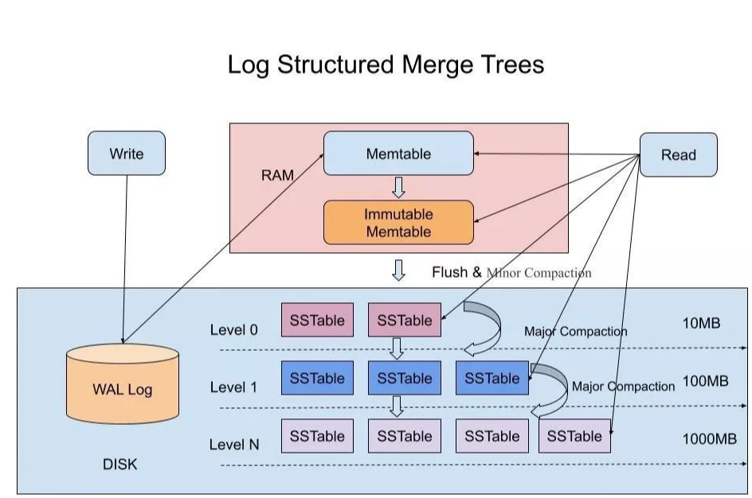

# 时序数据库完全指南：从零到 SpringBoot 实战 ⏰

## 🎯 引言：为什么我们需要时序数据库？

想象一下这样的场景：你的智能家居每秒钟产生数百条温度、湿度、光照传感器数据；股票交易系统每毫秒记录着成千上万笔交易信息；自动驾驶汽车每时每刻产生 GB 级别的传感器数据；你的服务器监控系统需要实时追踪 CPU、内存、网络流量...

这些数据有一个共同特点：**它们都带着时间戳，随时间连续产生，并且数据量巨大**。传统的关系型数据库在面对这类场景时会显得力不从心，而时序数据库（Time Series Database，TSDB）正是为解决这类问题而生。


------

## 📊 什么是时序数据？

### 时序数据的核心特征

时序数据（Time Series Data）是指按时间顺序排列的一系列数据点。它具有以下鲜明特点：

**时间是第一维度** ⏱️ - 每条数据必定带有时间戳，数据按时间顺序组织和查询，时间是最重要的索引维度。

**写多读少** ✍️ - 数据持续不断地写入（监控指标、传感器读数），读操作相对较少（通常是查询某个时间范围的数据），写入吞吐量是关键性能指标。

**数据很少更新或删除** 🔒 - 历史数据一旦写入，通常不会修改，主要操作是批量按时间删除过期数据，适合采用追加写入（Append-Only）策略。

**时间范围查询为主** 🔍 - 典型查询如"最近 24 小时的 CPU 使用率"，经常需要聚合计算（平均值、最大值、趋势分析），查询模式相对固定。

### 典型应用场景

时序数据库广泛应用于物联网（工厂设备监控、智能城市传感器）、系统监控（服务器性能、应用 APM、网络流量）、金融交易（股票行情、交易记录、风险监控）、车联网（车辆轨迹、驾驶行为、车况数据）、Web分析（用户行为追踪、点击流分析）等领域。

------

## 🏗️ 时序数据库 vs 传统数据库

### 为什么不用关系型数据库？

让我们通过一个实际案例来对比。假设你需要监控 1000 台服务器，每台服务器 10 个指标，每 10 秒采集一次。这意味着每秒写入量为 1000 条/秒，一天数据量高达 8640 万条！

#### 传统关系型数据库的痛点

传统数据库面临索引膨胀（大量 B-Tree 索引占用空间，维护成本高）、写入性能差（频繁的随机写入导致磁盘 I/O 瓶颈）、存储浪费（无专门压缩算法）、查询缓慢（时间范围查询需要扫描大量数据）、删除困难（删除历史数据需要昂贵的 DELETE 操作）等问题。

#### 时序数据库的优势

时序数据库通过 LSM-Tree 结构实现高效顺序写入，采用针对时序数据的专门压缩算法可达到 10-100 倍压缩比，利用时间分片、列式存储、预聚合实现快速查询，提供 TTL（生存时间）机制自动清理过期数据，并内置丰富的时序分析函数（移动平均、趋势预测等）。


------

## 🔧 时序数据库核心技术

### 1. 数据模型

时序数据库通常采用类似下面的数据模型：

```
measurement,tag1=value1,tag2=value2 field1=value1,field2=value2 timestamp
```

以一条 CPU 监控数据为例：

```
cpu,host=server01,region=us-west usage_user=45.2,usage_system=12.3 1634567890000000000
```

这里包含了四个核心概念：**Measurement（度量）** 类似关系型数据库的表名，如 `cpu`、`memory`；**Tags（标签）** 是索引字段，用于过滤和分组，如 `host=server01`；**Fields（字段）** 是实际数据值，不被索引，如 `usage_user=45.2`；**Timestamp（时间戳）** 是数据的时间点，通常是纳秒级精度。

### 2. 存储引擎：LSM-Tree



LSM-Tree（Log-Structured Merge Tree）是时序数据库的核心存储引擎。新数据首先写入内存中的 MemTable（跳表结构），写入速度极快。为保证数据持久性，写入前会先记录 WAL（预写日志），这是崩溃恢复的基础。当 MemTable 达到阈值后，数据会被刷入磁盘生成不可变的 SSTable 文件，这些文件按时间和键排序，支持高效范围查询。系统会定期执行 Compaction（压缩），合并多个 SSTable，删除过期数据，优化存储空间和查询性能。

### 3. 数据压缩技术

时序数据具有很强的规律性，可以实现惊人的压缩比。常用的压缩算法包括：Delta Encoding（用于递增的时间戳序列，压缩比 5-10x）、Run-Length Encoding（用于重复的标签值，压缩比 3-5x）、Gorilla Compression（Facebook 开源的浮点数压缩，压缩比 10-12x）、Simple8b（整数序列压缩，压缩比 5-8x）以及通用的 Snappy/LZ4 文本压缩（压缩比 2-3x）。

举个例子，原始时间戳序列 `1634567890, 1634567900, 1634567910, 1634567920...` 经过 Delta Encoding 后变成 `1634567890, +10, +10, +10...`，只存储差值，大大节省了存储空间。

### 4. 时间分片（Sharding）


时序数据库会按时间范围将数据分割成多个 Shard，每个 Shard 是独立的 LSM-Tree。这样做的优势是可以并行查询提升性能，按时间删除整个 Shard（而不是逐条删除），便于数据迁移和备份。分片策略通常根据数据保留期来设置，比如保留期小于 1 天的数据用 1 小时分片，1-7 天的数据用 1 天分片，7-90 天的数据用 7 天分片，超过 90 天的数据用 30 天分片。

------

## 🎯 深入 InfluxDB：最流行的时序数据库


### InfluxDB 架构概览


InfluxDB 3.0 采用了全新的云原生架构，主要包含以下几个核心组件：

**Router（路由器）** 负责解析 Line Protocol 格式的数据，将数据路由到不同的 Ingester，支持数据复制保证写入持久性，可以水平扩展提升写入吞吐。

**Ingester（数据摄入器）** 负责自动发现表结构、数据分区（默认按天分区）、数据去重以及持久化到对象存储（生成 Parquet 文件）。写入流程是：客户端 → Router → Ingester → WAL（崩溃恢复）→ Parquet（对象存储），同时更新元数据到 Catalog。

**Querier（查询器）** 接收 SQL/InfluxQL 查询，构建查询计划（基于 DataFusion），从 Ingester 获取最新数据，从 Object Store 读取历史数据，可水平扩展处理更多查询。

**Compactor（压缩器）** 负责合并小的 Parquet 文件，优化存储布局，应用压缩算法，通过垂直扩展（增加 CPU）提升性能。

核心存储方面，Catalog 使用 PostgreSQL 存储元数据，Object Store（S3/Azure Blob/GCS）存储数据文件，WAL 使用本地磁盘进行崩溃恢复。

### InfluxDB 数据模型实战

InfluxDB 使用 Line Protocol 语法写入数据，格式如下：

```
<measurement>[,<tag_key>=<tag_value>] <field_key>=<field_value> [<timestamp>]
```

以服务器监控数据为例：

```influxdb
# CPU 使用率
cpu,host=server01,region=us-west,cpu=cpu0 usage_user=45.2,usage_system=12.3 1634567890000000000

# 内存使用
mem,host=server01,region=us-west used=8589934592,free=2147483648 1634567890000000000

# 磁盘 I/O
disk,host=server01,region=us-west,device=sda read_bytes=104857600 1634567890000000000
```

### 查询语言示例

InfluxDB 支持多种查询语言。使用 InfluxQL（类 SQL 语法）查询最近 1 小时的平均 CPU 使用率：

```sql
SELECT MEAN("usage_user") 
FROM "cpu" 
WHERE time > now() - 1h 
GROUP BY time(1m), "host"
```

或者使用 SQL（InfluxDB 3.0）：

```sql
SELECT 
  host,
  DATE_TRUNC('minute', time) AS minute,
  AVG(usage_user) AS avg_cpu
FROM cpu
WHERE time > NOW() - INTERVAL '1 hour'
GROUP BY host, minute
ORDER BY minute DESC;
```

### 数据保留策略

InfluxDB 支持自动删除过期数据和数据降采样。创建保留策略：

```sql
-- 保留 30 天，副本数 1
CREATE RETENTION POLICY "thirty_days" 
ON "monitoring" 
DURATION 30d 
REPLICATION 1 
DEFAULT
```

实现数据分层存储：原始数据（10s 粒度）保留 30 天后自动删除，同时通过降采样生成 1 分钟聚合数据保留 1 年，再降采样生成 1 小时聚合数据永久保存。

------

## 🚀 SpringBoot 整合 InfluxDB 实战

### 1. 项目搭建与依赖配置

首先在 `pom.xml` 中添加 InfluxDB 依赖：

```xml
<dependencies>
    <!-- Spring Boot Web -->
    <dependency>
        <groupId>org.springframework.boot</groupId>
        <artifactId>spring-boot-starter-web</artifactId>
    </dependency>
    
    <!-- InfluxDB Java Client -->
    <dependency>
        <groupId>com.influxdb</groupId>
        <artifactId>influxdb-client-java</artifactId>
        <version>6.10.0</version>
    </dependency>
    
    <!-- Lombok (可选，简化代码) -->
    <dependency>
        <groupId>org.projectlombok</groupId>
        <artifactId>lombok</artifactId>
        <optional>true</optional>
    </dependency>
</dependencies>
```

在 `application.yml` 中配置 InfluxDB 连接信息：

```yaml
spring:
  application:
    name: influxdb-demo

influxdb:
  url: http://localhost:8086
  token: your-influxdb-token
  org: your-org
  bucket: monitoring
  timeout: 30s
```

### 2. InfluxDB 配置类

创建 InfluxDB 客户端配置类：

```java
package com.example.config;

import com.influxdb.client.InfluxDBClient;
import com.influxdb.client.InfluxDBClientFactory;
import lombok.Data;
import org.springframework.boot.context.properties.ConfigurationProperties;
import org.springframework.context.annotation.Bean;
import org.springframework.context.annotation.Configuration;

@Data
@Configuration
@ConfigurationProperties(prefix = "influxdb")
public class InfluxDBConfig {
    
    private String url;
    private String token;
    private String org;
    private String bucket;
    private String timeout;
    
    @Bean
    public InfluxDBClient influxDBClient() {
        return InfluxDBClientFactory.create(url, token.toCharArray(), org, bucket);
    }
}
```

### 3. 实体类定义

定义服务器监控数据实体：

```java
package com.example.entity;

import com.influxdb.annotations.Column;
import com.influxdb.annotations.Measurement;
import lombok.AllArgsConstructor;
import lombok.Builder;
import lombok.Data;
import lombok.NoArgsConstructor;

import java.time.Instant;

@Data
@Builder
@NoArgsConstructor
@AllArgsConstructor
@Measurement(name = "server_metrics")
public class ServerMetrics {
    
    // Tags - 用于索引和分组
    @Column(tag = true)
    private String host;
    
    @Column(tag = true)
    private String region;
    
    // Fields - 实际数据
    @Column
    private Double cpuUsage;
    
    @Column
    private Double memoryUsage;
    
    @Column
    private Long diskReadBytes;
    
    @Column
    private Long diskWriteBytes;
    
    // Timestamp
    @Column(timestamp = true)
    private Instant time;
}
```

### 4. 数据写入服务

创建数据写入服务类：

```java
package com.example.service;

import com.example.entity.ServerMetrics;
import com.influxdb.client.InfluxDBClient;
import com.influxdb.client.WriteApiBlocking;
import com.influxdb.client.domain.WritePrecision;
import com.influxdb.client.write.Point;
import lombok.RequiredArgsConstructor;
import lombok.extern.slf4j.Slf4j;
import org.springframework.stereotype.Service;

import java.time.Instant;
import java.util.List;

@Slf4j
@Service
@RequiredArgsConstructor
public class MetricsWriteService {
    
    private final InfluxDBClient influxDBClient;
    
    /**
     * 方法1: 使用 POJO 对象写入（推荐）
     */
    public void writeMetrics(ServerMetrics metrics) {
        WriteApiBlocking writeApi = influxDBClient.getWriteApiBlocking();
        writeApi.writeMeasurement(WritePrecision.NS, metrics);
        log.info("写入监控数据: {}", metrics);
    }
    
    /**
     * 方法2: 使用 Point 对象写入（更灵活）
     */
    public void writeMetricsByPoint(String host, String region, 
                                     Double cpuUsage, Double memUsage) {
        Point point = Point.measurement("server_metrics")
                .addTag("host", host)
                .addTag("region", region)
                .addField("cpuUsage", cpuUsage)
                .addField("memoryUsage", memUsage)
                .time(Instant.now(), WritePrecision.NS);
        
        WriteApiBlocking writeApi = influxDBClient.getWriteApiBlocking();
        writeApi.writePoint(point);
        log.info("写入监控数据: host={}, cpu={}", host, cpuUsage);
    }
    
    /**
     * 方法3: 批量写入（高性能）
     */
    public void batchWriteMetrics(List<ServerMetrics> metricsList) {
        WriteApiBlocking writeApi = influxDBClient.getWriteApiBlocking();
        writeApi.writeMeasurements(WritePrecision.NS, metricsList);
        log.info("批量写入 {} 条监控数据", metricsList.size());
    }
    
    /**
     * 方法4: 使用 Line Protocol 写入（最高性能）
     */
    public void writeLineProtocol(String lineProtocol) {
        WriteApiBlocking writeApi = influxDBClient.getWriteApiBlocking();
        writeApi.writeRecord(WritePrecision.NS, lineProtocol);
        log.info("写入 Line Protocol: {}", lineProtocol);
    }
}
```

### 5. 数据查询服务

创建数据查询服务类：

```java
package com.example.service;

import com.example.entity.ServerMetrics;
import com.influxdb.client.InfluxDBClient;
import com.influxdb.client.QueryApi;
import com.influxdb.query.FluxRecord;
import com.influxdb.query.FluxTable;
import lombok.RequiredArgsConstructor;
import lombok.extern.slf4j.Slf4j;
import org.springframework.stereotype.Service;

import java.time.Instant;
import java.util.ArrayList;
import java.util.HashMap;
import java.util.List;
import java.util.Map;

@Slf4j
@Service
@RequiredArgsConstructor
public class MetricsQueryService {
    
    private final InfluxDBClient influxDBClient;
    
    /**
     * 查询指定主机最近的监控数据
     */
    public List<ServerMetrics> queryRecentMetrics(String host, String duration) {
        String flux = String.format("""
            from(bucket: "monitoring")
              |> range(start: -%s)
              |> filter(fn: (r) => r._measurement == "server_metrics")
              |> filter(fn: (r) => r.host == "%s")
              |> pivot(rowKey:["_time"], columnKey: ["_field"], valueColumn: "_value")
            """, duration, host);
        
        QueryApi queryApi = influxDBClient.getQueryApi();
        List<FluxTable> tables = queryApi.query(flux);
        
        List<ServerMetrics> result = new ArrayList<>();
        for (FluxTable table : tables) {
            for (FluxRecord record : table.getRecords()) {
                ServerMetrics metrics = ServerMetrics.builder()
                        .host((String) record.getValueByKey("host"))
                        .region((String) record.getValueByKey("region"))
                        .cpuUsage(getDoubleValue(record, "cpuUsage"))
                        .memoryUsage(getDoubleValue(record, "memoryUsage"))
                        .diskReadBytes(getLongValue(record, "diskReadBytes"))
                        .diskWriteBytes(getLongValue(record, "diskWriteBytes"))
                        .time((Instant) record.getValueByKey("_time"))
                        .build();
                result.add(metrics);
            }
        }
        
        log.info("查询到 {} 条监控数据", result.size());
        return result;
    }
    
    /**
     * 查询平均 CPU 使用率（按时间聚合）
     */
    public Map<String, Double> queryAvgCpuUsage(String duration, String window) {
        String flux = String.format("""
            from(bucket: "monitoring")
              |> range(start: -%s)
              |> filter(fn: (r) => r._measurement == "server_metrics")
              |> filter(fn: (r) => r._field == "cpuUsage")
              |> aggregateWindow(every: %s, fn: mean)
              |> group(columns: ["host"])
            """, duration, window);
        
        QueryApi queryApi = influxDBClient.getQueryApi();
        List<FluxTable> tables = queryApi.query(flux);
        
        Map<String, Double> result = new HashMap<>();
        for (FluxTable table : tables) {
            for (FluxRecord record : table.getRecords()) {
                String host = (String) record.getValueByKey("host");
                Double avgCpu = getDoubleValue(record, "_value");
                result.put(host, avgCpu);
            }
        }
        
        log.info("查询平均 CPU: {}", result);
        return result;
    }
    
    /**
     * 查询 CPU 使用率趋势（使用 InfluxQL）
     */
    public List<Map<String, Object>> queryCpuTrend(String host, int hours) {
        // InfluxDB 2.x 推荐使用 Flux，这里仅作示例
        String flux = String.format("""
            from(bucket: "monitoring")
              |> range(start: -%dh)
              |> filter(fn: (r) => r._measurement == "server_metrics")
              |> filter(fn: (r) => r.host == "%s")
              |> filter(fn: (r) => r._field == "cpuUsage")
              |> aggregateWindow(every: 5m, fn: mean)
            """, hours, host);
        
        QueryApi queryApi = influxDBClient.getQueryApi();
        List<FluxTable> tables = queryApi.query(flux);
        
        List<Map<String, Object>> result = new ArrayList<>();
        for (FluxTable table : tables) {
            for (FluxRecord record : table.getRecords()) {
                Map<String, Object> point = new HashMap<>();
                point.put("time", record.getTime());
                point.put("value", record.getValue());
                result.add(point);
            }
        }
        
        return result;
    }
    
    // 辅助方法：安全获取 Double 值
    private Double getDoubleValue(FluxRecord record, String key) {
        Object value = record.getValueByKey(key);
        if (value instanceof Number) {
            return ((Number) value).doubleValue();
        }
        return null;
    }
    
    // 辅助方法：安全获取 Long 值
    private Long getLongValue(FluxRecord record, String key) {
        Object value = record.getValueByKey(key);
        if (value instanceof Number) {
            return ((Number) value).longValue();
        }
        return null;
    }
}
```

### 6. REST API 控制器

创建 RESTful API 控制器：

```java
package com.example.controller;

import com.example.entity.ServerMetrics;
import com.example.service.MetricsQueryService;
import com.example.service.MetricsWriteService;
import lombok.RequiredArgsConstructor;
import org.springframework.http.ResponseEntity;
import org.springframework.web.bind.annotation.*;

import java.time.Instant;
import java.util.List;
import java.util.Map;

@RestController
@RequestMapping("/api/metrics")
@RequiredArgsConstructor
public class MetricsController {
    
    private final MetricsWriteService writeService;
    private final MetricsQueryService queryService;
    
    /**
     * 写入单条监控数据
     * POST /api/metrics
     */
    @PostMapping
    public ResponseEntity<String> writeMetrics(@RequestBody ServerMetrics metrics) {
        if (metrics.getTime() == null) {
            metrics.setTime(Instant.now());
        }
        writeService.writeMetrics(metrics);
        return ResponseEntity.ok("数据写入成功");
    }
    
    /**
     * 批量写入监控数据
     * POST /api/metrics/batch
     */
    @PostMapping("/batch")
    public ResponseEntity<String> batchWriteMetrics(
            @RequestBody List<ServerMetrics> metricsList) {
        metricsList.forEach(m -> {
            if (m.getTime() == null) m.setTime(Instant.now());
        });
        writeService.batchWriteMetrics(metricsList);
        return ResponseEntity.ok("批量写入成功：" + metricsList.size() + " 条");
    }
    
    /**
     * 查询指定主机的监控数据
     * GET /api/metrics/{host}?duration=1h
     */
    @GetMapping("/{host}")
    public ResponseEntity<List<ServerMetrics>> getMetrics(
            @PathVariable String host,
            @RequestParam(defaultValue = "1h") String duration) {
        List<ServerMetrics> metrics = queryService.queryRecentMetrics(host, duration);
        return ResponseEntity.ok(metrics);
    }
    
    /**
     * 查询平均 CPU 使用率
     * GET /api/metrics/avg-cpu?duration=1h&window=5m
     */
    @GetMapping("/avg-cpu")
    public ResponseEntity<Map<String, Double>> getAvgCpu(
            @RequestParam(defaultValue = "1h") String duration,
            @RequestParam(defaultValue = "5m") String window) {
        Map<String, Double> avgCpu = queryService.queryAvgCpuUsage(duration, window);
        return ResponseEntity.ok(avgCpu);
    }
    
    /**
     * 查询 CPU 使用率趋势
     * GET /api/metrics/cpu-trend/{host}?hours=24
     */
    @GetMapping("/cpu-trend/{host}")
    public ResponseEntity<List<Map<String, Object>>> getCpuTrend(
            @PathVariable String host,
            @RequestParam(defaultValue = "24") int hours) {
        List<Map<String, Object>> trend = queryService.queryCpuTrend(host, hours);
        return ResponseEntity.ok(trend);
    }
}
```

### 7. 定时采集任务

创建定时任务模拟监控数据采集：

```java
package com.example.scheduler;

import com.example.entity.ServerMetrics;
import com.example.service.MetricsWriteService;
import lombok.RequiredArgsConstructor;
import lombok.extern.slf4j.Slf4j;
import org.springframework.scheduling.annotation.Scheduled;
import org.springframework.stereotype.Component;

import java.time.Instant;
import java.util.Random;

@Slf4j
@Component
@RequiredArgsConstructor
public class MetricsCollector {
    
    private final MetricsWriteService writeService;
    private final Random random = new Random();
    
    /**
     * 每 10 秒采集一次监控数据
     */
    @Scheduled(fixedRate = 10000)
    public void collectMetrics() {
        String[] hosts = {"server01", "server02", "server03"};
        String[] regions = {"us-west", "us-east", "eu-central"};
        
        for (int i = 0; i < hosts.length; i++) {
            ServerMetrics metrics = ServerMetrics.builder()
                    .host(hosts[i])
                    .region(regions[i % regions.length])
                    .cpuUsage(20 + random.nextDouble() * 60)  // 20-80%
                    .memoryUsage(30 + random.nextDouble() * 50)  // 30-80%
                    .diskReadBytes((long) (random.nextDouble() * 100_000_000))
                    .diskWriteBytes((long) (random.nextDouble() * 50_000_000))
                    .time(Instant.now())
                    .build();
            
            writeService.writeMetrics(metrics);
        }
        
        log.info("完成一轮监控数据采集");
    }
}
```

记得在启动类上添加 `@EnableScheduling` 注解：

```java
package com.example;

import org.springframework.boot.SpringApplication;
import org.springframework.boot.autoconfigure.SpringBootApplication;
import org.springframework.scheduling.annotation.EnableScheduling;

@EnableScheduling
@SpringBootApplication
public class InfluxdbDemoApplication {
    public static void main(String[] args) {
        SpringApplication.run(InfluxdbDemoApplication.class, args);
    }
}
```

### 8. 测试与验证

启动应用后，可以通过以下方式测试：

**1. 使用 curl 写入数据：**

```bash
curl -X POST http://localhost:8080/api/metrics \
  -H "Content-Type: application/json" \
  -d '{
    "host": "server01",
    "region": "us-west",
    "cpuUsage": 45.2,
    "memoryUsage": 68.5,
    "diskReadBytes": 104857600,
    "diskWriteBytes": 52428800
  }'
```

**2. 查询最近 1 小时的数据：**

```bash
curl http://localhost:8080/api/metrics/server01?duration=1h
```

**3. 查询平均 CPU 使用率：**

```bash
curl http://localhost:8080/api/metrics/avg-cpu?duration=24h&window=1h
```

**4. 查询 CPU 趋势：**

```bash
curl http://localhost:8080/api/metrics/cpu-trend/server01?hours=24
```

### 9. 高级特性：异步写入与批处理

为了提高写入性能，可以使用异步 API：

```java
package com.example.service;

import com.example.entity.ServerMetrics;
import com.influxdb.client.InfluxDBClient;
import com.influxdb.client.WriteApi;
import com.influxdb.client.domain.WritePrecision;
import com.influxdb.client.write.events.WriteErrorEvent;
import com.influxdb.client.write.events.WriteSuccessEvent;
import lombok.extern.slf4j.Slf4j;
import org.springframework.stereotype.Service;

import javax.annotation.PreDestroy;

@Slf4j
@Service
public class AsyncMetricsWriteService {
    
    private final WriteApi writeApi;
    
    public AsyncMetricsWriteService(InfluxDBClient influxDBClient) {
        this.writeApi = influxDBClient.makeWriteApi();
        
        // 监听写入成功事件
        writeApi.listenEvents(WriteSuccessEvent.class, event -> {
            log.debug("数据写入成功");
        });
        
        // 监听写入失败事件
        writeApi.listenEvents(WriteErrorEvent.class, event -> {
            log.error("数据写入失败: {}", event.getThrowable().getMessage());
        });
    }
    
    /**
     * 异步写入单条数据
     */
    public void writeAsync(ServerMetrics metrics) {
        writeApi.writeMeasurement(WritePrecision.NS, metrics);
        log.info("异步写入队列: {}", metrics.getHost());
    }
    
    /**
     * 应用关闭时刷新并关闭 WriteApi
     */
    @PreDestroy
    public void close() {
        log.info("关闭 WriteApi，刷新缓冲区...");
        writeApi.flush();
        writeApi.close();
    }
}
```

### 10. 异常处理与监控

创建全局异常处理器：

```java
package com.example.exception;

import com.influxdb.exceptions.InfluxException;
import lombok.extern.slf4j.Slf4j;
import org.springframework.http.HttpStatus;
import org.springframework.http.ResponseEntity;
import org.springframework.web.bind.annotation.ExceptionHandler;
import org.springframework.web.bind.annotation.RestControllerAdvice;

import java.util.HashMap;
import java.util.Map;

@Slf4j
@RestControllerAdvice
public class GlobalExceptionHandler {
    
    @ExceptionHandler(InfluxException.class)
    public ResponseEntity<Map<String, Object>> handleInfluxException(
            InfluxException e) {
        log.error("InfluxDB 操作异常: {}", e.getMessage(), e);
        
        Map<String, Object> error = new HashMap<>();
        error.put("error", "InfluxDB Error");
        error.put("message", e.getMessage());
        error.put("code", e.code());
        
        return ResponseEntity.status(HttpStatus.INTERNAL_SERVER_ERROR).body(error);
    }
    
    @ExceptionHandler(Exception.class)
    public ResponseEntity<Map<String, Object>> handleException(Exception e) {
        log.error("系统异常: {}", e.getMessage(), e);
        
        Map<String, Object> error = new HashMap<>();
        error.put("error", "Internal Server Error");
        error.put("message", e.getMessage());
        
        return ResponseEntity.status(HttpStatus.INTERNAL_SERVER_ERROR).body(error);
    }
}
```

### 11. 性能优化建议

在生产环境中使用 InfluxDB 时，需要注意以下几点：

**批量写入优化** - 尽量使用批量写入而不是单条写入，建议每批 5000-10000 条数据。可以配置 WriteApi 的批处理参数：`batchSize`（批次大小，默认 5000）、`flushInterval`（刷新间隔，默认 1000ms）、`bufferLimit`（缓冲区限制，默认 10000）。

**合理设计 Schema** - Tags 应该是低基数的（不超过几千个唯一值），比如 host、region、environment 等。Fields 用于存储高基数或数值型数据，比如 CPU 使用率、内存大小等。避免在 Tags 中存储唯一标识符（如 UUID），这会导致索引膨胀。

**使用连接池** - 虽然 InfluxDB Java Client 内部已经处理了连接复用，但在高并发场景下建议配置合理的超时时间和重试策略。

**数据保留策略** - 根据业务需求设置合理的数据保留期，避免存储无用的历史数据。对于长期数据，可以通过降采样（Downsampling）减少数据量，保留聚合后的统计信息而不是原始明细。

**查询优化** - 始终在查询中使用时间范围限制，避免全表扫描。合理使用 Tags 进行过滤，因为 Tags 是被索引的。对于复杂的聚合查询，考虑使用 Continuous Query（连续查询）预计算结果。

------

## 📈 实战案例：服务器监控系统

### 完整的监控数据流

下面展示一个完整的监控数据流程：

```
[服务器] → [采集 Agent] → [SpringBoot API] → [InfluxDB]
                                  ↓
                            [查询 API]
                                  ↓
                          [可视化面板（Grafana）]
```

### 与 Grafana 集成

InfluxDB 与 Grafana 是黄金组合，可以快速搭建监控面板：

1. 在 Grafana 中添加 InfluxDB 数据源
2. 配置查询语句（支持 Flux 和 InfluxQL）
3. 创建可视化图表（折线图、柱状图、仪表盘等）
4. 设置告警规则（CPU 超过 80% 发送通知）


### 告警服务集成

在 SpringBoot 中可以集成告警逻辑：

```java
package com.example.service;

import lombok.RequiredArgsConstructor;
import lombok.extern.slf4j.Slf4j;
import org.springframework.stereotype.Service;

@Slf4j
@Service
@RequiredArgsConstructor
public class AlertService {
    
    private final MetricsQueryService queryService;
    
    /**
     * 检查 CPU 使用率告警
     */
    public void checkCpuAlert(String host) {
        var avgCpu = queryService.queryAvgCpuUsage("5m", "1m");
        
        if (avgCpu.get(host) != null && avgCpu.get(host) > 80.0) {
            log.warn("告警: 主机 {} CPU 使用率超过 80%: {}%", 
                     host, avgCpu.get(host));
            // 发送告警通知（邮件、钉钉、Slack 等）
            sendAlert(host, "CPU 使用率过高", avgCpu.get(host));
        }
    }
    
    private void sendAlert(String host, String message, Double value) {
        // 实现告警通知逻辑
        log.info("发送告警: host={}, message={}, value={}", host, message, value);
    }
}
```

------

## 🎓 总结与最佳实践

### 时序数据库选型建议

**选择 InfluxDB 的场景**：单机或中小规模集群，需要快速上手，对 SQL 友好，适合监控、IoT 等场景。

**选择 Prometheus 的场景**：Kubernetes 生态，Pull 模式采集，强大的查询语言（PromQL），适合云原生监控。

**选择 TimescaleDB 的场景**：已有 PostgreSQL 技能栈，需要关系型特性（JOIN、事务），对 SQL 兼容性要求高。

**选择 ClickHouse 的场景**：超大规模数据（PB 级），实时分析需求，需要复杂的 SQL 查询。

### 核心要点回顾

时序数据库专为时间序列数据优化，提供高性能写入、高压缩比存储、快速时间范围查询等特性。InfluxDB 采用 LSM-Tree 存储引擎，支持灵活的数据模型（Measurement、Tags、Fields）和强大的查询语言。在 SpringBoot 中集成 InfluxDB 非常简单，通过官方 Java Client 即可实现数据的读写操作。合理设计 Schema、使用批量写入、设置数据保留策略是生产环境的关键。

### 进阶学习资源

- [InfluxDB 官方文档](https://docs.influxdata.com/)
- [Flux 查询语言指南](https://docs.influxdata.com/flux/)
- [时序数据库性能基准测试](https://www.timescale.com/blog/time-series-database-benchmarks/)
- [Grafana 可视化最佳实践](https://grafana.com/docs/grafana/latest/best-practices/)

------

## 🚀 下一步

现在你已经掌握了时序数据库的核心概念和 SpringBoot 整合实践，可以尝试：

1. 在你的项目中引入 InfluxDB 替代传统监控方案
2. 使用 Grafana 搭建可视化监控面板
3. 探索更高级的特性（Continuous Query、Kapacitor 告警等）
4. 研究分布式时序数据库集群方案

时序数据库是现代可观测性体系的基石，掌握它将让你的系统监控能力提升到新的高度！💪
