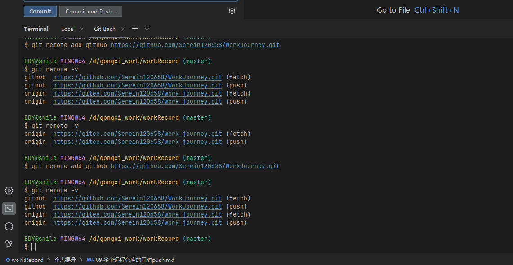
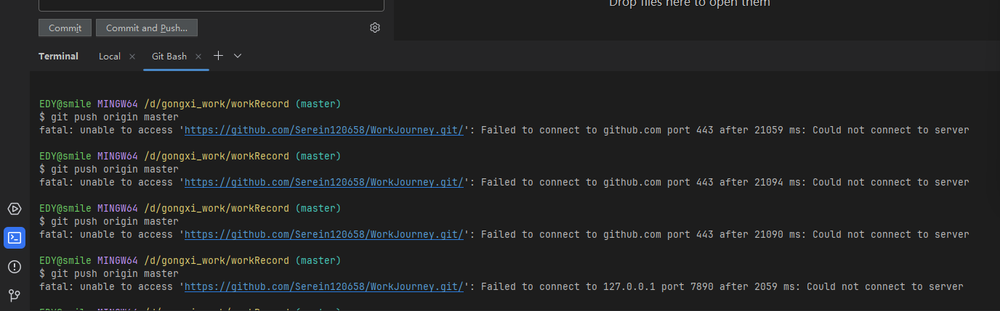
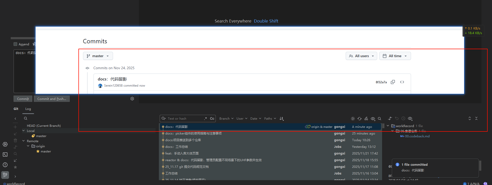

# Git 项目推送到多个仓库指南

## 概述

在实际开发中，我们经常需要将同一个项目同步到多个 Git 仓库，比如同时推送到 GitHub、GitLab、Gitee 等平台。本指南将详细介绍如何配置和实现一次推送到多个远程仓库。

## 方法一：为一个远程源添加多个推送地址

这是最推荐的方法，可以通过一次 `git push` 命令同时推送到多个仓库。

### 步骤说明

**1. 查看现有远程仓库配置**

```bash
git remote -v
```

你会看到类似这样的输出：

```
origin  https://github.com/username/project.git (fetch)
origin  https://github.com/username/project.git (push)
```

**2. 添加额外的推送地址**

假设你想同时推送到 GitHub 和 GitLab：

```bash
# 添加 GitLab 推送地址
git remote set-url --add --push origin https://gitlab.com/username/project.git

# 添加 GitHub 推送地址（需要显式添加原有地址）
git remote set-url --add --push origin https://github.com/username/project.git
```

**3. 验证配置**

```bash
git remote -v
```

现在应该看到：

```
origin  https://github.com/username/project.git (fetch)
origin  https://github.com/username/project.git (push)
origin  https://gitlab.com/username/project.git (push)
```

**4. 推送代码**

现在只需要执行一次推送命令：

```bash
git push origin main
```

代码将自动推送到所有配置的远程仓库。

## 方法二：配置多个独立的远程源

这种方法为每个仓库配置独立的远程名称，推送时需要指定具体的远程源。

### 步骤说明

**1. 添加多个远程仓库**

```bash
# 添加 GitHub 仓库
git remote add github https://github.com/username/project.git

# 添加 GitLab 仓库
git remote add gitlab https://gitlab.com/username/project.git

# 添加 Gitee 仓库
git remote add gitee https://gitee.com/username/project.git
```

**2. 查看所有远程仓库**

```bash
git remote -v
```

输出示例：

```
github  https://github.com/username/project.git (fetch)
github  https://github.com/username/project.git (push)
gitlab  https://gitlab.com/username/project.git (fetch)
gitlab  https://gitlab.com/username/project.git (push)
gitee   https://gitee.com/username/project.git (fetch)
gitee   https://gitee.com/username/project.git (push)
```

类似：



**3. 推送到指定仓库**

```bash
# 推送到 GitHub
git push github main

# 推送到 GitLab
git push gitlab main

# 推送到 Gitee
git push gitee main
```

**4. 推送到所有仓库**

```bash
git push github main && git push gitlab main && git push gitee main
```

或者创建一个别名来简化操作：

```bash
git config alias.pushall '!git push github main && git push gitlab main && git push gitee main'
```

之后可以使用：

```bash
git pushall
```


## 方法三：直接编辑配置文件

如果你喜欢直接编辑配置文件，可以修改 `.git/config` 文件。

### 步骤说明

**1. 打开配置文件**

```bash
vim .git/config
# 或
nano .git/config
```

**2. 编辑配置**

找到 `[remote "origin"]` 部分，修改为：

```ini
[remote "origin"]
    url = https://github.com/username/project.git
    fetch = +refs/heads/*:refs/remotes/origin/*
    pushurl = https://github.com/username/project.git
    pushurl = https://gitlab.com/username/project.git
    pushurl = https://gitee.com/username/project.git
```

**3. 保存并退出**

现在执行 `git push origin main` 将同时推送到所有配置的仓库。

## 使用 IntelliJ IDEA / PyCharm 进行多仓库推送

JetBrains 系列 IDE（如 IDEA、PyCharm、WebStorm 等）提供了图形化界面来管理 Git 远程仓库，操作更加直观。

### 方法一：在 IDE 中配置单个远程源的多个推送地址

**1. 打开 Git 远程仓库设置**

- 方式 1：菜单栏 `Git` → `Manage Remotes...`
- 方式 2：在项目窗口右键 → `Git` → `Manage Remotes...`
- 方式 3：使用快捷键 `Ctrl+Shift+A`（Windows/Linux）或 `Cmd+Shift+A`（Mac），搜索 "Manage Remotes"

**2. 查看和编辑远程仓库**

在弹出的对话框中，你会看到所有已配置的远程仓库。

**3. 编辑 origin 远程源**

- 选择 `origin`，点击编辑按钮（铅笔图标）
- 在 URL 字段中，你会看到一个 URL
- 点击 URL 字段右侧的 `+` 按钮添加额外的 URL

**4. 添加多个推送 URL**

在编辑界面：

- 保持原有的 URL 作为 fetch URL

- 点击 

  ```
  +
  ```

   按钮添加所有需要推送的仓库地址：

  - `https://github.com/username/project.git`
  - `https://gitlab.com/username/project.git`
  - `https://gitee.com/username/project.git`

**5. 保存配置**

点击 `OK` 保存所有更改。

**6. 推送代码**

- 点击右上角的绿色箭头 `Push` 按钮
- 或使用快捷键 `Ctrl+Shift+K`（Windows/Linux）或 `Cmd+Shift+K`（Mac）
- 或菜单栏 `Git` → `Push...`

在推送对话框中：

- 选择要推送的分支
- 点击 `Push` 按钮
- IDE 会自动推送到所有配置的远程仓库

**7. 查看推送结果**

在底部的 `Git` 标签页中，你可以看到每个仓库的推送状态和结果。

### 方法二：在 IDE 中配置多个独立远程源

**1. 打开 Git 远程仓库设置**

同上，打开 `Manage Remotes` 对话框。

**2. 添加新的远程仓库**

- 点击 `+` 按钮
- 输入远程仓库名称（如 `github`、`gitlab`、`gitee`）
- 输入对应的 URL
- 点击 `OK` 保存

重复此步骤添加所有需要的远程仓库。

**3. 推送到指定仓库**

推送时有两种方式：

**方式 A：使用推送对话框**

- 点击 `Push` 按钮或使用快捷键
- 在 "Push Commits to" 下拉列表中选择目标远程仓库
- 点击 `Push`

**方式 B：使用分支面板**

- 点击右下角的分支名称
- 在弹出菜单中选择当前分支
- 选择 `Push...`
- 选择目标远程仓库

**4. 批量推送到多个仓库**

IDE 不直接支持一键推送到多个独立远程源，但你可以：

- 多次执行推送操作，每次选择不同的远程仓库
- 或者在终端面板中使用命令行

### 使用 IDE 内置终端

如果你更喜欢命令行，IDE 底部有集成的终端：

**1. 打开终端**

- 点击底部的 `Terminal` 标签
- 或使用快捷键 `Alt+F12`（Windows/Linux）或 `Option+F12`（Mac）

**2. 执行 Git 命令**

在终端中直接使用本指南中提到的任何 Git 命令：

```bash
# 查看远程仓库
git remote -v

# 添加推送地址
git remote set-url --add --push origin https://gitlab.com/username/project.git

# 推送到所有仓库
git push origin main
```

### IDE 中的实用技巧

**1. 查看推送历史**

- 菜单栏 `Git` → `Show Git Log`
- 或使用快捷键 `Alt+9`（Windows/Linux）或 `Cmd+9`（Mac）
- 在 Log 标签页中可以看到每次提交的详细信息

**2. 推送时的高级选项**

在推送对话框中，你可以：

- 选择 `Force Push` 强制推送（谨慎使用）
- 勾选 `Push Tags` 同时推送标签
- 选择推送的分支范围

**3. 解决推送冲突**

如果推送失败：

- IDE 会显示错误信息
- 通常需要先 `Pull` 拉取远程更改
- 解决冲突后再次推送

**4. 保存密码**

为了避免每次推送都输入密码：

- 菜单栏 `File` → `Settings`（Windows/Linux）或 `Preferences`（Mac）
- 搜索 `Passwords`
- 在 `System Settings` → `Passwords` 中配置密码存储方式
- 推荐使用 `KeePass` 或系统密钥链

**5. 使用 SSH 密钥**

如果使用 SSH 方式：

- 确保已在系统中配置 SSH 密钥
- 在添加远程仓库时使用 SSH URL（如 `git@github.com:username/project.git`）
- IDE 会自动使用系统的 SSH 配置

### 图形化界面的优势

使用 IDE 进行多仓库推送的优势：

- ✅ 可视化管理所有远程仓库
- ✅ 一键推送，无需记忆命令
- ✅ 实时查看推送进度和结果
- ✅ 更容易解决冲突和错误
- ✅ 与代码编辑无缝集成

### IDE 操作注意事项

1. **首次推送**：第一次推送到新仓库时，可能需要输入凭证
2. **网络问题**：如果某个仓库推送失败，IDE 会显示具体的错误信息
3. **大文件**：推送大文件时注意各平台的限制（GitHub: 100MB）
4. **配置同步**：`.git/config` 文件的更改会在 IDE 中自动反映

## 从方法二切换到方法一

如果你已经使用了方法二（多个独立远程源），想要切换到方法一（单个远程源多个推送地址），可以按照以下步骤操作：

### 切换步骤

**1. 查看当前配置**

```bash
git remote -v
```

假设你看到的是：

```
github  https://github.com/username/project.git (fetch)
github  https://github.com/username/project.git (push)
gitlab  https://gitlab.com/username/project.git (fetch)
gitlab  https://gitlab.com/username/project.git (push)
gitee   https://gitee.com/username/project.git (fetch)
gitee   https://gitee.com/username/project.git (push)
```

**2. 选择一个作为主远程源（推荐使用 origin）**

如果你想使用 GitHub 作为主远程源，可以重命名它：

```bash
# 将 github 重命名为 origin
git remote rename github origin
```

或者如果你想保留 origin 这个名字，可以先删除原有的 origin（如果存在），然后重命名：

```bash
# 查看是否存在 origin
git remote -v

# 如果存在 origin，先删除
git remote remove origin

# 将 github 重命名为 origin
git remote rename github origin
```

**3. 为 origin 添加其他推送地址**

```bash
# 添加 GitLab 作为推送地址
git remote set-url --add --push origin https://gitlab.com/username/project.git

# 添加 Gitee 作为推送地址
git remote set-url --add --push origin https://gitee.com/username/project.git

# 添加 GitHub 作为推送地址（需要显式添加）
git remote set-url --add --push origin https://github.com/username/project.git
```

**4. 删除其他独立的远程源**

```bash
# 删除 gitlab 远程源
git remote remove gitlab

# 删除 gitee 远程源
git remote remove gitee
```

**5. 验证新配置**

```bash
git remote -v
```

现在应该看到：

```
origin  https://github.com/username/project.git (fetch)
origin  https://github.com/username/project.git (push)
origin  https://gitlab.com/username/project.git (push)
origin  https://gitee.com/username/project.git (push)
```

**6. 测试推送**

```bash
git push origin main
```

代码将同时推送到所有三个仓库。

### 在 IDE 中进行切换


**<font color=red> fetch 是远程匹配的仓库</font>**

**<font color=red>push  是要推送的仓库  可以看到上面有两个仓库 就会推送到这两个仓库</font>**

### <font color = red>注意</font>

有时候我们使用idea进行推送的时候，由于git 本身不走代理 ，会导致一个问题

就是推上了gitee    但是没有推送到github



此时就需要配置本地个git配置   让其提交到github的时候  走咱们的代理

```bash
# 只对github.com使用代理
git config --global http.https://github.com.proxy http://127.0.0.1:7890
git config --global https.https://github.com.proxy http://127.0.0.1:7890
```

注意上面的7890端口虽然是默认的(很多的代理软件都是这个端口) 但有时候代理端口被占用的时候，需要自己去代理软件查看相应的端口：


确定了端口之后：


提交测试：


**期间可能需要github的验证   可以按照提示去生成一个永久的token   在弹出的信息框  填入token即可**

idea提交测试 可以看着提交上去了：



### 完整示例脚本(看前面的步骤就行)

你也可以使用以下脚本一键完成切换：

```bash
#!/bin/bash

# 保存各仓库的 URL
GITHUB_URL=$(git remote get-url github)
GITLAB_URL=$(git remote get-url gitlab)
GITEE_URL=$(git remote get-url gitee)

# 删除所有现有远程源
git remote remove github
git remote remove gitlab
git remote remove gitee

# 添加 origin 作为主远程源（使用 GitHub）
git remote add origin $GITHUB_URL

# 为 origin 添加所有推送地址
git remote set-url --add --push origin $GITHUB_URL
git remote set-url --add --push origin $GITLAB_URL
git remote set-url --add --push origin $GITEE_URL

# 显示新配置
echo "新的远程仓库配置："
git remote -v
```

### 切换注意事项

1. **保留 fetch 地址**：通常建议保留一个主要的 fetch 地址（如 GitHub），用于拉取代码
2. **推送顺序**：推送地址的添加顺序就是推送的执行顺序
3. **分支跟踪**：切换后，如果有分支跟踪关系，可能需要重新设置：

```bash
git branch --set-upstream-to=origin/main main
```

1. **备份配置**：在操作前，可以先备份 `.git/config` 文件：

```bash
cp .git/config .git/config.backup
```

## 使用 SSH 方式配置

如果你使用 SSH 密钥认证，配置方法类似：

```bash
# 方法一：添加多个推送地址
git remote set-url --add --push origin git@github.com:username/project.git
git remote set-url --add --push origin git@gitlab.com:username/project.git

# 方法二：添加多个远程源
git remote add github git@github.com:username/project.git
git remote add gitlab git@gitlab.com:username/project.git
```

## 常见问题与解决方案

### 问题 1：推送失败

如果某个仓库推送失败，整个推送过程会中断。可以：

- 检查网络连接
- 验证仓库 URL 是否正确
- 确认是否有推送权限
- 检查认证信息（用户名、密码或 SSH 密钥）

### 问题 2：同步不同分支

推送不同分支到不同仓库：

```bash
# 推送 main 分支到 GitHub
git push github main

# 推送 develop 分支到 GitLab
git push gitlab develop
```

### 问题 3：删除远程仓库配置

```bash
# 删除特定的推送 URL
git remote set-url --delete --push origin https://gitlab.com/username/project.git

# 删除整个远程源
git remote remove gitlab
```

### 问题 4：修改远程仓库地址

```bash
# 修改远程仓库 URL
git remote set-url origin https://new-url.com/username/project.git
```

## 推荐使用场景

- **方法一**：适合需要始终同步所有仓库的场景，操作最简便
- **方法二**：适合需要灵活控制推送目标的场景
- **方法三**：适合熟悉 Git 配置文件的高级用户
- **IDE 操作**：适合不熟悉命令行或喜欢图形界面的开发者

## 额外提示

1. **使用 Git 凭证管理器**：避免每次都输入密码

```bash
git config --global credential.helper store
```

1. **设置默认分支**：

```bash
git config --global init.defaultBranch main
```

1. **批量推送脚本**：创建一个 Shell 脚本自动化推送过程

```bash
#!/bin/bash
git push github main
git push gitlab main
git push gitee main
echo "所有仓库推送完成！"
```

## 总结

将项目推送到多个仓库可以提高代码的可用性和备份安全性。根据你的具体需求选择合适的方法：

- 使用**命令行**：灵活强大，适合有经验的开发者
- 使用**IDE**：直观便捷，适合喜欢图形界面的开发者
- **方法一**最为便捷，适合大多数使用场景
- 如果已经使用了方法二，也可以轻松切换到方法一

配置完成后，你就可以轻松地将代码同步到多个平台了！