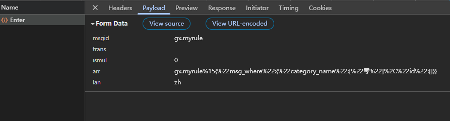
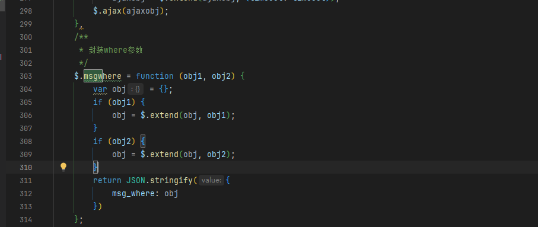
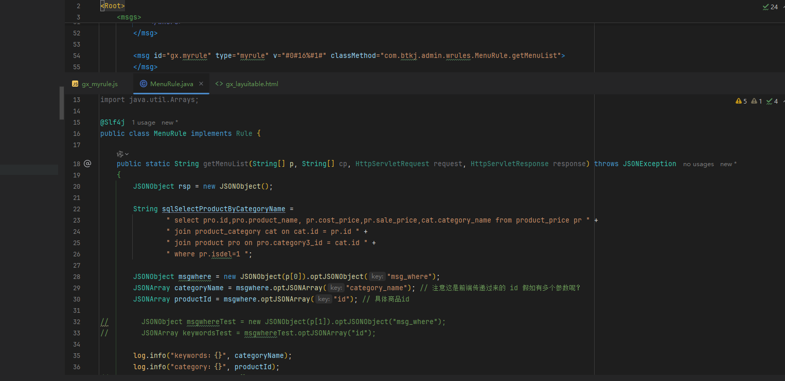

## 1、script中的参数

```js
<script data-main="../../js/gx/gx_layuitable.js" src='../../sys/require.min.js'></script>
```

场景：自己在 `gx_layuitable.html` 中按照上面的格式引入时，发现相应的js不生效，而将其改为下面的代码时反而可以使用了。

```js
<script src="../../js/gx/gx_layuitable.js"></script>
```

1. data-main  所代表的含义？ 什么场景使用它？  是需要配合啥才能使用吗？

   data-main 必须配合着 require.min.js使用  

2. 为什么下面这种情况就可以？

   用到了layui框架的东西的时候就需要src为require.min.js


## 2、$.msgwhere(obj1,obj2)

在自己练习myrule消息类型的时候，在js中，我想要传递两个对象，然后在后端接收，如下：


在xml文件中使用 type为myrule  v="#0#%16"  再去创建相应的类获取参数  发现第二个是拿不到的

**只能拿到objwhere对象的, 这里如果想要拿到两个对象里面的参数  该如何做呢？**

想过消息内容使用  16% 分割   再使用#1#  去接收  接收不了



在system.js 源码文件中  可以看到msgwhere传递的对象会合并为一个对象到后端进行接收：



明天看看源码

## 3、权限标识  perms参数

1. 这个参数的含义是权限标识 格式：  `sys:menu:list`  为啥这样写？

   首先格式：格式是为了开发者在开发的时候更清楚是干什么的，比如上面的list是为了获取相应的列表

   格式没有硬性要求

2. 这个参数在什么场景下使用？

   一方面通过用户登录的时候会获取相应的权限存储在token或者别的地方，初始化程序的时候就直接决定了用户可以使用那些页面  总而言之就是 看用户是否有权限去使用按钮、访问页面啊之类的

3. 在使用layuitable的时候也有一个参数   lay-perm

   

## 4、cp参数

场景：在练习myrule消息类型的时候，实现了Rule接口，编写方法时需要的参数 如图：



p参数对应的是msg_where的

那cp对应的是啥？    did  指明数据库类型  


------

# 注意

## 不能直接使用sql去拼接

也就是不直接使用dbutil 里面的方法

后续的sql操作基本都是在[msgutil](https://apifox.com/apidoc/shared/98badc4f-73a4-4f9c-ac97-0248ed8f5d2f/doc-5635611) 使用这个工具类去执行sql操作  明天看msgutil


